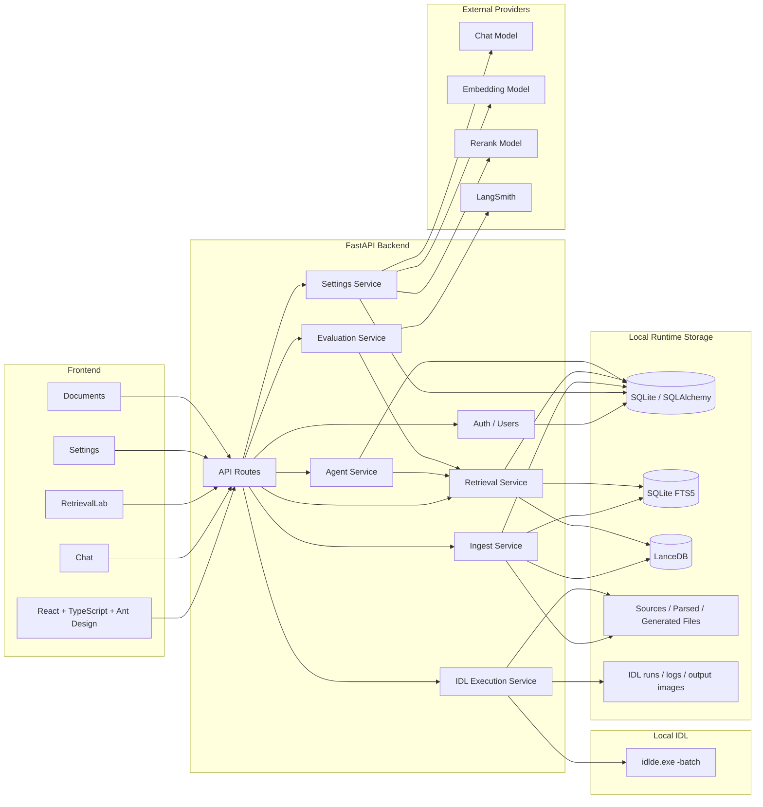
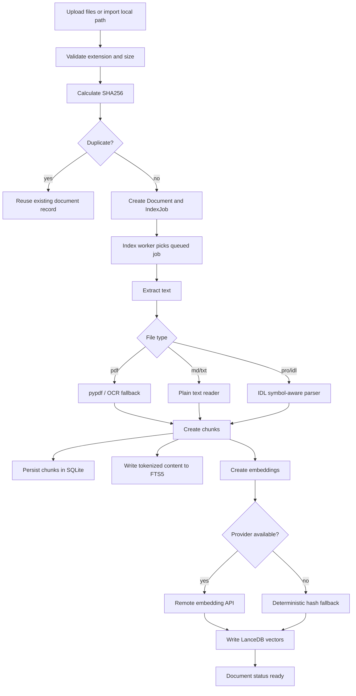
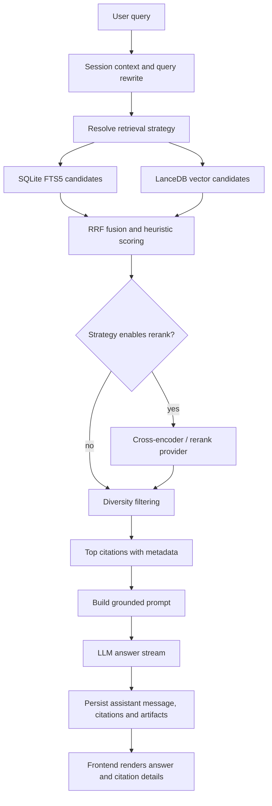
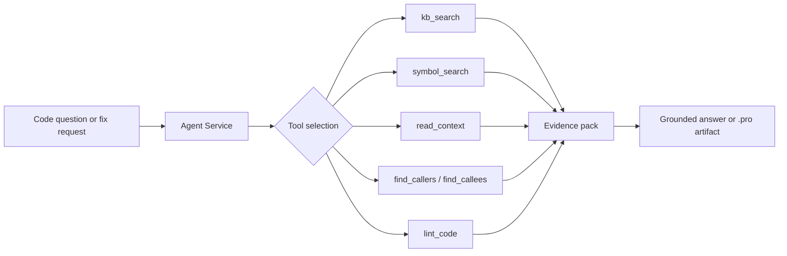
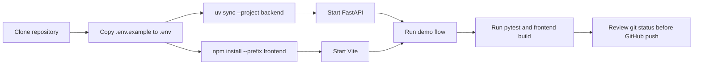

# IDL RAG Panel 架构文档

IDL RAG Panel 是一个面向 ENVI/IDL 资料和代码场景的本地优先 RAG 工作台。系统由 React 前端、FastAPI 后端、SQLite/FTS5、LanceDB、本地文件存储和 OpenAI-compatible 模型服务组成。

## 1. 总体架构



## 2. 后端模块

| 模块 | 代表文件 | 职责 |
|---|---|---|
| API layer | `backend/app/api/routes/*` | Auth、用户、知识库、文档、Chat、检索调试、评测和系统设置接口 |
| Config | `backend/app/core/config.py` | 读取 `IDLRAG_` 环境变量、运行目录、上传限制、CORS、模型默认值 |
| Security | `backend/app/core/security.py` | PBKDF2 密码哈希、访问 token、Fernet 敏感字段加密与密钥轮转 |
| Database | `backend/app/db/database.py`, `backend/app/db/models.py` | SQLite、FTS5、索引 worker 数据库连接、ORM 模型 |
| Settings | `backend/app/services/settings_service.py` | 运行时 provider/model/key 配置，敏感 key 加密存储 |
| Ingest | `backend/app/services/ingest_service.py` | 文档导入、去重、文本提取、分块、FTS 和向量索引写入 |
| IDL chunking | `backend/app/services/chunk_idl_service.py` | IDL/ENVI 代码符号级分块、结构体和调用关系提取 |
| Retrieval | `backend/app/services/retrieve_service.py` | FTS、向量、RRF、rerank、parent-child、dependency 和代码工具检索 |
| Agent | `backend/app/services/agent_service.py`, `backend/app/services/agent_tools.py` | 对话编排、工具调用、代码分析/修复、`.pro` artifact 生成 |
| IDL Execution | `backend/app/services/idl_execution_service.py` | 校验用户拥有的 `.pro` artifact，生成 batch runner，通过 `idlde.exe -batch` 调用本机 IDL，收集日志和输出图片 |
| Evaluation | `backend/app/services/evaluation_service.py`, `backend/app/services/eval_runner.py` | 本地 golden QA、策略对比、LangSmith 同步/评测 |

## 3. 前端模块

| 页面 | 职责 |
|---|---|
| Dashboard | 展示知识库、文档、索引 worker、fallback embedding 等状态 |
| KnowledgeBases | 创建、删除、配置知识库默认检索策略与 top_k |
| Documents | 上传、路径导入、重试、重建索引、查看 chunks |
| Chat | 普通问答、Agent 模式、流式生成、citation 和 artifact 下载 |
| RetrievalLab | 检索策略调试、候选详情、分数和 metadata 查看 |
| Settings | Provider/key/model 配置、连接测试、评测报告查看 |
| Users | 管理员用户管理、重置密码、禁用用户 |

前端 API base URL 来自 `frontend/src/api/client.ts` 中的 `VITE_API_BASE_URL`，默认回退到 `http://127.0.0.1:8000/api`。

## 4. 文档入库流程



## 5. RAG 查询流程



Default strategy is `hybrid_rrf_no_rerank`. `hybrid_rrf` remains available as a rerank comparison path. `vector_only` is mainly diagnostic because vector quality depends on embedding provider and index freshness.

## 6. Code RAG and Agent tools



Code tools are evaluated separately from natural-language QA cases because they need exact symbol/file/dependency expectations rather than generic answer relevance scoring.

## 7. 本地 IDL 执行流程

```mermaid
flowchart TD
  Click[用户点击 .pro artifact 的运行 IDL] --> Route[POST /run-idl]
  Route --> Owner[校验登录用户、session owner 和 artifact]
  Owner --> RunDir[创建 runs/{run_id}/]
  RunDir --> Source[复制 source.pro]
  RunDir --> Outputs[创建 outputs/]
  Source --> Runner[生成 __idlrag_runner.pro]
  Outputs --> Runner
  Runner --> Batch[idlde.exe -batch __idlrag_runner.pro]
  Batch --> Logs[stdout.log / stderr.log]
  Batch --> Images[outputs/*.png / *.jpg / *.tif]
  Logs --> Message[保存 assistant 运行摘要]
  Images --> Artifact[保存 idl_output artifact]
  Message --> UI[前端运行卡片]
  Artifact --> UIImg[图片缩略图 / 大图预览 / 下载]
```

当前 Windows IDL 8.8 环境中，`idl.exe -e` 会卡住或触发 control pipe 错误；已验证可用的方式是使用 IDL Workbench 启动器：`idlde.exe -batch <runner.pro>`。后端不接收任意 shell 命令，只对当前用户拥有的 Chat `.pro` artifact 生成受控 runner，且仅收集 `outputs/` 目录中的允许图片后缀。

## 8. 配置与密钥流转

```mermaid
flowchart TD
  Env[.env / environment variables] --> Config[backend/app/core/config.py]
  UI[Settings page] --> SettingsAPI[/api/settings]
  SettingsAPI --> SettingsService[settings_service.py]
  SettingsService --> Encrypt[encrypt_secret in security.py]
  Encrypt --> DB[(SQLite system_settings)]
  DB --> Decrypt[decrypt_secret_with_rotation]
  Decrypt --> Provider[LLM / embedding / rerank / LangSmith clients]
```

Sensitive runtime settings include `api_key`, `rerank_api_key` and `langsmith_api_key`. They are encrypted before being stored in SQLite. The SQLite database still must not be committed because it is local runtime state and may contain user data, encrypted secrets, prompts, documents, chat history and generated artifacts.

## 9. 构建与展示流程



## 10. Storage and publishing boundary

The repository should contain source code, tests, documentation and configuration templates. It should not contain runtime state.

Do not publish:

- `.env` or real provider keys.
- `data/app.db`, WAL/SHM files, LanceDB indexes, logs, generated chat artifacts and parsed text.
- Source documents unless they are reviewed, public, licensed and intentionally included.
- Private PDFs, resume drafts, local transcripts, caches, build output and dependency folders.

See [`docs/security-and-data-control.md`](./docs/security-and-data-control.md) for the full checklist.
