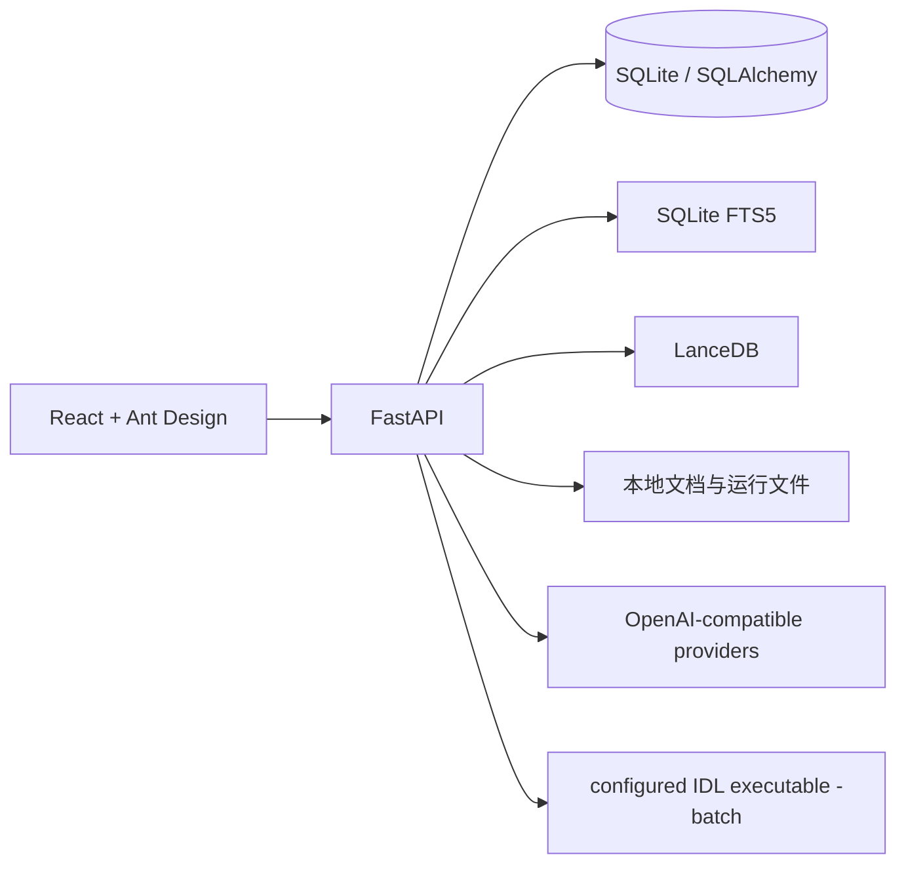
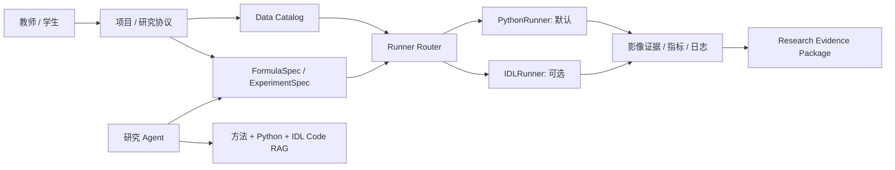

# IDL RAG Panel 设计文档

> **状态：当前实现架构与已确认演进方向的设计摘要。**  
> 完整的研究协议、实施路线图和验收标准见 [docs/research-workflow-platform-plan.md](docs/research-workflow-platform-plan.md)。

## 设计概述

### 当前目标

IDL RAG Panel 当前是本地优先的 ENVI/IDL 专用 RAG 工作台：将用户自有的论文、课程资料和 IDL 代码组织为带引用的知识库，提供检索、代码上下文、受控 GEE 数据 artifact 与用户主动触发的本机 IDL 运行。

### 演进目标

在不破坏现有本地 RAG 和 IDL 资产的前提下，将系统演进为遥感研究工作流平台。平台以项目、数据快照、公式模型、受控 Runner、逐步可视化证据和可复现实验包为中心；新增研究模板默认用 Python 实现，IDL/ENVI 作为可选的兼容、复现和教学执行器。

### 非目标

- V1 不建设公网 SaaS、高并发分布式集群或无人工判断的自动科研发表系统。
- V1 不强制所有研究任务生成/运行 IDL，也不强行容器化受许可的 IDL/ENVI 桌面软件。
- V1 不把私有原始影像、样本或高精度预览自动发送给外部模型服务。
- V1 不把遥感栅格像元直接当作普通 RAG 文本进行嵌入。

## 架构设计

### 当前实现

当前详细架构、已有服务和存储边界见 [ARCHITECTURE.md](ARCHITECTURE.md)。

### 目标研究工作流架构

### 核心组件

| 组件 | 职责 | 状态 |
|---|---|---|
| 文档入库与 RAG | 论文、文本和 IDL 代码摄入；混合检索与引用。 | 已有。 |
| IDL Code RAG | IDL 符号分块、依赖关系和代码辅助。 | 已有。 |
| 研究 Agent 上下文 | 在项目成员权限内只读检索项目 RAG、生成未持久化协议草案和检查研究就绪状态；外部搜索、GEE 获取和 preview 排队均需独立显式同意。 | 已实现。 |
| GEE / IDL artifact | 结构化 GEE 小范围数据、本地 IDL 受控执行与结果图片收集。 | 已有。 |
| `Data Catalog` | 数据卡、资产校验、快照、访问策略与数据来源。 | 已实现（本地优先；GEE/STAC 受控获取、私有资产与快照）。 |
| `FormulaSpec` / `ExperimentSpec` | 与语言无关的研究协议、公式、参数、验证和冻结状态。 | 已实现（含协议版本、冻结快照和正式/预览实验边界）。 |
| `PythonRunner` | Python/GDAL/Rasterio/GEE 的默认科研执行器。 | 已实现（受限操作、阶段影像、manifest、验证和队列执行）。 |
| `IDLRunner` | 用户已有许可环境下的项目级 `.pro` 执行与遗留算法对照适配器。 | 已实现（私有脚本资产、快照输入沙箱、超时/输出限制；无许可时明确 `unavailable`）。 |
| 证据板与验证 | 阶段影像、样本、指标、不确定性和结论回溯。 | 已实现（运行产物、点样本设计、栅格比较和研究页展示）。 |
| 证据包 | 正式研究结果的版本化、可导出归档。 | 已实现（受保护 ZIP、校验与 review-first 报告）。 |

## 设计决策

| 日期 | 决策 | 理由 | 影响 |
|---|---|---|---|
| 2026-09-28 | 生成初始设计文档骨架 | 建立项目级设计入口。 | 文档基础。 |
| 2026-09-29 | Python-first、IDL-optional | Python 更适合 GEE、GDAL、验证、测试与容器化；IDL 仍承载既有 ENVI/IDL 资产。 | 新模板必须具备 Python 主实现。 |
| 2026-09-29 | 模板模式与开放研究模式并存 | 兼顾课程/标准任务与真实科研探索。 | 正式运行前仍需冻结研究协议。 |
| 2026-09-29 | Data Catalog 与 RAG 分离 | 栅格像元不适合普通文本向量检索；数据需版本和权限控制。 | 新增数据资产与快照领域模型。 |
| 2026-09-29 | 预览与正式运行分离 | 减少试错成本并保护正式结论的研究有效性。 | Run 需记录模式、快照和状态。 |
| 2026-09-29 | `private-local` 为默认数据策略 | 支持学校/企业私有资料并最小化外部数据暴露。 | Agent/GEE/LLM 调用受项目策略约束。 |
| 2026-09-29 | 协议保存即版本化，实验只引用版本快照 | 防止项目后来编辑时改写正式运行所依据的研究设计。 | 协议版本以项目内顺序号与 SHA-256 保存；正式 Run 和证据包记录关联版本。 |
| 2026-09-29 | 低摩擦项目协作 | 教师与学生无需角色分级即可协作，同时不默认公开内部资料。 | 项目创建者可按用户名管理成员，成员共享项目工作流。 |
| 2026-09-29 | 研究 Agent 只读工具边界 | Agent 可以帮助理解项目和资料，但不能绕过研究页执行正式实验或修改冻结对象。 | 项目 ID、成员权限、外部搜索同意和私有数据边界在服务端重新校验。 |
| 2026-09-29 | 研究 Agent 预览排队需二次授权 | 允许 Agent 帮用户减少重复点击，但不让模型隐式启动正式科研流程。 | 独立 UI 开关 + `confirm=true` + preview/Python/项目归属服务端校验；只创建 queued Run。 |
| 2026-09-29 | GEE 获取与执行授权分离 | 获取外部数据会产生项目资产，风险和生命周期不同于排队本地 preview。 | 单独的 GEE 授权开关；工具只登记私有 DataAsset，不冻结快照或执行代码，并脱敏 URI。 |

## 技术选型

| 层 | 选择 | 理由 |
|---|---|---|
| 现有前后端 | React、TypeScript、FastAPI、SQLAlchemy | 现有项目基础，应增量演进。 |
| 默认研究执行 | Python + GDAL/Rasterio/NumPy/SciPy/GeoPandas/xarray | 遥感数据处理、数值计算、验证和自动化生态完整。 |
| 遗留执行 | IDL/ENVI 本机适配器 | 保留经过验证的 `.pro` 资产和 ENVI API 能力。 |
| 本地数据 | 项目目录、校验资产、SQLite 元数据 | 适合 V1 本地验证与可追溯资产管理。 |
| 后续内部部署 | Docker Compose、PostgreSQL、挂载卷或对象存储 | 支持内部多用户与持久化，而不提前引入分布式复杂度。 |

## 权衡取舍

### 已知限制

- 当前实现已具备项目级 Data Catalog、PythonRunner、研究证据包和按用户名的项目成员协作；仍以 SQLite/LanceDB 为本地优先存储，不是组织级生产部署。
- 当前成员模型让受邀成员共同使用项目，而不是教师/学生角色分级；学校/企业目录、课程组、组织范围、配额和 SSO 仍未实现。
- 影像处理依赖本机 GDAL/IDL/ENVI 安装状态；容器化只能在 PythonRunner 经过稳定验证后进行。
- JRC Global Surface Water 等产品可作历史参考，但不是无条件替代现场真值的独立标签来源。

### 有意延后事项

- 深度学习训练、PROSAIL/复杂反演和大规模时序分析延后到可解释基线与样本验证稳定之后。
- 企业 SSO、分布式队列、对象存储和组织托管 GEE 身份延后到本地研究闭环通过验收之后。
- IDL/ENVI 不纳入核心 Docker 镜像，以避免许可与桌面运行时复杂度。

## 安全考量

### 威胁模型

- 私有数据或高精度预览被无意传给外部 LLM、搜索或非预期共享者。
- 多用户场景中通过对象 ID、下载链接或 artifact 路径越权读取他人数据。
- 上传文件或生成代码触发任意路径访问、恶意文件处理或任意命令执行。
- 未验证来源被 Agent 误表述为科研事实，导致结论缺乏证据。

### 安全措施

- 使用项目级 `private-local` 默认策略、最小外发、外发日志和安全导出包。
- 对项目、数据、运行和 artifact 做对象级所有者/成员验证；项目创建者管理成员名单，受邀成员共同工作。
- 采用扩展名/大小/内容校验、隔离存储、路径规范化和受控 Runner；保留“用户主动触发 IDL”的现有边界。
- 对方法、公式和代码使用 EvidenceCard；探索候选与正式验证结果分开标识。

## 变更历史

### 2026-09-29 - 研究工作流平台设计基线

**变更内容：** 将自动生成的通用骨架替换为当前架构摘要、目标架构、关键决策、安全边界和详细蓝图入口。

**变更理由：** 为从 IDL RAG 工作台向可复现遥感研究工作流平台的增量实施提供统一依据。
