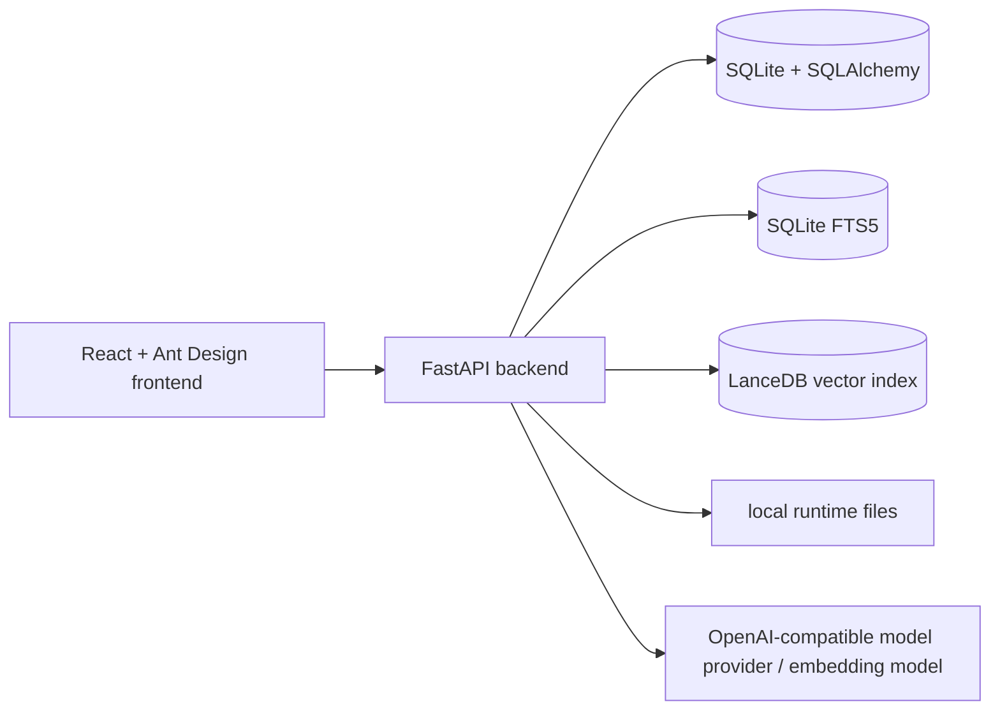

# IDL RAG Panel

Language: [中文](./README.md) | **English**

IDL RAG Panel is a private RAG web application for ENVI/IDL documents and code. It organizes local documents, course materials, IDL/ENVI source files, and project references into knowledge bases, then provides grounded Q&A, retrieval debugging, Agent tool execution, `.pro` file generation, and evaluation comparison.

The project is suitable for local development, lab intranet deployment, portfolio presentation, and small-team knowledge-base validation. The repository version should contain only source code, documentation, and configuration templates. Real API keys, local databases, indexes, logs, private documents, and unsanitized materials should not be committed to GitHub.

## Core Capabilities

- Multi-user authentication, admin user management, and user-level isolation for knowledge bases and sessions.
- Knowledge base creation, document upload, path import, file deduplication, failed-job retry, and index rebuild.
- Supports `.pdf`, `.md`, `.markdown`, `.txt`, `.pro`, and `.idl` files.
- ENVI/IDL-specific chunking: normal text is chunked by paragraphs, while IDL code is chunked around procedure/function symbol boundaries.
- SQLite FTS5 keyword retrieval, LanceDB vector retrieval, Hybrid RRF fusion, and optional rerank.
- The default retrieval strategy is `hybrid_rrf_no_rerank`, which provides a stable balance of speed and quality in the current benchmark results.
- The chat page shows answers, citation sources, retrieval strategy, and generated `.pro` files.
- The retrieval test page compares strategies and exposes candidate chunks, scores, metadata, and raw JSON.
- The settings page supports model configuration, connection testing, local evaluation, and LangSmith-related evaluation settings.
- Runtime sensitive keys are encrypted by the settings service; the local database is still runtime data and should not be committed.

## Tech Stack

### Backend

- Python 3.12
- FastAPI / Uvicorn
- SQLAlchemy / SQLite / SQLite FTS5
- LanceDB / PyArrow
- Pydantic / pydantic-settings
- httpx
- jieba
- cryptography
- pytest / ruff

### Frontend

- React 18
- TypeScript
- Vite
- Ant Design 5
- TanStack React Query

## Project Structure

```text
idl-rag/
  backend/
    app/
      api/              # FastAPI routes and dependencies
      core/             # config, auth token, password and secret helpers
      db/               # SQLAlchemy models and SQLite/FTS initialization
      services/         # ingest, retrieval, embedding, model, Agent, eval services
      main.py           # FastAPI app and index worker lifecycle
    tests/              # backend tests and golden eval data
    pyproject.toml

  frontend/
    src/
      api/              # API client and types
      pages/            # dashboard, knowledge bases, documents, chat, retrieval test, settings
      styles/           # app-level styles
      App.tsx
      main.tsx
    package.json

  docs/
    architecture.md
    configuration.md
    demo.md
    security-and-data-control.md

  .env.example          # public configuration template without real secrets
  .gitignore            # excludes local data, secrets, caches, and build output
```

Runtime data is generated under `data/` by default. `data/app.db`, `data/indexes/`, `data/logs/`, `data/generated/`, `data/parsed/`, and source documents are local runtime artifacts and are intentionally excluded from Git.

## Quick Start

### 1. Prepare Environment Variables

Copy the template and fill in local-only values:

```powershell
Copy-Item .env.example .env
```

The most important local development values are:

```text
IDLRAG_AUTH_SECRET=replace-with-a-long-random-secret
IDLRAG_CORS_ORIGINS=http://127.0.0.1:5173,http://localhost:5173
VITE_API_BASE_URL=http://127.0.0.1:8000/api
```

Do not commit `.env`.

### 2. Install Backend Dependencies

```powershell
uv sync --project backend
```

### 3. Start the Backend

```powershell
uv run --project backend uvicorn app.main:app --app-dir backend --reload
```

Default backend URL:

```text
http://127.0.0.1:8000
```

### 4. Install Frontend Dependencies

```powershell
npm install --prefix frontend
```

### 5. Start the Frontend

```powershell
npm run dev --prefix frontend
```

Default frontend URL:

```text
http://127.0.0.1:5173
```

## Demo Flow

1. Open the frontend page and register or log in.
2. Open the settings page and configure an OpenAI-compatible model provider, chat model, and embedding model.
3. Create a knowledge base.
4. Upload or import ENVI/IDL documents.
5. Wait until the document status becomes `ready`.
6. Open the chat page, select a knowledge base, ask an ENVI/IDL question, and inspect citations.
7. Use the retrieval test page to compare retrieval strategies and inspect candidate chunks.
8. Use evaluation reports in the settings page to compare strategy performance.
9. Before publishing, run `git status` and confirm that local databases, keys, logs, indexes, and private documents are not staged.

Detailed demo steps are available in [`docs/demo.md`](./docs/demo.md).

## Project Showcase

The default project showcase is Chinese: [`docs/project-showcase.md`](./docs/project-showcase.md). Separate language versions are available: [中文](./docs/project-showcase.zh-CN.md) / [English](./docs/project-showcase.en-US.md).

Key screenshots:

- [Dashboard](./docs/assets/screenshots/dashboard.png)
- [Knowledge Bases](./docs/assets/screenshots/knowledge-bases.png)
- [Documents](./docs/assets/screenshots/documents.png)
- [Chat](./docs/assets/screenshots/chat.png)
- [Retrieval Test](./docs/assets/screenshots/retrieval-lab.png)
- [Settings](./docs/assets/screenshots/settings.png)

## Configuration and Key Handling

The backend reads environment defaults from `backend/app/core/config.py`. Runtime model settings and provider keys are managed by `backend/app/services/settings_service.py`; sensitive values such as `api_key`, `rerank_api_key`, and `langsmith_api_key` are encrypted through helpers in `backend/app/core/security.py` before being stored in the local database.

This encryption protects sensitive values at rest in local runtime storage, but `data/app.db` is still local application data and should not be uploaded to GitHub.

Configuration details are available in [`docs/configuration.md`](./docs/configuration.md). Security and data-control rules are available in [`docs/security-and-data-control.md`](./docs/security-and-data-control.md).

## Architecture

The system is a local-first RAG workbench:



Full architecture diagrams are available in [`ARCHITECTURE.md`](./ARCHITECTURE.md) and [`docs/architecture.md`](./docs/architecture.md).

## Verification

Run focused backend tests:

```powershell
uv run --project backend pytest backend/tests/test_retrieval_strategies.py backend/tests/test_agent_service.py
uv run --project backend pytest backend/tests/test_eval_golden_qa.py backend/tests/test_eval_metrics.py backend/tests/test_evaluation_api.py
```

Build the frontend:

```powershell
npm run build --prefix frontend
```

## GitHub Publishing Rules

Safe default upload set:

- Root documentation and `docs/`.
- `.gitignore` and `.env.example`.
- `backend/app/`, `backend/tests/`, `backend/scripts/`, backend package files, and lock files.
- `frontend/src/`, frontend package files, and build configuration files.

Do not upload by default:

- Real `.env` files or API keys.
- `data/app.db`, WAL/SHM files, LanceDB indexes, logs, generated files, and parsed text.
- `frontend/node_modules/`, `frontend/dist/`, `backend/.venv/`, and caches.
- Private PDFs, resume drafts, course materials, and unsanitized source documents.

Recommended module commits:

1. Safety boundary and environment template.
2. Documentation and architecture diagrams.
3. Backend source and tests.
4. Frontend source and build configuration.
5. Public demo materials only after manual review.

Confirm the target remote repository before pushing to GitHub.
