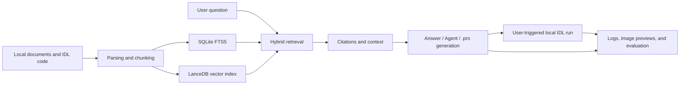
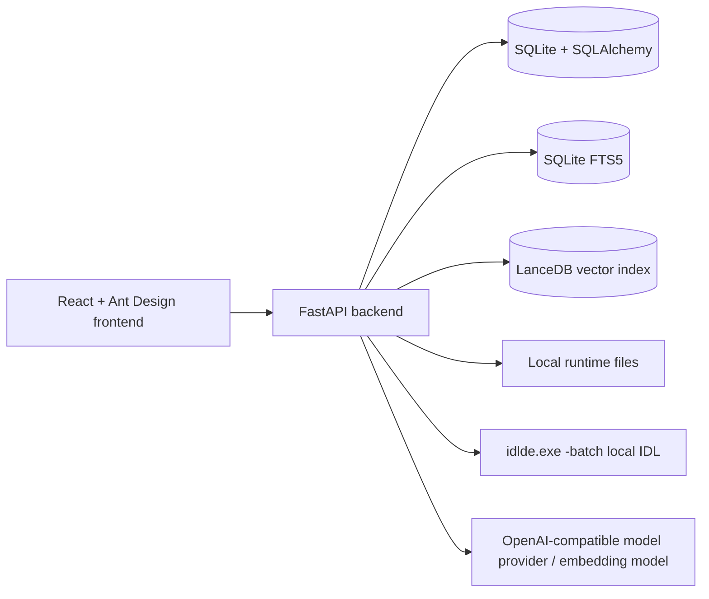

# IDL RAG Panel

Language: [中文](./README.md) | **English**

IDL RAG Panel is a local-first RAG workbench for ENVI/IDL documents, code, and course materials. It turns local PDFs, Markdown files, text documents, and `.pro` / `.idl` source files into searchable knowledge bases, then provides grounded Q&A, retrieval debugging, Agent tool execution, `.pro` file generation, local IDL execution, and retrieval evaluation.

The project is not meant to be a generic chat UI. It focuses on three practical problems in ENVI/IDL learning, lab work, and project development: scattered materials are hard to search, code context is hard to trace, and generated answers need verifiable sources.

## Project Highlights

| Highlight | Description |
|---|---|
| ENVI/IDL vertical focus | Built for remote-sensing materials, ENVI/IDL learning notes, lab documents, and `.pro` / `.idl` code rather than generic document chat. |
| Local-first RAG | Uses SQLite, SQLite FTS5, and LanceDB to build local knowledge bases without requiring an external database service. |
| IDL symbol-aware chunking | Chunks IDL code around procedure/function boundaries to preserve code-level semantic context. |
| Traceable answers | Shows citation sources, retrieval strategy, scores, line ranges, and metadata in answers. |
| Retrieval debugging workbench | RetrievalLab compares strategies and exposes candidate chunks, scores, metadata, and raw JSON. |
| Evaluation support | Supports local golden QA, strategy comparison, hit rate, MRR, latency, and LangSmith-related evaluation settings. |
| Code assistance | Agent mode supports symbol search, context reading, call-relationship analysis, and `.pro` file generation. |
| GEE data acquisition | Chat can fetch small bounded Google Earth Engine datasets through structured parameters and save them as local session artifacts. |
| Local IDL execution | Generated or saved chat `.pro` artifacts can be run by user action; the backend invokes local IDL through `idlde.exe -batch` and returns a run summary, logs, and output image previews. |

## Screenshots

### Chat and Citations


### Retrieval Test


### Knowledge Base and Document Management


More screenshots:

- [Dashboard](./docs/assets/screenshots/dashboard.png)
- [Documents](./docs/assets/screenshots/documents.png)
- [Settings](./docs/assets/screenshots/settings.png)

See the full showcase in [`docs/project-showcase.en-US.md`](./docs/project-showcase.en-US.md). The default showcase is Chinese: [`docs/project-showcase.md`](./docs/project-showcase.md).

## Real remote-sensing demo

The repository also includes a real local `gemin2api` run on the Poyang Lake case. The Agent created and queued two Python previews, then the local research worker generated the MNDWI feature image, water mask, GeoTIFF outputs, and run manifest.

<video controls muted loop playsinline poster="./docs/assets/demos/poyang-mndwi-preview-feature.png" width="720">
  <source src="./docs/assets/demos/poyang-agent-demo.mp4" type="video/mp4">
</video>


See the execution record and scientific limitations in [`docs/agent-demo-result.md`](./docs/agent-demo-result.md).

## Core Capabilities

| Module | Capabilities |
|---|---|
| Auth and users | Registration, login, admin user management, and user-level isolation for knowledge bases and sessions. |
| Knowledge bases | Create knowledge bases and configure default retrieval strategy, `top_k`, and rerank settings. |
| Document ingestion | Upload files, import from local paths, deduplicate with SHA256, retry failed jobs, rebuild indexes, and track status. |
| IDL chunking | Chunk normal text by paragraphs and IDL code around procedure/function symbol boundaries. |
| Hybrid retrieval | SQLite FTS5 keyword retrieval, LanceDB vector retrieval, RRF fusion, and optional rerank. |
| Chat Q&A | Streaming answers, citations, retrieval strategy display, Agent mode, GEE data acquisition, `.pro` file generation, local IDL execution, and image result display. |
| Retrieval testing | Compare strategies and inspect candidate chunks, scores, metadata, match info, and raw JSON. |
| Evaluation | Local golden QA, strategy comparison, hit rate, precision, recall, MRR, and latency statistics. |
| Settings | Model providers, API keys, chat model, embedding model, rerank model, and LangSmith configuration. |

## Core Pages

| Page | Purpose |
|---|---|
| Dashboard | Shows knowledge-base count, document status, index jobs, worker status, and fallback embedding warnings. |
| Knowledge Bases | Creates and manages knowledge bases, default strategy, `top_k`, and rerank settings. |
| Documents | Uploads or imports documents, shows ingestion status, chunk count, parser metadata, retries, and rebuilds. |
| Chat | Selects knowledge bases, asks questions, shows citations, retrieval policy, Agent results, and generated files. |
| Retrieval Test | Runs different retrieval strategies for the same query and inspects candidate chunks, scores, and metadata. |
| Settings | Configures model providers, tests connections, runs local evaluation, and reviews evaluation reports. |

## Workflow



## Architecture



Full architecture diagrams are available in [`ARCHITECTURE.md`](./ARCHITECTURE.md) and [`docs/architecture.md`](./docs/architecture.md).

## Tech Stack

| Layer | Technologies |
|---|---|
| Backend | Python 3.12, FastAPI, Uvicorn, SQLAlchemy, Pydantic |
| Storage | SQLite, SQLite FTS5, LanceDB, PyArrow |
| RAG | Hybrid RRF, optional rerank, multi-query, parent-child retrieval, code-tool retrieval |
| Model APIs | OpenAI-compatible chat / embedding providers |
| Frontend | React 18, TypeScript, Vite, Ant Design 5, TanStack React Query |
| Testing | pytest, ruff, frontend build |

## Suitable and Not Suitable For

Suitable for:

- Local ENVI/IDL material organization and retrieval.
- Lab or small-team internal knowledge-base validation.
- Portfolio presentation and RAG engineering showcase.
- RAG scenarios that require citations, retrieval debugging, and evaluation.
- Private knowledge-base applications where local data control matters.

Not suitable as-is for:

- Large-scale public multi-tenant SaaS.
- Cluster-scale retrieval over massive document collections.
- Hosted platforms that publish private materials without manual review.
- Fully offline model systems; generation and embeddings currently rely on external or local OpenAI-compatible model providers.

## Current Boundaries

- SQLite is the default storage layer, which is convenient for local deployment and small-team validation; high-concurrency production usage would need further storage and queue changes.
- Vector retrieval quality depends on the configured embedding provider.
- Sensitive fields in `data/app.db` are encrypted, but the database file itself is still local runtime data.
- Local IDL execution only runs chat `.pro` artifacts owned by the current user and must be triggered by the user; the backend generates `__idlrag_runner.pro` and executes it through `idlde.exe -batch`, while run logs and output images stay under `data/generated/chat/**/runs/` and should not be committed to Git.
- Screenshots and showcase materials use public synthetic data and do not contain private learning files, real API keys, or local databases.

## Project Structure

```text
idl-rag/
  backend/
    app/
      api/              # FastAPI routes and dependencies
      core/             # config, auth token, password and secret helpers
      db/               # SQLAlchemy models and SQLite/FTS initialization
      services/         # ingest, retrieval, embedding, model, Agent, eval services
      main.py           # FastAPI app and index worker lifecycle
    tests/              # backend tests and golden eval data
    pyproject.toml

  frontend/
    src/
      api/              # API client and types
      pages/            # dashboard, knowledge bases, documents, chat, retrieval test, settings
      styles/           # app-level styles
      App.tsx
      main.tsx
    package.json

  docs/
    architecture.md
    configuration.md
    demo.md
    project-showcase.md
    security-and-data-control.md

  .env.example          # public configuration template without real secrets
  .gitignore            # excludes local data, secrets, caches, and build output
```

Runtime data is generated under `data/` by default. `data/app.db`, `data/indexes/`, `data/logs/`, `data/generated/`, `data/parsed/`, and source documents are local runtime artifacts.

## Quick Start

### 1. Prepare Environment Variables

```powershell
Copy-Item .env.example .env
```

The most important local development values are:

```text
IDLRAG_AUTH_SECRET=replace-with-a-long-random-secret
IDLRAG_CORS_ORIGINS=http://127.0.0.1:5173,http://localhost:5173
IDLRAG_IDL_EXECUTABLE=idlde
VITE_API_BASE_URL=http://127.0.0.1:8000/api
```

For Windows IDL 8.8, set `IDLRAG_IDL_EXECUTABLE` to the Workbench launcher, for example `D:\envi5.6\ENVI56\IDL88\bin\bin.x86_64\idlde.exe`. The backend runs `idlde.exe -batch <runner.pro>` and does not use `idl.exe -e`.

To use GEE data acquisition, first enable the Earth Engine API on a Google Cloud project, then configure the Project ID and auth mode. For local development, ADC browser authentication is usually simplest:

```powershell
uv run --project backend python -c "import ee; ee.Authenticate(auth_mode='localhost')"
```

Then enable GEE in `.env`:

```text
IDLRAG_GEE_ENABLED=true
IDLRAG_GEE_AUTH_MODE=adc
IDLRAG_GEE_PROJECT=your-google-cloud-project-id
```

If the Earth Engine API is not enabled, initialization reports that `earthengine.googleapis.com` has not been used or is disabled for the project. See the full setup and smoke test in [`docs/configuration.md`](./docs/configuration.md#google-earth-engine-data-acquisition).

### 2. Install Backend Dependencies

```powershell
uv sync --project backend
```

### 3. Start the Backend

```powershell
uv run --project backend uvicorn app.main:app --app-dir backend --reload
```

Default backend URL:

```text
http://127.0.0.1:8000
```

### 4. Install Frontend Dependencies

```powershell
npm install --prefix frontend
```

### 5. Start the Frontend

```powershell
npm run dev --prefix frontend
```

Default frontend URL:

```text
http://127.0.0.1:5173
```

## Local Demo Path

1. Open the frontend page and register or log in.
2. Open the settings page and configure an OpenAI-compatible provider, chat model, and embedding model.
3. Create a knowledge base.
4. Upload or import public or sanitized ENVI/IDL documents.
5. Wait until the document status becomes `ready`.
6. Open the chat page, select a knowledge base, and ask a question.
7. Optional: after configuring GEE, click the GEE data button to fetch a small bounded remote-sensing dataset as an IDL input artifact.
8. Enable `.pro` file generation so the Agent can generate an IDL script from retrieved documentation and selected input data.
9. Click “运行 IDL” to inspect the run summary, stdout/stderr logs, and output image previews.
10. Inspect citation sources, retrieval strategy, and line ranges in the answer.
11. Open the retrieval test page and compare candidate results from different strategies.
12. Review local evaluation reports in the settings page.

More detailed demo steps are available in [`docs/demo.md`](./docs/demo.md).

## Configuration and Security

The backend reads environment defaults from `backend/app/core/config.py`. Runtime model settings and provider keys are managed by `backend/app/services/settings_service.py`; sensitive values are encrypted through `backend/app/core/security.py` before being stored in the local database.

Encryption protects sensitive fields in local runtime storage, but `data/app.db` is still local application data. Configuration details are available in [`docs/configuration.md`](./docs/configuration.md), and data-control rules are available in [`docs/security-and-data-control.md`](./docs/security-and-data-control.md).

## Verification

Run focused backend tests:

```powershell
uv run --project backend pytest backend/tests/test_retrieval_strategies.py backend/tests/test_agent_service.py
uv run --project backend pytest backend/tests/test_eval_golden_qa.py backend/tests/test_eval_metrics.py backend/tests/test_evaluation_api.py
```

Build the frontend:

```powershell
npm run build --prefix frontend
```
