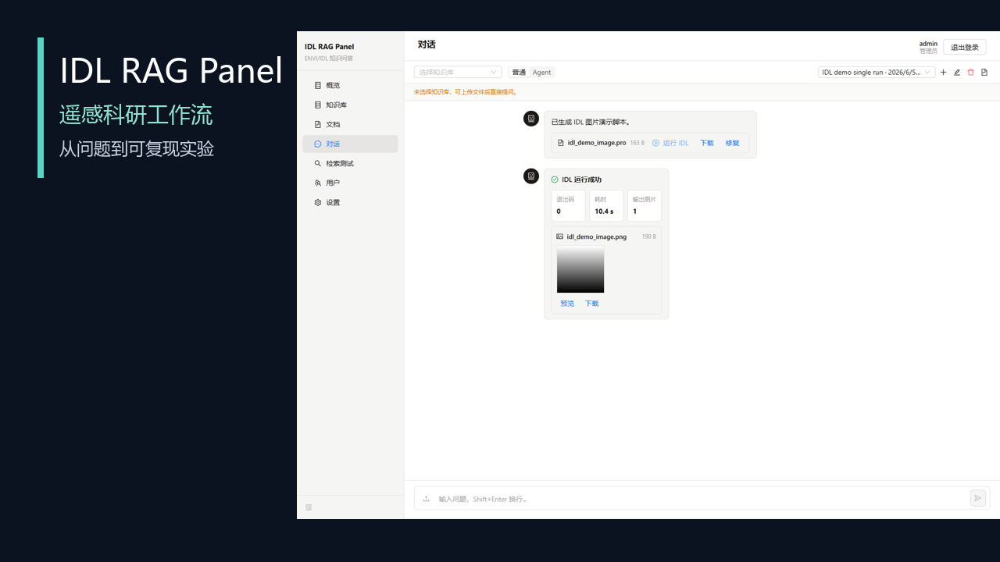
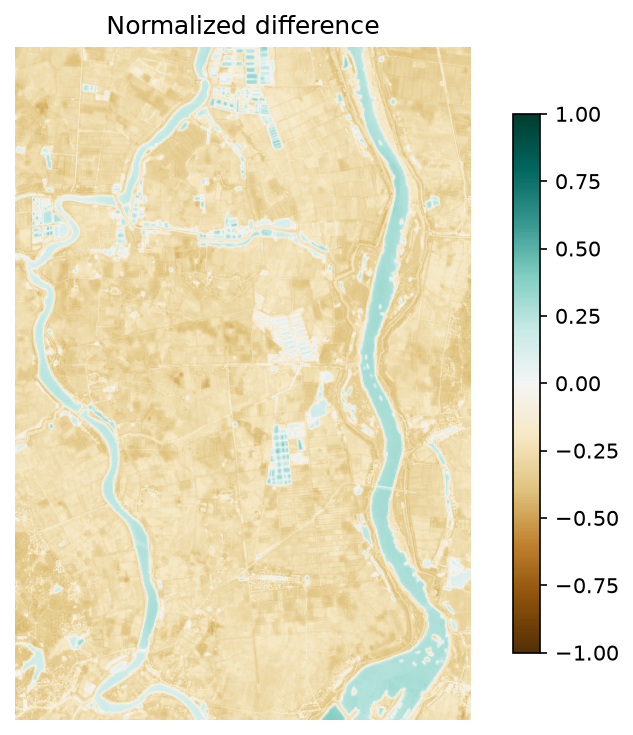
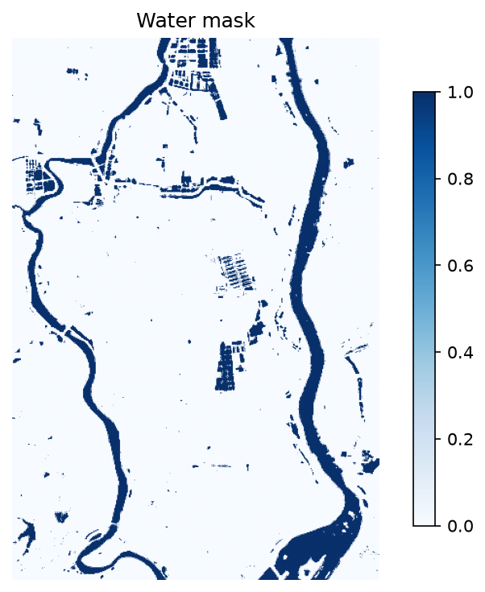

# IDL RAG Panel

语言版本：**中文** | [English](./README.en-US.md)

**把论文、遥感资料和 IDL/Python 实验放进同一个可复现工作流**

上传自己的资料，向 Agent 提问，生成并运行实验代码，查看引用、日志和每个处理阶段的影像结果。

<p align="center">
  
</p>

## Demo

这段视频展示完整的平台操作路径：进入工作台、管理知识库、使用 Agent 对话、查看检索证据、运行脚本并回看结果。

<video controls muted loop playsinline poster="./docs/assets/demos/idl-rag-panel-demo-poster.png" width="900">
  <source src="./docs/assets/demos/idl-rag-panel-demo.mp4" type="video/mp4">
</video>

[下载或打开平台演示视频](./docs/assets/demos/idl-rag-panel-demo.mp4)

## What you can do

- **整理研究资料：** 将论文、遥感文档、IDL `.pro` 文件和 Python 代码放入可检索的知识库。
- **带依据地提问：** Agent 返回引用、代码片段和检索位置，方便老师或同学复核。
- **生成实验代码：** 根据资料和问题生成 IDL 或 Python 处理脚本，不需要先选择固定模板。
- **运行并查看结果：** 使用本地 IDL 或 Python/GDAL 执行 preview，查看日志、阶段影像和输出文件。
- **比较检索效果：** 在检索测试页查看候选片段、分数、策略和原始元数据。
- **管理私有数据：** 每个用户可以上传自己的资料和遥感数据，项目运行产物保留在本地。

## 一个真实工作流

以 MNDWI 水体提取为例，平台中的一次任务会经历：

```text
研究问题
  -> 检索论文、遥感资料与代码
  -> 确认数据和公式
  -> Agent 生成 Python / IDL 脚本
  -> 用户确认后执行 preview
  -> 查看阶段影像、日志和 GeoTIFF
  -> 保存运行记录，继续修改公式或参数
```

实际运行产生的阶段影像：

<p align="center">
  
  
</p>

这两张图是工作流的输出示例，不是平台演示视频的替代品。完整运行记录见 [`docs/agent-demo-result.md`](./docs/agent-demo-result.md)。

## 页面一览

<table>
  <tr>
    <td></td>
    <td></td>
  </tr>
  <tr>
    <td align="center">工作台：资料、索引与运行状态</td>
    <td align="center">对话：生成脚本并查看运行结果</td>
  </tr>
  <tr>
    <td></td>
    <td></td>
  </tr>
  <tr>
    <td align="center">知识库：论文、遥感资料和 IDL 代码</td>
    <td align="center">检索测试：候选片段与分数</td>
  </tr>
</table>

## Install

需要 Python 3.12、Node.js 18+ 和 `uv`。在项目目录执行：

```powershell
Copy-Item .env.example .env
uv sync --project backend
npm install --prefix frontend
```

分别启动后端和前端：

```powershell
uv run --project backend uvicorn app.main:app --app-dir backend --reload
```

```powershell
npm run dev --prefix frontend
```

打开 <http://127.0.0.1:5173>，注册账号后即可创建知识库。需要容器部署时，执行 `docker compose up --build`。

## Research boundary

- 平台负责检索、代码生成、受控执行和结果记录；公式是否合理、样本是否具有代表性以及结论是否成立，仍由研究者确认。
- 本地 IDL 是可选兼容层。没有 IDL 环境时，仍可以使用 Python/GDAL 完成主要遥感实验。
- 私有资料和运行数据默认保存在本地 `data/`，不会随代码提交到仓库。

## Docs

- [研究工作流说明](./docs/research-workflow-platform-plan.md)
- [本地演示步骤](./docs/demo.md)
- [真实案例记录](./docs/real-research-case-poyang.md)
- [配置与数据控制](./docs/configuration.md) · [安全说明](./docs/security-and-data-control.md)
- [项目展示页](./docs/project-showcase.md)
