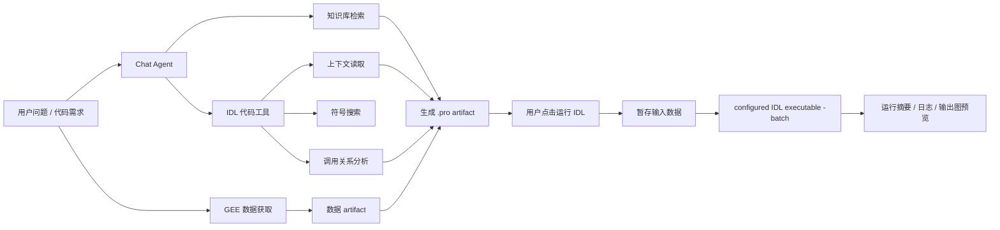
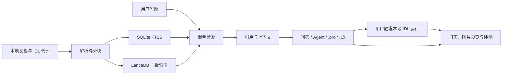
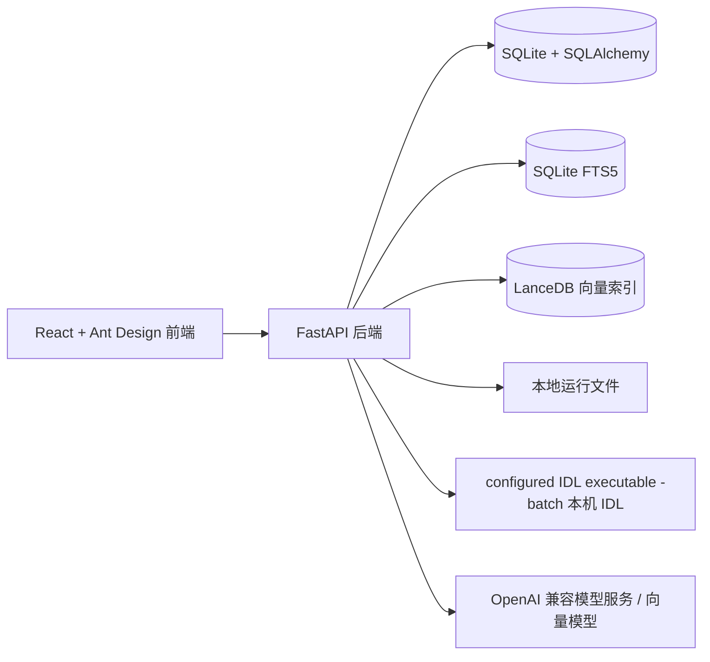

# IDL RAG Panel

语言版本：**中文** | [English](./README.en-US.md)

<div align="center">

**从论文与 RAG 出发，把遥感问题推进到可复现的 Python/IDL 实验**

一个面向老师、学生和研究小组的本地优先科研工作流平台：检索依据、冻结数据、编写公式、运行 preview、查看阶段影像，并把每一步留在可审计的 Run 记录里。

<a href="#真实科研案例鄱阳湖-mndwi-preview">观看真实演示</a> ·
<a href="./docs/agent-demo-result.md">查看任务结果</a> ·
<a href="#快速开始">开始运行</a>

</div>

IDL RAG Panel 是一个面向 ENVI/IDL 文档、代码和课程资料的本地优先 RAG 工作台。它把分散在本地的 PDF、Markdown、文本和 `.pro` / `.idl` 代码整理成可检索的知识库，并提供带引用的问答、检索调试、Agent 工具调用、`.pro` 文件生成、本地 IDL 运行和检索效果评测。

这个项目的重点不是做一个通用聊天界面，而是解决 ENVI/IDL 学习、实验和项目开发中常见的三个问题：资料难找、代码上下文难追踪、回答缺少可验证来源。

## 项目特色

| 特色 | 说明 |
|---|---|
| ENVI/IDL 垂直场景 | 面向遥感、ENVI/IDL 学习资料、实验文档和 `.pro` / `.idl` 代码，而不是通用文档聊天。 |
| 本地优先 RAG | 使用 SQLite、SQLite FTS5 和 LanceDB 构建本地知识库，不依赖外部数据库服务。 |
| IDL 符号级分块 | 对 IDL 代码按 procedure/function 等符号边界分块，尽量保留代码语义上下文。 |
| 可追溯回答 | 回答中展示引用来源、检索策略、分数、行号范围和元数据，便于检查依据。 |
| 检索调试工作台 | RetrievalLab 可对比不同检索策略，查看候选 chunk、score、metadata 和 raw JSON。 |
| 效果评测 | 支持本地 golden QA、策略对比、命中率、MRR、延迟和 LangSmith 相关评测配置。 |
| 代码辅助 | Agent 模式支持符号搜索、上下文读取、调用关系分析和 `.pro` 文件生成。 |
| GEE 数据获取 | Chat 中可通过结构化表单从 Google Earth Engine 获取小范围数据，并保存为当前会话的本地 artifact。 |
| 本地 IDL 运行 | 对话中生成或保存的 `.pro` artifact 可由用户主动点击运行，后端通过配置的命令行 IDL 批处理入口调用本机 IDL，并返回运行摘要、日志和输出图预览；Workbench/ENVI GUI 启动器会被拒绝。 |

## 页面预览

### 对话与引用


### 检索测试


### 知识库与文档管理


更多页面截图：

- [概览页](./docs/assets/screenshots/dashboard.png)
- [文档页](./docs/assets/screenshots/documents.png)
- [设置页](./docs/assets/screenshots/settings.png)

完整展示说明见 [`docs/project-showcase.md`](./docs/project-showcase.md)。

## 真实科研案例：鄱阳湖 MNDWI preview

下面不是 mock 截图，而是一次使用本地 `gemin2api` 完成的真实 Agent 工作流。Agent 从项目上下文和冻结快照出发，在授权后创建 Python preview，排队交给本地 ResearchRunService worker 执行，并生成 GeoTIFF、阶段 PNG 和运行清单。

### 实际执行链路

```text
项目上下文
  -> 数据目录与冻结快照
  -> MNDWI 公式
  -> Python preview(confirm=true)
  -> queued
  -> local worker
  -> 指数图 / 水体分类图 / GeoTIFF / run manifest
```

### 8 秒演示视频

<video controls muted loop playsinline poster="./docs/assets/demos/poyang-mndwi-preview-feature.png" width="720">
  <source src="./docs/assets/demos/poyang-agent-demo.mp4" type="video/mp4">
</video>

[打开或下载演示视频](./docs/assets/demos/poyang-agent-demo.mp4)

本次真实演示使用：

| 项目 | 结果 |
|---|---|
| 模型 | `gemini-3.6-flash` via `http://127.0.0.1:8081/v1` |
| 数据 | Sentinel-2 B03/B11、Sentinel-1 VV、WorldCover 代理参考 |
| 公式 | `MNDWI = (B03 - B11) / (B03 + B11)` |
| preview 1 | 阈值 `0.0`，Run 3，`completed` |
| preview 2 | 阈值 `0.15`，Run 4，`completed` |
| Agent 任务集 | 10 个任务，8 个通过工具契约，2 个 `needs_review`，0 个程序异常 |

### 阶段影像

指数图：


水体分类图：


这两张图来自真实 Run 产物。需要注意：本次 preview 没有声明 `reference_asset_id` 或 `sample_validation`，因此生成了阶段影像和清单，但没有虚构验证指标。平台会把这一点明确标记出来，不会把 preview 当作 formal 结论。

完整执行记录、任务验收和科学边界见 [`docs/agent-demo-result.md`](./docs/agent-demo-result.md)。任务定义见 [`backend/tests/eval/agent_research_tasks.json`](./backend/tests/eval/agent_research_tasks.json)。

### 三个演示用例

| 用例 | 直接输入 | 用户能看到的结果 |
|---|---|---|
| 老师审阅研究依据 | “检索 MNDWI 方法，区分项目 RAG、外部候选和待核验内容。” | 引用、候选论文、适用条件、限制和人工核验清单。 |
| 学生测试公式候选 | “把 MNDWI 阈值从 0.0 改为 0.15，创建 Python preview 并展示阶段图。” | 公式参数、冻结快照、queued/running/completed 状态、指数图和分类图。 |
| 研究小组准备正式实验 | “比较 SAR VV 与 MNDWI，但不要把代理参考写成同期真值。” | 单位转换、可比性检查、证据包状态和不能自动推出的科学结论。 |

这些用例都可以在同一个项目中复现。Agent 的授权、工具调用和科学边界会写入 trace，而不是只显示一段无法追溯的自然语言。

## 核心能力

| 模块 | 能力 |
|---|---|
| 认证与用户 | 注册、登录、管理员用户管理、知识库和会话按用户隔离。 |
| 知识库 | 创建知识库，配置默认检索策略、`top_k` 和重排开关。 |
| 文档入库 | 上传文件、路径导入、SHA256 去重、失败重试、重建索引和状态跟踪。 |
| IDL 分块 | 普通文本按段落分块，IDL 代码按 procedure/function 等符号边界分块。 |
| 混合检索 | SQLite FTS5 关键词检索、LanceDB 向量检索、RRF 融合和可选重排。 |
| 对话问答 | 流式回答、引用展示、检索策略展示、Agent 模式、GEE 数据获取、`.pro` 文件生成、本地 IDL 运行和图片结果展示。 |
| 检索测试 | 对比策略，查看候选 chunk、分数、元数据、匹配信息和原始 JSON。 |
| 评测 | 本地 golden QA、策略对比、命中率、精确率、召回率、MRR 和延迟统计。 |
| 设置 | 模型服务、API Key、对话模型、向量模型、重排模型和 LangSmith 配置。 |

## Agent 能力

Chat 中的 Agent 模式不是单纯把问题交给大模型生成回答，而是围绕当前知识库、IDL 代码结构和本地运行环境组织一个可验证的代码工作流。

| 能力 | 说明 |
|---|---|
| 知识库检索 | 根据用户问题检索当前选中的知识库，并把引用来源、chunk 分数和行号范围带回回答。 |
| IDL 代码工具 | 支持符号搜索、上下文读取、调用方/被调用方分析、代码片段检查等工具调用，用于追踪 `.pro` / `.idl` 文件结构。 |
| GEE 数据 artifact | 用户可通过结构化参数从 GEE 获取小范围遥感数据，后端保存为当前会话 artifact，并可作为 IDL 输入数据。 |
| `.pro` artifact 生成 | Agent 可以基于检索资料、代码上下文和已选 GEE 数据生成 `.pro` 文件，并以 Chat artifact 形式保存、下载和继续运行。 |
| 本地 IDL 执行 | 用户点击“运行 IDL”后，后端为当前 artifact 生成独立 run 目录，暂存输入数据，并通过配置的 `<executable> -batch` 执行完整 `.pro` 文件。 |
| 结果回传 | 执行完成后，Chat 会追加运行摘要、退出码、耗时、stdout/stderr 日志和 PNG/JPEG 等输出图预览。 |
| 安全边界 | Agent 不会自主执行任意 shell 命令，也不能运行任意本地路径；v1 只运行当前登录用户拥有的 Chat `.pro` artifact。 |



这条链路适合做 ENVI/IDL 学习资料问答、代码上下文追踪、脚本生成、运行验证和效果图展示。运行产物保存在 `data/generated/chat/**/runs/`，属于本地运行数据，不应提交到 Git。

## 核心页面

| 页面 | 用途 |
|---|---|
| 概览页 | 查看知识库数量、文档状态、索引任务、worker 状态和 fallback embedding 提示。 |
| 知识库页 | 创建和管理知识库，配置默认策略、`top_k` 和重排设置。 |
| 文档页 | 上传或导入文档，查看入库状态、chunk 数量、解析器信息，执行重试和重建。 |
| 对话页 | 选择知识库提问，查看引用、检索策略、Agent 执行结果和生成文件。 |
| 检索测试页 | 对同一问题运行不同检索策略，检查候选 chunk、分数和元数据。 |
| 研究工作流页 | 建立私有研究项目，冻结数据/公式，执行 M1–M3 Python 实验，审阅阶段影像、验证指标和证据包。 |
| 设置页 | 配置模型服务，测试连接，运行本地评测，查看评测报告。 |

## 工作流程



## 技术架构



完整架构说明见 [`ARCHITECTURE.md`](./ARCHITECTURE.md) 和 [`docs/architecture.md`](./docs/architecture.md)。

## 已确认的演进规划

当前项目已具备“遥感研究工作流平台”的首个可运行切片：登录用户可建立私有研究项目、按用户名邀请无教师/学生角色分级的协作成员，也可在不选模板的情况下把自然语言研究问题生成一份**仅本地、可编辑且须手动保存**的协议草案；该预填步骤不会调用 RAG、外部检索或模型。每次内容变化的协议保存都会产生项目内单调递增的版本、规范化 JSON 和 SHA-256；每个新建实验关联当前协议版本并固定快照，正式实验需要已保存研究问题，运行与证据包始终使用该实验版本，后续项目编辑不会改写历史记录。用户可以上传本地私有 GeoTIFF、受控获取 GEE 数据，或通过白名单 STAC 搜索后显式下载、裁剪、可选重采样并校验为私有 GeoTIFF；同一项目内的 B03/B11 等私有波段还可以按参考 CRS、仿射变换和分辨率显式对齐成新的多波段 GeoTIFF，再冻结为数据快照、关联方法证据、登记/冻结公式并运行 Python 地理空间实验。项目成员可将自己拥有的论文/方法、IDL 代码或 Python 代码知识库显式绑定到项目，再在项目内检索带引用的文本；影像、样本和 ROI 始终只作为 Data Catalog 资产。PythonRunner 已实现 M1 光学归一化差分、M2 SAR 阈值、M3 可解释的 optical/SAR 融合、M4 的透明 Otsu 自适应阈值候选，以及供反射率/指数研究假设使用的安全声明式波段数学：它只接受同一私有栅格中已声明的波段、有限参数和白名单数学运算，不能执行任意 Python 或读取验证标签。正式运行可生成阶段图、不确定性/验证误差图、指标、确定性的 review-first Markdown 报告和不含原始私有数据的 Research Evidence Package；报告会明确列出研究问题、冻结上下文、验证结果、限制及“不能自动证明科学优越性”的结论边界。证据包可在页面下载并进行外层/内部 SHA-256、运行清单和生成产物摘要校验；同一冻结 formal 实验可以选择另一次已完成运行，在页面按绝对/相对容差比较 GeoTIFF、JSON 和其他产物，明确报告一致、超差像元和冻结上下文差异。项目页还可逐条登记，或以受限的私有 CSV 原子批量导入带来源、时间、标注人、置信度、时空分层、独立测试划分和冲突状态的人工验证样本；正式点样本验证会检查总体及每个空间块/时间分层的协议下限。本地 IDL/ENVI 导出的 GeoTIFF 可作为私有 `derived` 资产在同一次 Python Run 中做分类或连续变量数值对照，输出差异图、NoData/网格检查与统计报告；该 IDL 结果是实现对照，不是独立真值。平台还提供带审计的 Crossref/OpenAlex 文献元数据搜索和白名单 STAC 数据发现/私有导入；搜索结果不会自动进入 RAG，但用户明确选择已绑定的 `method` 知识库后，可将有公开摘要的候选以 `abstract_only` 记录导入项目 RAG；STAC 远端引用不能直接运行，只有下载成私有 `research://assets/` 后才能创建快照和进入 Runner。IDL/ENVI 仍是可选兼容和教学对照层，未配置时不会阻断 Python。

这不是整个 V1 的完成声明：本地协议草案不等于由 RAG/Agent 完成的研究设计；已实现的项目 RAG 证据映射也只保留待人工核验的引用，仍需研究者补全、保存并在正式运行前冻结。真实研究的分层方案代表性、设计权重/误差调整与置信区间、真实受许可 IDL/ENVI 节点现场验收、队列/容器真实启动和组织共享仍在后续范围内。完整研究协议、系统边界、首个鄱阳湖水体制图模板和技术路线见 [`docs/research-workflow-platform-plan.md`](./docs/research-workflow-platform-plan.md)；设计摘要见 [`DESIGN.md`](./DESIGN.md)。

开放研究的 preview 实验还支持“候选参数实验”：用户可以提交 2–20 个阈值或公式参数候选，只在 development/model_selection 样本上比较 OA、Precision、Recall、F1 或 IoU，并保存每个候选的图件、指标、排序和失败原因。它既可立即运行，也可交给研究 worker 队列，并支持取消、超时回收和独立重试。该功能明确隔离 independent_test，不自动冻结 FormulaSpec，也不把探索排名当作正式科学结论。正式运行之间还可以选择同一冻结快照和相同验证方案的基线/候选 Run，输出 OA、Precision、Recall、F1、IoU 的“候选 − 基线”描述性 delta；快照、验证设计或运行模式不兼容时会拒绝比较，delta 不代表统计显著性。正式点样本验证还可声明互斥的分层面积调整方案，从样本元数据读取分层面积，输出面积调整混淆矩阵、面积 OA/F1/IoU、参考/预测正类面积和面积绝对误差；它会检查分层覆盖与面积一致性，但不会伪造复杂抽样设计的置信区间。

研究协议页还提供只读的协议就绪检查，会按路径列出研究问题、假设、ROI、日期、冻结快照、可信证据、时空验证、图件契约和结论边界的缺项；完整协议会返回版本 ID 与指纹，预览实验不会被该检查阻断。外部文献助手现在可在 Crossref、OpenAlex 与 Semantic Scholar 之间选择，候选结果会记录搜索审计；对 Semantic Scholar 候选还可以展开引用/参考文献关系，关系结果仍是带独立审计的候选，不会自动进入 RAG 或成为已核验方法依据；用户明确导入的摘要仍标记为候选，全文和许可需要人工核对。

聊天 Agent 还可以显式绑定一个研究项目，使用只读的项目摘要、项目 RAG 检索、未持久化协议草案和协议就绪检查工具；项目成员权限会在服务端重新验证，工具不会返回原始影像路径、凭据或私有 URI。外部文献搜索默认关闭，只有用户主动打开允许开关后才会向公开元数据接口发送查询词，且不会自动运行实验、修改协议或导入 RAG。

在用户明确打开“允许 Agent 预览执行”并提出执行请求后，Agent 可以读取安全的数据目录和运行摘要，并在当前项目已有公式规格/数据快照上创建、再排队一个受控的 Python preview；服务端会再次拒绝 formal、parameter sweep、IDL、跨项目或未确认的任务。Agent 不会修改公式/协议、读取原始像元或直接产生正式结论。研究者仍需在研究页审阅参数、阶段图件和证据包。

用户还可以单独打开“允许 Agent 获取 GEE”。在明确提出获取请求并确认参数后，Agent 会复用 GEE 白名单和范围/尺度/下载限制，将结果登记为项目私有 DataAsset；它不会把像元或私有 URI返回给模型，也不会自动冻结 DataSnapshot、创建实验或启动 Runner。

V1 的可观察验收门槛、自动化证据要求与首个真实研究模板的完成定义见 [`docs/v1-acceptance.md`](./docs/v1-acceptance.md)。

Agent 的真实科研测试集和老师演示脚本见 [`docs/agent-research-task-suite.md`](./docs/agent-research-task-suite.md)；任务数据位于 [`backend/tests/eval/agent_research_tasks.json`](./backend/tests/eval/agent_research_tasks.json)，可用 `backend/scripts/validate_agent_task_suite.py` 做离线结构校验。

后端模块级的接口、服务边界和栅格对齐契约见 [`backend/app/README.md`](./backend/app/README.md) 与 [`backend/app/DESIGN.md`](./backend/app/DESIGN.md)。

真实 Sentinel-2 B03/B11 搜索、下载、对齐和 MNDWI 预览的现场工程记录见 [`docs/real-data-validation-record.md`](./docs/real-data-validation-record.md)。

已完成的第一条真实研究案例见 [`docs/real-research-case-poyang.md`](./docs/real-research-case-poyang.md)：它记录了 Planetary Computer Sentinel-2 B03/B11、Sentinel-1 RTC VV（线性功率到 dB）、ESA WorldCover 代理参考、10 m 同网格对齐、正式 PythonRunner、阶段影像、验证指标、光学/SAR formal comparison 和两份证据包；上传资产还会保存受限 provenance metadata（来源单位、转换公式、重采样和目标网格），真实运行中发现的分辨率、CRS、派生资产类型和 SAR 单位问题及修复见 [`docs/real-case-issues.md`](./docs/real-case-issues.md)。

## 技术栈

| 层级 | 技术 |
|---|---|
| 后端 | Python 3.12, FastAPI, Uvicorn, SQLAlchemy, Pydantic |
| 存储 | SQLite, SQLite FTS5, LanceDB, PyArrow |
| RAG | 混合 RRF、可选重排、多查询、父子块检索、代码工具检索 |
| 模型接口 | OpenAI 兼容对话模型 / 向量模型服务 |
| 前端 | React 18, TypeScript, Vite, Ant Design 5, TanStack React Query |
| 测试 | pytest, ruff, 前端构建 |

## 适合与不适合

适合：

- 本地 ENVI/IDL 资料整理和检索。
- 实验室或小团队内部知识库验证。
- 个人作品集和 RAG 工程能力展示。
- 需要引用来源、检索调试和效果评测的 RAG 场景。
- 希望保留本地数据控制权的私有知识库应用。

不适合直接作为：

- 面向公网的大规模多租户 SaaS。
- 海量文档集群检索系统。
- 无需人工审查即可公开上传私有资料的托管平台。
- 完全离线模型系统；当前仍依赖外部或本地 OpenAI 兼容模型服务提供生成和向量能力。

## 当前边界

- 默认使用 SQLite，本地部署和小团队验证更方便；大规模并发需要进一步改造存储和任务队列。
- 向量检索质量依赖实际配置的 embedding provider。
- `data/app.db` 中的敏感字段会加密存储，但数据库文件本身仍属于本地运行数据。
- GEE 对接第一版只支持结构化参数的小范围数据获取，不接受任意 Earth Engine Python/JavaScript 代码；下载数据保存为 `data/generated/chat/**/gee/` 下的本地 artifact，不应提交到 Git。
- 本地 IDL 运行只针对当前用户拥有的 Chat `.pro` artifact，由用户主动触发；后端生成 `__idlrag_runner.pro` 并通过配置的 IDL 批处理入口执行，运行日志和输出图保存在 `data/generated/chat/**/runs/`，不应提交到 Git。
- 截图和展示材料使用公开合成数据，不包含私人学习文件、真实 API Key、GEE 凭据或本地数据库。

## 项目结构

```text
idl-rag/
  backend/
    app/
      api/              # FastAPI 路由与依赖
      core/             # 配置、认证 token、密码与密钥工具
      db/               # SQLAlchemy 模型与 SQLite/FTS 初始化
      services/         # 入库、检索、向量、模型、Agent、评测服务
      main.py           # FastAPI 应用与内嵌 worker 生命周期
      index_worker.py   # 可选的独立文档索引 worker 入口
    tests/              # 后端测试与 golden eval 数据
    pyproject.toml

  frontend/
    src/
      api/              # API 客户端与类型
      pages/            # 概览、知识库、文档、对话、检索测试、设置
      styles/           # 应用级样式
      App.tsx
      main.tsx
    package.json

  docs/
    architecture.md
    agent-demo-result.md
    configuration.md
    demo.md
    assets/demos/       # 脱敏的真实 preview 阶段影像
    project-showcase.md
    security-and-data-control.md

  .env.example          # 公开配置模板，不包含真实密钥
  .gitignore            # 排除本地数据、密钥、缓存和构建产物
```

默认运行数据生成在 `data/` 目录下。`data/app.db`、`data/indexes/`、`data/logs/`、`data/generated/`、`data/parsed/` 和源文档都属于本地运行产物。

## 快速开始

### 1. 准备环境变量

```powershell
Copy-Item .env.example .env
```

本地开发最重要的配置如下：

```text
IDLRAG_AUTH_SECRET=replace-with-a-long-random-secret
IDLRAG_CORS_ORIGINS=http://127.0.0.1:5173,http://localhost:5173
IDLRAG_IDL_EXECUTABLE=idl
VITE_API_BASE_URL=http://127.0.0.1:8000/api
```

Windows ENVI/IDL 8.8 应把 `IDLRAG_IDL_EXECUTABLE` 设置为真正的命令行解释器，例如 `D:\envi5.6\ENVI56\IDL88\bin\bin.x86_64\idl.exe`。后端会使用配置的 `<executable> -batch <runner.pro>` 执行；`envi_idl.exe`、`idlde.exe` 是 Workbench/ENVI GUI 启动器，`idlrt.exe` 只能运行 SAV，项目 Runner 会拒绝这些入口，防止“进程退出但源码没有执行”被误报为成功。ENVI API 脚本仍需在 `.pro` 中按许可环境完成 batch 初始化。

如果需要使用 GEE 数据获取，需要先在 Google Cloud 项目中启用 Earth Engine API，并配置项目 ID 与认证方式。本地开发推荐 ADC 浏览器授权：

```powershell
uv run --project backend python -c "import ee; ee.Authenticate(auth_mode='localhost')"
```

然后在 `.env` 中启用：

```text
IDLRAG_GEE_ENABLED=true
IDLRAG_GEE_AUTH_MODE=adc
IDLRAG_GEE_PROJECT=your-google-cloud-project-id
```

如果未启用 Earth Engine API，初始化会提示该项目尚未使用或未启用 `earthengine.googleapis.com`。完整配置和 smoke test 见 [`docs/configuration.md`](./docs/configuration.md#google-earth-engine-data-acquisition)。

### 2. 安装后端依赖

```powershell
uv sync --project backend
```

### 3. 启动后端

```powershell
uv run --project backend uvicorn app.main:app --app-dir backend --reload
```

默认后端地址：

```text
http://127.0.0.1:8000
```

### 4. 安装前端依赖

```powershell
npm install --prefix frontend
```

### 5. 启动前端

```powershell
npm run dev --prefix frontend
```

默认前端地址：

```text
http://127.0.0.1:5173
```

## Docker Compose（Python-first 工作流）

容器化部署包含 Web、Python API 和独立的文档/研究运行 worker；SQLite、索引、上传的私有研究资产、运行产物和 worker 心跳位于命名卷 `idl_rag_data`。API 在 Compose 中关闭内嵌索引线程，worker 使用同一个后端镜像和数据卷运行 `app.index_worker`，并且只有在 heartbeat 状态为 `running` 且时间新鲜时才会通过容器 healthcheck；Web 会等待 API 和 worker 均 healthy 后启动，因此可以单独重启和监控。研究页的“加入后台队列”会由同一 worker 消费，立即运行模式仍可用于短预览。IDL/ENVI 不会被打入镜像，因为它依赖宿主机许可；项目级 IDLRunner 在宿主机/内部受许可节点上运行，核心 Python 容器不承担 IDL 许可。

```powershell
Copy-Item .env.example .env
# 编辑 .env，将 IDLRAG_AUTH_SECRET 替换成长随机值
docker compose up --build
```

打开 `http://127.0.0.1:8080`。浏览器请求 `/api` 会由 Web 容器代理到 API，因此不必在镜像中写入后端地址或跨域密钥。停止服务不会删除命名卷；如需删除所有本地应用数据，须由管理员明确执行 `docker compose down -v`。

现场验收时应看到 API、worker、Web 均为 `healthy/running`，并分别检查：

```powershell
docker compose ps
Invoke-WebRequest http://127.0.0.1:8080/api/health
Invoke-WebRequest http://127.0.0.1:8080/api/ready
docker compose logs --tail=100 worker
```

在本仓库当前验证环境中，Compose 配置已通过 `docker compose config` 解析；API 同时提供 `/api/health`（进程 liveness）和 `/api/ready`（数据库与独立 worker readiness）。Docker Desktop 的 Linux daemon 未启动，因此尚未在本机执行镜像构建或启动验证。

## 本地演示路径

1. 打开前端页面并注册或登录。
2. 进入设置页面，配置 OpenAI 兼容模型服务、对话模型和向量模型。若使用 Ollama/LM Studio 等本机服务，可将地址设为 `http://127.0.0.1:11434/v1` 或 `http://localhost:1234/v1`，并把 provider 标为 `ollama`/`local`；本机 Agent 工具循环不要求云端 API Key。
3. 创建知识库。
4. 上传或导入公开、脱敏的 ENVI/IDL 文档。
5. 等待文档状态变为 `ready`。
6. 进入对话页面，选择知识库并提问。
7. 可选：配置 GEE 后，点击“获取 GEE 数据”，下载小范围遥感数据并作为 IDL 输入 artifact。
8. 开启 `.pro` 文件生成，让 Agent 基于检索资料和已选输入数据生成 IDL 脚本。
9. 点击“运行 IDL”查看执行摘要、stdout/stderr 日志和输出图片预览。
10. 查看回答中的引用来源、检索策略和行号范围。
11. 进入检索测试页面，对比不同检索策略的候选结果。
12. 在设置页面查看本地评测报告。

更完整的演示步骤见 [`docs/demo.md`](./docs/demo.md)。

如果要复现上面的真实 Agent 案例，请先准备一份案例数据库副本，再把本地 `gemin2api` 配置为 OpenAI-compatible endpoint：

```powershell
backend/.venv/Scripts/python.exe backend/scripts/run_agent_task_suite.py `
  --base-dir E:\desktop\idl-rag\.tmp-agent-gemin2api-case `
  --api-base-url http://127.0.0.1:8081/v1 `
  --api-key sk-gemini `
  --model gemini-3.6-flash `
  --output-dir E:\desktop\idl-rag\.tmp-agent-gemin2api
```

任务 trace 和契约汇总会写入 `--output-dir`。preview 队列由独立 worker 执行；完成后可用 [`aggregate_agent_task_runs.py`](./backend/scripts/aggregate_agent_task_runs.py) 汇总最新结果。完整参数、worker 命令和限制见 [`docs/agent-research-task-suite.md`](./docs/agent-research-task-suite.md)。

## 配置与安全说明

后端通过 `backend/app/core/config.py` 读取环境变量默认值。运行时模型设置和服务密钥由 `backend/app/services/settings_service.py` 管理；敏感值通过 `backend/app/core/security.py` 加密后写入本地数据库。

加密可以保护本地运行存储中的敏感字段，但 `data/app.db` 仍然属于本地应用数据。配置细节见 [`docs/configuration.md`](./docs/configuration.md)，数据控制规则见 [`docs/security-and-data-control.md`](./docs/security-and-data-control.md)。

## 验证命令

运行后端重点测试：

```powershell
uv run --project backend pytest backend/tests/test_retrieval_strategies.py backend/tests/test_agent_service.py
uv run --project backend pytest backend/tests/test_eval_golden_qa.py backend/tests/test_eval_metrics.py backend/tests/test_evaluation_api.py
```

构建前端：

```powershell
npm run build --prefix frontend
```
