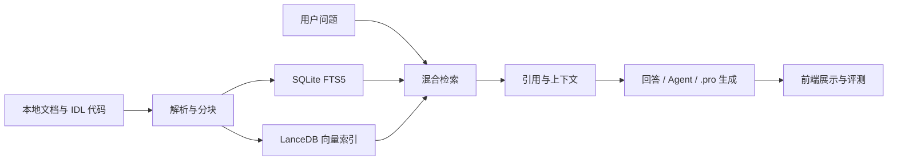
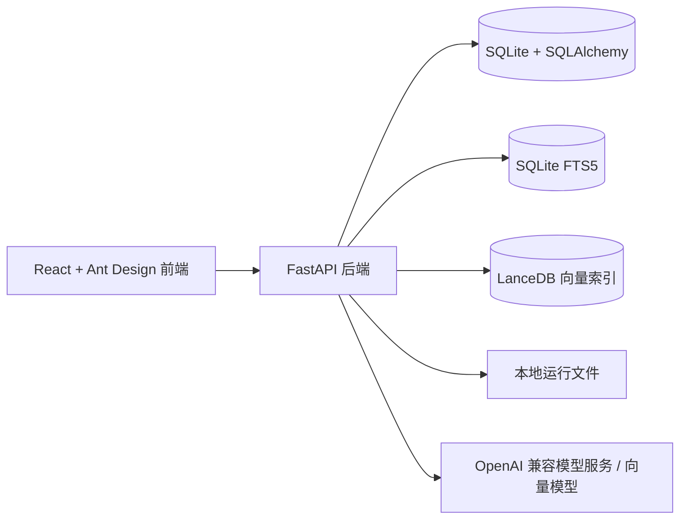

# IDL RAG Panel

语言版本：**中文** | [English](./README.en-US.md)

IDL RAG Panel 是一个面向 ENVI/IDL 文档、代码和课程资料的本地优先 RAG 工作台。它把分散在本地的 PDF、Markdown、文本和 `.pro` / `.idl` 代码整理成可检索的知识库，并提供带引用的问答、检索调试、Agent 工具调用、`.pro` 文件生成和检索效果评测。

这个项目的重点不是做一个通用聊天界面，而是解决 ENVI/IDL 学习、实验和项目开发中常见的三个问题：资料难找、代码上下文难追踪、回答缺少可验证来源。

## 项目特色

| 特色 | 说明 |
|---|---|
| ENVI/IDL 垂直场景 | 面向遥感、ENVI/IDL 学习资料、实验文档和 `.pro` / `.idl` 代码，而不是通用文档聊天。 |
| 本地优先 RAG | 使用 SQLite、SQLite FTS5 和 LanceDB 构建本地知识库，不依赖外部数据库服务。 |
| IDL 符号级分块 | 对 IDL 代码按 procedure/function 等符号边界分块，尽量保留代码语义上下文。 |
| 可追溯回答 | 回答中展示引用来源、检索策略、分数、行号范围和元数据，便于检查依据。 |
| 检索调试工作台 | RetrievalLab 可对比不同检索策略，查看候选 chunk、score、metadata 和 raw JSON。 |
| 效果评测 | 支持本地 golden QA、策略对比、命中率、MRR、延迟和 LangSmith 相关评测配置。 |
| 代码辅助 | Agent 模式支持符号搜索、上下文读取、调用关系分析和 `.pro` 文件生成。 |

## 页面预览

### 对话与引用


### 检索测试


### 知识库与文档管理


更多页面截图：

- [概览页](./docs/assets/screenshots/dashboard.png)
- [文档页](./docs/assets/screenshots/documents.png)
- [设置页](./docs/assets/screenshots/settings.png)

完整展示说明见 [`docs/project-showcase.md`](./docs/project-showcase.md)。

## 核心能力

| 模块 | 能力 |
|---|---|
| 认证与用户 | 注册、登录、管理员用户管理、知识库和会话按用户隔离。 |
| 知识库 | 创建知识库，配置默认检索策略、`top_k` 和重排开关。 |
| 文档入库 | 上传文件、路径导入、SHA256 去重、失败重试、重建索引和状态跟踪。 |
| IDL 分块 | 普通文本按段落分块，IDL 代码按 procedure/function 等符号边界分块。 |
| 混合检索 | SQLite FTS5 关键词检索、LanceDB 向量检索、RRF 融合和可选重排。 |
| 对话问答 | 流式回答、引用展示、检索策略展示、Agent 模式和 `.pro` 文件生成。 |
| 检索测试 | 对比策略，查看候选 chunk、分数、元数据、匹配信息和原始 JSON。 |
| 评测 | 本地 golden QA、策略对比、命中率、精确率、召回率、MRR 和延迟统计。 |
| 设置 | 模型服务、API Key、对话模型、向量模型、重排模型和 LangSmith 配置。 |

## 核心页面

| 页面 | 用途 |
|---|---|
| 概览页 | 查看知识库数量、文档状态、索引任务、worker 状态和 fallback embedding 提示。 |
| 知识库页 | 创建和管理知识库，配置默认策略、`top_k` 和重排设置。 |
| 文档页 | 上传或导入文档，查看入库状态、chunk 数量、解析器信息，执行重试和重建。 |
| 对话页 | 选择知识库提问，查看引用、检索策略、Agent 执行结果和生成文件。 |
| 检索测试页 | 对同一问题运行不同检索策略，检查候选 chunk、分数和元数据。 |
| 设置页 | 配置模型服务，测试连接，运行本地评测，查看评测报告。 |

## 工作流程



## 技术架构



完整架构说明见 [`ARCHITECTURE.md`](./ARCHITECTURE.md) 和 [`docs/architecture.md`](./docs/architecture.md)。

## 技术栈

| 层级 | 技术 |
|---|---|
| 后端 | Python 3.12, FastAPI, Uvicorn, SQLAlchemy, Pydantic |
| 存储 | SQLite, SQLite FTS5, LanceDB, PyArrow |
| RAG | 混合 RRF、可选重排、多查询、父子块检索、代码工具检索 |
| 模型接口 | OpenAI 兼容对话模型 / 向量模型服务 |
| 前端 | React 18, TypeScript, Vite, Ant Design 5, TanStack React Query |
| 测试 | pytest, ruff, 前端构建 |

## 适合与不适合

适合：

- 本地 ENVI/IDL 资料整理和检索。
- 实验室或小团队内部知识库验证。
- 个人作品集和 RAG 工程能力展示。
- 需要引用来源、检索调试和效果评测的 RAG 场景。
- 希望保留本地数据控制权的私有知识库应用。

不适合直接作为：

- 面向公网的大规模多租户 SaaS。
- 海量文档集群检索系统。
- 无需人工审查即可公开上传私有资料的托管平台。
- 完全离线模型系统；当前仍依赖外部或本地 OpenAI 兼容模型服务提供生成和向量能力。

## 当前边界

- 默认使用 SQLite，本地部署和小团队验证更方便；大规模并发需要进一步改造存储和任务队列。
- 向量检索质量依赖实际配置的 embedding provider。
- `data/app.db` 中的敏感字段会加密存储，但数据库文件本身仍属于本地运行数据。
- 截图和展示材料使用公开合成数据，不包含私人学习文件、真实 API Key 或本地数据库。

## 项目结构

```text
idl-rag/
  backend/
    app/
      api/              # FastAPI 路由与依赖
      core/             # 配置、认证 token、密码与密钥工具
      db/               # SQLAlchemy 模型与 SQLite/FTS 初始化
      services/         # 入库、检索、向量、模型、Agent、评测服务
      main.py           # FastAPI 应用与索引 worker 生命周期
    tests/              # 后端测试与 golden eval 数据
    pyproject.toml

  frontend/
    src/
      api/              # API 客户端与类型
      pages/            # 概览、知识库、文档、对话、检索测试、设置
      styles/           # 应用级样式
      App.tsx
      main.tsx
    package.json

  docs/
    architecture.md
    configuration.md
    demo.md
    project-showcase.md
    security-and-data-control.md

  .env.example          # 公开配置模板，不包含真实密钥
  .gitignore            # 排除本地数据、密钥、缓存和构建产物
```

默认运行数据生成在 `data/` 目录下。`data/app.db`、`data/indexes/`、`data/logs/`、`data/generated/`、`data/parsed/` 和源文档都属于本地运行产物。

## 快速开始

### 1. 准备环境变量

```powershell
Copy-Item .env.example .env
```

本地开发最重要的配置如下：

```text
IDLRAG_AUTH_SECRET=replace-with-a-long-random-secret
IDLRAG_CORS_ORIGINS=http://127.0.0.1:5173,http://localhost:5173
VITE_API_BASE_URL=http://127.0.0.1:8000/api
```

### 2. 安装后端依赖

```powershell
uv sync --project backend
```

### 3. 启动后端

```powershell
uv run --project backend uvicorn app.main:app --app-dir backend --reload
```

默认后端地址：

```text
http://127.0.0.1:8000
```

### 4. 安装前端依赖

```powershell
npm install --prefix frontend
```

### 5. 启动前端

```powershell
npm run dev --prefix frontend
```

默认前端地址：

```text
http://127.0.0.1:5173
```

## 本地演示路径

1. 打开前端页面并注册或登录。
2. 进入设置页面，配置 OpenAI 兼容模型服务、对话模型和向量模型。
3. 创建知识库。
4. 上传或导入公开、脱敏的 ENVI/IDL 文档。
5. 等待文档状态变为 `ready`。
6. 进入对话页面，选择知识库并提问。
7. 查看回答中的引用来源、检索策略和行号范围。
8. 进入检索测试页面，对比不同检索策略的候选结果。
9. 在设置页面查看本地评测报告。

更完整的演示步骤见 [`docs/demo.md`](./docs/demo.md)。

## 配置与安全说明

后端通过 `backend/app/core/config.py` 读取环境变量默认值。运行时模型设置和服务密钥由 `backend/app/services/settings_service.py` 管理；敏感值通过 `backend/app/core/security.py` 加密后写入本地数据库。

加密可以保护本地运行存储中的敏感字段，但 `data/app.db` 仍然属于本地应用数据。配置细节见 [`docs/configuration.md`](./docs/configuration.md)，数据控制规则见 [`docs/security-and-data-control.md`](./docs/security-and-data-control.md)。

## 验证命令

运行后端重点测试：

```powershell
uv run --project backend pytest backend/tests/test_retrieval_strategies.py backend/tests/test_agent_service.py
uv run --project backend pytest backend/tests/test_eval_golden_qa.py backend/tests/test_eval_metrics.py backend/tests/test_evaluation_api.py
```

构建前端：

```powershell
npm run build --prefix frontend
```
