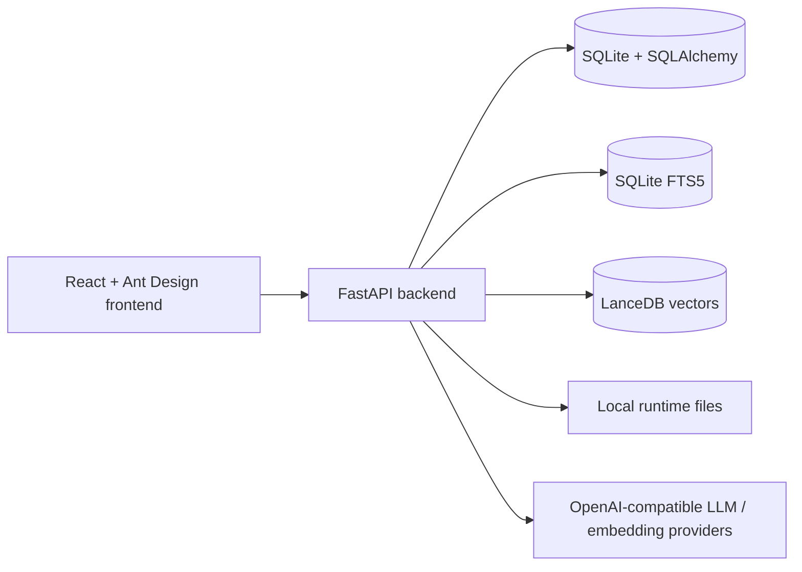

# IDL RAG Panel

IDL RAG Panel 是一个面向 ENVI/IDL 资料与代码场景的私有 RAG Web 应用。它用于把本地文档、课程材料、IDL/ENVI 代码和项目资料整理成知识库，并提供带引用的问答、检索调试、Agent 工具调用、`.pro` 文件生成和效果评测能力。

项目适合本地运行、实验室内网部署、个人作品展示和小团队知识库验证。仓库版本只应包含源码、文档和配置模板；真实 API Key、本地数据库、索引、日志、私有文档和未脱敏材料不要提交到 GitHub。

## 核心能力

- 多用户认证、管理员用户管理、知识库和会话按用户隔离。
- 知识库创建、文档上传、路径导入、文件去重、失败重试和重建索引。
- 支持 `.pdf`、`.md`、`.markdown`、`.txt`、`.pro`、`.idl` 文件。
- IDL/ENVI 专用分块：普通文本按段落分块，IDL 代码按 procedure/function 等符号边界分块。
- SQLite FTS5 关键词检索、LanceDB 向量检索、Hybrid RRF 融合和可选 rerank。
- 默认检索策略为 `hybrid_rrf_no_rerank`，用于在当前 benchmark 结果下获得更稳定的速度和效果平衡。
- Chat 页面展示回答、引用来源、retrieval policy 和生成的 `.pro` artifact。
- RetrievalLab 页面用于对比策略、查看候选 chunk、score、metadata 和 raw JSON。
- Settings 页面支持模型配置、连接测试、本地评测和 LangSmith 相关评测配置。
- 运行时敏感 key 通过设置服务加密存储；本地数据库仍属于运行数据，不应提交。

## 技术栈

### 后端

- Python 3.12
- FastAPI / Uvicorn
- SQLAlchemy / SQLite / SQLite FTS5
- LanceDB / PyArrow
- Pydantic / pydantic-settings
- httpx
- jieba
- cryptography
- pytest / ruff

### 前端

- React 18
- TypeScript
- Vite
- Ant Design 5
- TanStack React Query

## 项目结构

```text
idl-rag/
  backend/
    app/
      api/              # FastAPI routes and dependencies
      core/             # config, auth token, password and secret helpers
      db/               # SQLAlchemy models and SQLite/FTS initialization
      services/         # ingest, retrieval, embedding, LLM, agent, eval
      main.py           # FastAPI app and index worker lifecycle
    tests/              # backend tests and golden eval data
    pyproject.toml

  frontend/
    src/
      api/              # API client and types
      pages/            # Dashboard, KnowledgeBases, Documents, Chat, RetrievalLab, Settings
      styles/           # app-level CSS
      App.tsx
      main.tsx
    package.json

  docs/
    architecture.md
    configuration.md
    demo.md
    security-and-data-control.md

  .env.example          # public template only, no real secrets
  .gitignore            # excludes local data, secrets, caches and build output
```

Runtime data is generated under `data/` by default. `data/app.db`, `data/indexes/`, `data/logs/`, `data/generated/`, `data/parsed/` and source documents are local artifacts and are intentionally excluded from Git.

## Quick start

### 1. Prepare environment variables

Copy the template and fill local-only values:

```powershell
Copy-Item .env.example .env
```

For local development, the most important values are:

```text
IDLRAG_AUTH_SECRET=replace-with-a-long-random-secret
IDLRAG_CORS_ORIGINS=http://127.0.0.1:5173,http://localhost:5173
VITE_API_BASE_URL=http://127.0.0.1:8000/api
```

Do not commit `.env`.

### 2. Install backend dependencies

```powershell
uv sync --project backend
```

### 3. Start backend

```powershell
uv run --project backend uvicorn app.main:app --app-dir backend --reload
```

Default backend URL:

```text
http://127.0.0.1:8000
```

### 4. Install frontend dependencies

```powershell
npm install --prefix frontend
```

### 5. Start frontend

```powershell
npm run dev --prefix frontend
```

Default frontend URL:

```text
http://127.0.0.1:5173
```

## Demo flow

1. Open the frontend and register or log in.
2. Open Settings and configure an OpenAI-compatible provider, chat model and embedding model.
3. Create a knowledge base.
4. Upload or import ENVI/IDL documents.
5. Wait until documents become `ready`.
6. Open Chat, select a knowledge base, ask an ENVI/IDL question and inspect citations.
7. Use RetrievalLab to compare retrieval strategies and inspect candidate chunks.
8. Use Settings evaluation reports to compare strategy performance.
9. Before publishing, run `git status` and verify that local DBs, keys, logs, indexes and private documents are not staged.

Detailed demo steps are in [`docs/demo.md`](./docs/demo.md).

## Project showcase

The default project showcase is Chinese: [`docs/project-showcase.md`](./docs/project-showcase.md). Separate language versions are also available: [中文](./docs/project-showcase.zh-CN.md) / [English](./docs/project-showcase.en-US.md).

Key screenshots:

- [Dashboard](./docs/assets/screenshots/dashboard.png)
- [Knowledge Bases](./docs/assets/screenshots/knowledge-bases.png)
- [Documents](./docs/assets/screenshots/documents.png)
- [Chat](./docs/assets/screenshots/chat.png)
- [RetrievalLab](./docs/assets/screenshots/retrieval-lab.png)
- [Settings](./docs/assets/screenshots/settings.png)

## Configuration and key handling

The backend reads environment defaults through `backend/app/core/config.py`. Runtime model settings and provider keys are managed by `backend/app/services/settings_service.py`; sensitive values such as `api_key`, `rerank_api_key` and `langsmith_api_key` are encrypted through helpers in `backend/app/core/security.py` before being stored in the local database.

This encryption protects values at rest in local runtime storage, but `data/app.db` is still local application data and must not be uploaded to GitHub.

Configuration details are in [`docs/configuration.md`](./docs/configuration.md). Security and data-control rules are in [`docs/security-and-data-control.md`](./docs/security-and-data-control.md).

## Architecture

The system is a local-first RAG workbench:



Full architecture diagrams are in [`ARCHITECTURE.md`](./ARCHITECTURE.md) and [`docs/architecture.md`](./docs/architecture.md).

## Verification

Run focused backend tests:

```powershell
uv run --project backend pytest backend/tests/test_retrieval_strategies.py backend/tests/test_agent_service.py
uv run --project backend pytest backend/tests/test_eval_golden_qa.py backend/tests/test_eval_metrics.py backend/tests/test_evaluation_api.py
```

Build frontend:

```powershell
npm run build --prefix frontend
```

## GitHub publishing rules

Safe default upload set:

- Root docs and `docs/`.
- `.gitignore` and `.env.example`.
- `backend/app/`, `backend/tests/`, `backend/scripts/`, backend package files and lock files.
- `frontend/src/`, frontend package files and config files.

Do not upload by default:

- Real `.env` files or API keys.
- `data/app.db`, WAL/SHM files, LanceDB indexes, logs, generated artifacts and parsed text.
- `frontend/node_modules/`, `frontend/dist/`, `backend/.venv/` and caches.
- Private PDFs, resume drafts, course materials and unreviewed source documents.

Recommended module commits:

1. Safety boundary and environment template.
2. Documentation and architecture diagrams.
3. Backend source and tests.
4. Frontend source and build config.
5. Public demo material only after manual review.

Push to GitHub only after the target remote URL is confirmed.
