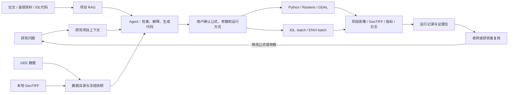
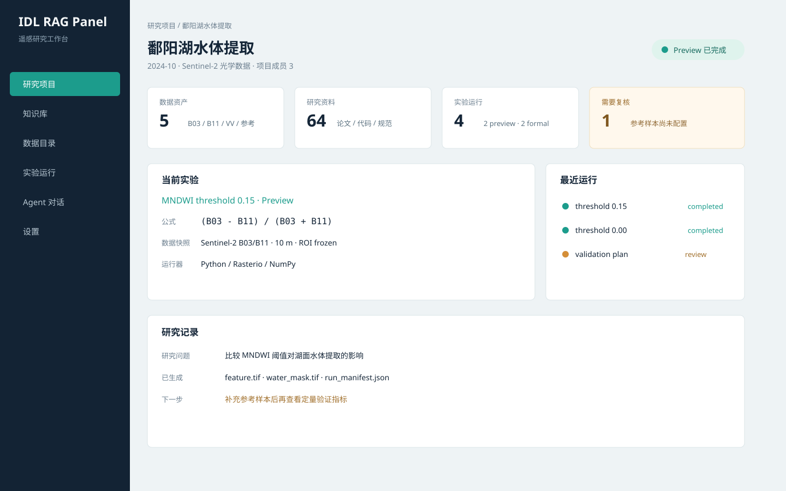
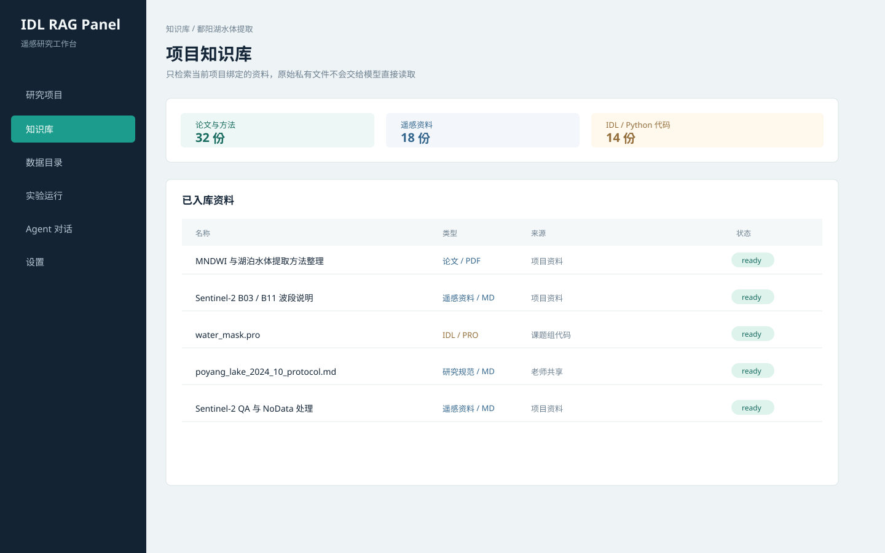
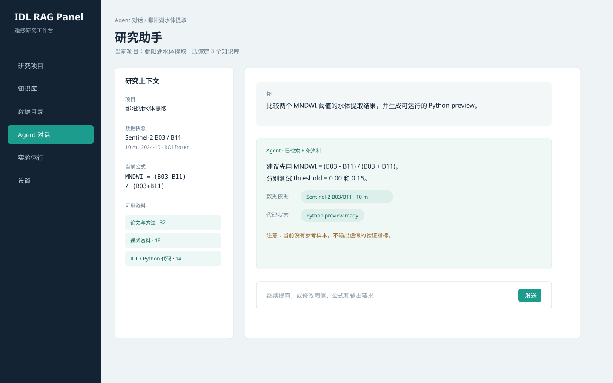
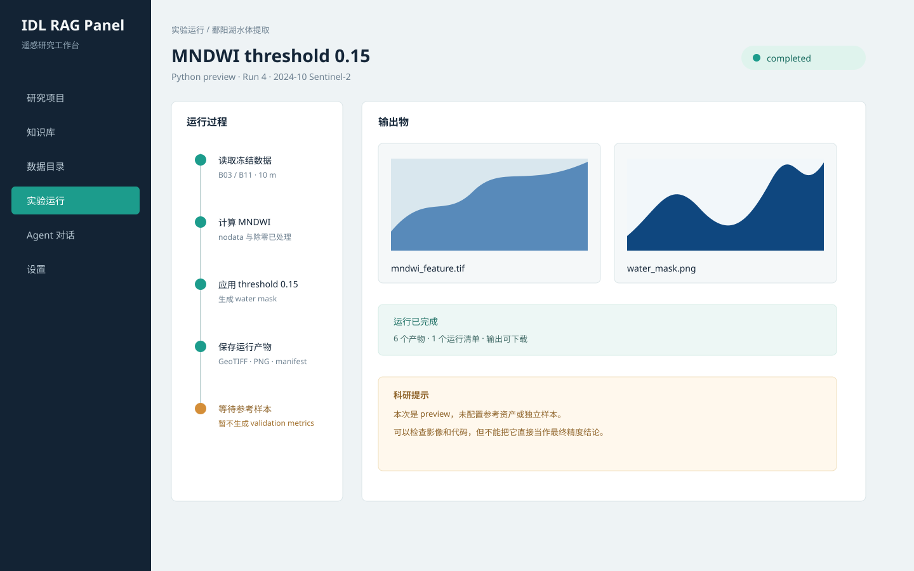

# IDL RAG Panel

语言版本：**中文** | [English](./README.en-US.md)

**给遥感研究用的资料、代码和实验工作台** 🛰️

IDL RAG Panel 把论文、遥感资料、IDL 代码、Python 脚本和本地影像放到一个地方。你可以在页面里提问，找到资料依据，让 Agent 帮你整理方法和编写代码，然后在本地运行实验，查看图片、日志和输出文件。

它不是只会聊天的问答框，也不是按一个按钮就替你下科学结论的黑盒。它更像一个研究助理：帮你找资料、理清代码、搭好实验，最后把每一步留给你检查。

## 这个平台能做什么？

### 📚 管理三类研究资料

可以分别建立论文资料库、IDL 代码资料库和遥感资料库，也可以加入课题组内部文档。支持 PDF、Markdown、文本和 `.pro` / `.idl` 文件，回答时会带上来源和代码位置。

### 💬 从自然语言开始做实验

你不需要先选模板。直接描述问题，例如：

> “比较 MNDWI 在两个阈值下的水体提取效果，使用当前项目的数据，并把每个阶段的影像展示出来。”

Agent 会先检索相关资料，再整理数据、公式和参数，生成 Python 或 IDL 代码。你确认后才会运行。

### 🧪 把代码真正跑起来

- Python 路线使用 Rasterio、GDAL、NumPy 等工具处理本地栅格数据；
- IDL 路线可以调用用户电脑上已经安装的 IDL，作为教学或结果对照；
- 也可以通过结构化参数获取小范围 GEE 数据；
- 没有 IDL 时，主要研究流程仍然可以使用 Python 完成。

### 🖼️ 每一步都能看到结果

运行后可以查看输入影像、指数图、分类图、差异图、日志、GeoTIFF 和运行记录。这样老师可以检查过程，学生也能知道问题出在数据、公式还是代码。

## 谁会用到它？

| 使用者 | 可以怎么用 |
|---|---|
| 老师 / 课题组 | 把内部论文、实验规范和代码放进私有资料库，检查学生的依据、参数和结果。 |
| 学生 | 用自然语言学习遥感方法，修改公式或阈值，观察不同方案的影像变化。 |
| 研究人员 | 固定数据和公式版本，重复运行实验，比较 Python 与 IDL 或不同算法的输出。 |

## 一次完整操作

```text
提出遥感问题
  ↓
检索论文、遥感资料和 IDL/Python 代码
  ↓
确认数据、公式和参数
  ↓
生成并运行实验代码
  ↓
查看阶段影像、指标、日志和输出文件
  ↓
修改公式或参数，继续下一次实验
```

例如 MNDWI 水体提取可以得到下面这样的中间结果：

<p align="center">
  
  
</p>

这些图片只是实验结果的一部分。平台还会保留使用的资料、公式、参数、运行日志和输出文件，方便之后重新检查。

## Workflow 架构

平台把“资料依据”和“实验执行”分开，但用同一个研究项目把它们连起来：



GEE 和本地数据都会先进入数据目录，经过确认后才能成为实验输入；RAG 只负责提供资料依据和代码上下文，不会把未经确认的搜索结果自动当成结论。Python 是默认实验路线，IDL 是可选的本地兼容和对照路线。接入步骤见 [`docs/integrations.md`](./docs/integrations.md)。

## 页面长什么样？

<table>
  <tr>
    <td></td>
    <td></td>
  </tr>
  <tr>
    <td align="center">研究工作台：项目、数据快照和运行状态</td>
    <td align="center">项目知识库：论文、遥感资料和代码</td>
  </tr>
  <tr>
    <td></td>
    <td></td>
  </tr>
  <tr>
    <td align="center">Agent：问题、引用、公式和代码</td>
    <td align="center">实验运行：阶段图、日志和科研提示</td>
  </tr>
</table>

如果想快速浏览一遍页面，可以观看 [平台操作视频](./docs/assets/demos/idl-rag-panel-demo.mp4)。视频只是界面导览，真正的研究结果和执行记录见 [`docs/agent-demo-result.md`](./docs/agent-demo-result.md)。

## 开始使用

需要 Python 3.12、Node.js 18+ 和 `uv`。在项目目录执行：

```powershell
Copy-Item .env.example .env
uv sync --project backend
npm install --prefix frontend
```

打开两个终端，分别启动后端和前端：

```powershell
uv run --project backend uvicorn app.main:app --app-dir backend --reload
```

```powershell
npm run dev --prefix frontend
```

浏览器打开 <http://127.0.0.1:5173>，注册账号后就可以创建自己的知识库。需要容器部署时，执行 `docker compose up --build`。

## 使用前需要知道

- 平台可以帮你找依据、写代码和跑实验，但公式是否合理、样本是否合适、结论是否成立，仍需要研究者判断。
- 私有论文、代码和影像默认保存在本地 `data/`，不会自动上传到仓库。
- IDL 是可选的兼容层。没有 IDL 环境时，Python/GDAL 仍然可以完成主要遥感处理。

## 进一步了解

- [研究工作流设计](./docs/research-workflow-platform-plan.md)
- [Workflow 架构图与数据流](./docs/workflow-architecture.md)
- [本地演示步骤](./docs/demo.md)
- [鄱阳湖真实案例](./docs/real-research-case-poyang.md)
- [配置说明](./docs/configuration.md)
- [GEE、IDL 与 Python 接入说明](./docs/integrations.md)
- [安全与数据控制](./docs/security-and-data-control.md)
- [项目展示说明](./docs/project-showcase.md)
