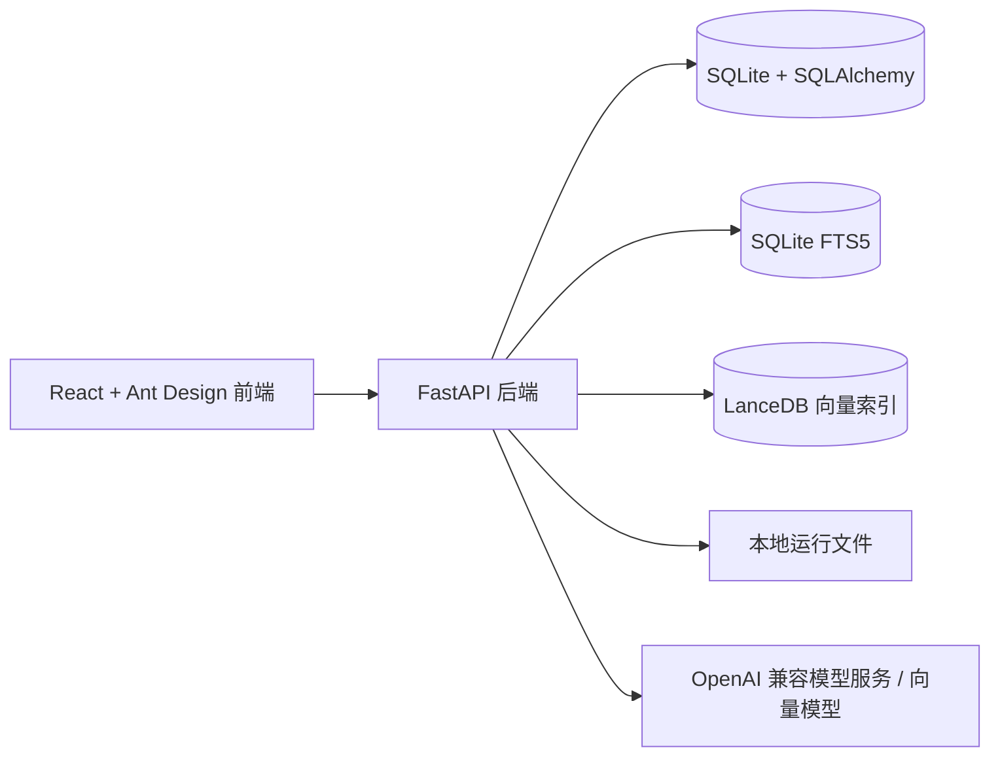

# IDL RAG Panel

语言版本：**中文** | [English](./README.en-US.md)

IDL RAG Panel 是一个面向 ENVI/IDL 资料与代码场景的私有 RAG Web 应用。它用于把本地文档、课程材料、IDL/ENVI 代码和项目资料整理成知识库，并提供带引用的问答、检索调试、Agent 工具调用、`.pro` 文件生成和效果评测能力。

项目适合本地运行、实验室内网部署、个人作品展示和小团队知识库验证。仓库版本只应包含源码、文档和配置模板；真实 API Key、本地数据库、索引、日志、私有文档和未脱敏材料不要提交到 GitHub。

## 核心能力

- 多用户认证、管理员用户管理、知识库和会话按用户隔离。
- 知识库创建、文档上传、路径导入、文件去重、失败重试和重建索引。
- 支持 `.pdf`、`.md`、`.markdown`、`.txt`、`.pro`、`.idl` 文件。
- IDL/ENVI 专用分块：普通文本按段落分块，IDL 代码按 procedure/function 等符号边界分块。
- SQLite FTS5 关键词检索、LanceDB 向量检索、Hybrid RRF 融合和可选 rerank。
- 默认检索策略为 `hybrid_rrf_no_rerank`，用于在当前 benchmark 结果下获得更稳定的速度和效果平衡。
- 对话页面展示回答、引用来源、检索策略和生成的 `.pro` 文件。
- 检索测试页面用于对比策略、查看候选 chunk、分数、元数据和原始 JSON。
- 设置页面支持模型配置、连接测试、本地评测和 LangSmith 相关评测配置。
- 运行时敏感 key 通过设置服务加密存储；本地数据库仍属于运行数据，不应提交。

## 技术栈

### 后端

- Python 3.12
- FastAPI / Uvicorn
- SQLAlchemy / SQLite / SQLite FTS5
- LanceDB / PyArrow
- Pydantic / pydantic-settings
- httpx
- jieba
- cryptography
- pytest / ruff

### 前端

- React 18
- TypeScript
- Vite
- Ant Design 5
- TanStack React Query

## 项目结构

```text
idl-rag/
  backend/
    app/
      api/              # FastAPI 路由与依赖
      core/             # 配置、认证 token、密码与密钥工具
      db/               # SQLAlchemy 模型与 SQLite/FTS 初始化
      services/         # 入库、检索、向量、模型、Agent、评测服务
      main.py           # FastAPI 应用与索引 worker 生命周期
    tests/              # 后端测试与 golden eval 数据
    pyproject.toml

  frontend/
    src/
      api/              # API 客户端与类型
      pages/            # 概览、知识库、文档、对话、检索测试、设置
      styles/           # 应用级样式
      App.tsx
      main.tsx
    package.json

  docs/
    architecture.md
    configuration.md
    demo.md
    security-and-data-control.md

  .env.example          # 公开配置模板，不包含真实密钥
  .gitignore            # 排除本地数据、密钥、缓存和构建产物
```

默认运行数据生成在 `data/` 目录下。`data/app.db`、`data/indexes/`、`data/logs/`、`data/generated/`、`data/parsed/` 和源文档都属于本地运行产物，已被排除在 Git 之外。

## 快速开始

### 1. 准备环境变量

复制模板并填写本地专用配置：

```powershell
Copy-Item .env.example .env
```

本地开发最重要的配置如下：

```text
IDLRAG_AUTH_SECRET=replace-with-a-long-random-secret
IDLRAG_CORS_ORIGINS=http://127.0.0.1:5173,http://localhost:5173
VITE_API_BASE_URL=http://127.0.0.1:8000/api
```

不要提交 `.env`。

### 2. 安装后端依赖

```powershell
uv sync --project backend
```

### 3. 启动后端

```powershell
uv run --project backend uvicorn app.main:app --app-dir backend --reload
```

默认后端地址：

```text
http://127.0.0.1:8000
```

### 4. 安装前端依赖

```powershell
npm install --prefix frontend
```

### 5. 启动前端

```powershell
npm run dev --prefix frontend
```

默认前端地址：

```text
http://127.0.0.1:5173
```

## 演示流程

1. 打开前端页面并注册或登录。
2. 进入设置页面，配置 OpenAI 兼容模型服务、对话模型和向量模型。
3. 创建知识库。
4. 上传或导入 ENVI/IDL 文档。
5. 等待文档状态变为 `ready`。
6. 进入对话页面，选择知识库，提出 ENVI/IDL 问题并查看引用。
7. 使用检索测试页面对比检索策略并检查候选文本块。
8. 使用设置页面的评测报告对比策略效果。
9. 发布前运行 `git status`，确认本地数据库、key、日志、索引和私有文档没有进入暂存区。

详细演示步骤见 [`docs/demo.md`](./docs/demo.md)。

## 项目展示文档

默认项目展示文档为中文：[`docs/project-showcase.md`](./docs/project-showcase.md)。独立语言版本包括：[中文](./docs/project-showcase.zh-CN.md) / [English](./docs/project-showcase.en-US.md)。

主要截图：

- [概览页](./docs/assets/screenshots/dashboard.png)
- [知识库页](./docs/assets/screenshots/knowledge-bases.png)
- [文档页](./docs/assets/screenshots/documents.png)
- [对话页](./docs/assets/screenshots/chat.png)
- [检索测试页](./docs/assets/screenshots/retrieval-lab.png)
- [设置页](./docs/assets/screenshots/settings.png)

## 配置与密钥处理

后端通过 `backend/app/core/config.py` 读取环境变量默认值。运行时模型设置和服务密钥由 `backend/app/services/settings_service.py` 管理；`api_key`、`rerank_api_key` 和 `langsmith_api_key` 等敏感值会通过 `backend/app/core/security.py` 中的工具加密后存入本地数据库。

该加密用于保护本地运行存储中的敏感值，但 `data/app.db` 仍然属于本地应用数据，不应上传到 GitHub。

配置细节见 [`docs/configuration.md`](./docs/configuration.md)。安全与数据控制规则见 [`docs/security-and-data-control.md`](./docs/security-and-data-control.md)。

## 架构说明

系统是一个本地优先的 RAG 工作台：



完整架构图见 [`ARCHITECTURE.md`](./ARCHITECTURE.md) 和 [`docs/architecture.md`](./docs/architecture.md)。

## 验证命令

运行后端重点测试：

```powershell
uv run --project backend pytest backend/tests/test_retrieval_strategies.py backend/tests/test_agent_service.py
uv run --project backend pytest backend/tests/test_eval_golden_qa.py backend/tests/test_eval_metrics.py backend/tests/test_evaluation_api.py
```

构建前端：

```powershell
npm run build --prefix frontend
```

## GitHub 发布规则

默认可以上传：

- 根目录文档和 `docs/`。
- `.gitignore` 和 `.env.example`。
- `backend/app/`、`backend/tests/`、`backend/scripts/`、后端包配置文件和锁文件。
- `frontend/src/`、前端包配置文件和构建配置文件。

默认不要上传：

- 真实 `.env` 文件或 API Key。
- `data/app.db`、WAL/SHM 文件、LanceDB 索引、日志、生成文件和解析文本。
- `frontend/node_modules/`、`frontend/dist/`、`backend/.venv/` 和缓存。
- 私有 PDF、简历草稿、课程材料和未经脱敏的源文档。

建议按模块提交：

1. 安全边界与环境模板。
2. 文档和架构图。
3. 后端源码与测试。
4. 前端源码与构建配置。
5. 公开演示材料，且仅在人工确认后提交。

推送到 GitHub 前，应确认目标远程仓库地址。
