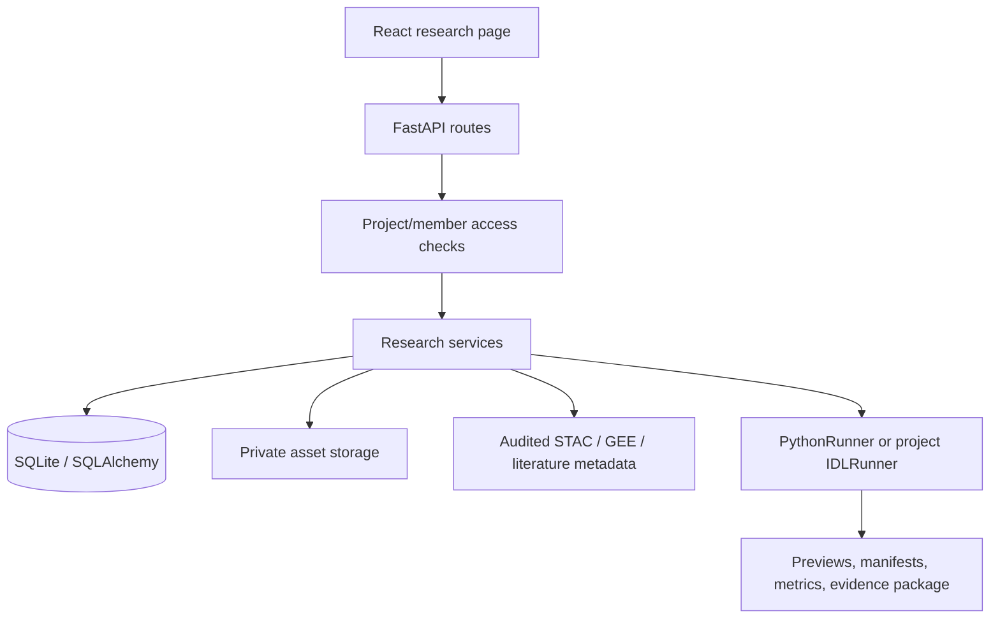

# Backend application design

## Goals

1. Make every research action addressable by a project, immutable snapshot or versioned method.
2. Keep private source pixels local by default and record every external metadata/data request in an audit trail.
3. Provide a safe Python-first execution path with inspectable intermediate images, while preserving optional IDL compatibility.
4. Reject ambiguous or unverifiable formal runs instead of silently turning exploratory output into a scientific conclusion.

## Non-goals for V1

- No unrestricted Python/IDL code execution through an HTTP payload.
- No public SaaS tenancy, enterprise SSO, distributed queue or organization-level policy engine.
- No automatic claim that a formula is physically correct or superior to a baseline.
- No embedding of raster pixels into ordinary text RAG.

## Architecture

The API never treats a client-supplied asset ID as sufficient authority. Services first load the project through the current user, then constrain every asset, snapshot, formula, experiment and run query to that project. Private assets are addressed through `research://assets/...` URIs and resolved by `ResearchAssetStorage`, not by arbitrary filesystem paths.

## Core design decisions

| Decision | Rationale | Consequence |
|---|---|---|
| Python-first, IDL-optional | Rasterio/GDAL/NumPy/GEE integration, testing and containers are easier to maintain in Python. | Explicit project `.pro` scripts run only on a configured licensed local node; missing IDL never blocks Python. |
| Project-scoped catalog and RAG | Pixels need geospatial metadata, hashes and access control; text retrieval needs citations and chunk provenance. | RAG bindings are explicit and raster assets never enter the text vector index. |
| Reference-grid raster stacking | MNDWI and similar formulas need bands in one deterministic grid. | `POST .../data-assets/stack` creates a new hashed private asset and records source fingerprints, grid and resampling. |
| Full download plus COG Range | Small assets are simple to materialize; large cloud-optimized assets should read only a requested crop. | Range mode hashes the stored crop and records `source_hash_scope=stored_output_only`; it never pretends to hash an unmaterialized source. |
| Preview/formal separation | Research exploration must be fast, but conclusions must be reproducible and independently validated. | Runs record execution mode, protocol/FormulaSpec/data snapshot and visual evidence; formal runs enforce readiness contracts. |
| Explicit external discovery | Search results can be useful without being trusted evidence. | Crossref/OpenAlex/Semantic Scholar/STAC candidates are audited and remain candidate/reference until the user reviews and materializes them. |
| Abstract-only literature import | A confirmed public metadata record can help RAG explain a method without guessing publisher access or license. | Import requires a bound Method KB, preserves audit/DOI/URL in a generated Markdown record, and labels it `abstract_only`; full text remains a user upload. |

## Raster stack contract

`ResearchRasterStackService` accepts 2–8 same-project private raster assets. The first asset, or explicit `reference_asset_id`, defines CRS, affine transform, width and height. Other assets are read through Rasterio `WarpedVRT` using nearest, bilinear or cubic resampling. The service writes a float32 LZW GeoTIFF, fills NoData with `-9999`, enforces the configured output-pixel limit, computes a SHA-256 for the stored result and persists:

- ordered source asset IDs and source fingerprints;
- reference asset ID and band names;
- resampling method;
- CRS, transform, dimensions, band count and NoData value;
- a `raw_project_data_sent=false` marker for downstream data-egress audits.

Remote `reference` assets, non-raster assets, cross-project IDs and unreadable GeoTIFFs are rejected before a derived DataAsset is registered.

## Safety boundaries

- Request schemas constrain identifiers, enum values, counts and file sizes.
- Storage resolves only approved `research://assets/` URIs; external URLs are handled by allowlisted clients with timeout/size limits.
- PythonRunner uses declarative operation contracts and a restricted AST for band math; it does not evaluate arbitrary client code.
- Project IDL execution accepts only a private `.pro` asset uploaded through the dedicated route, stages snapshot inputs in a bounded directory, enforces output/timeout limits, and captures stdout/stderr; no shell or executable path is accepted from experiment parameters.
- Formal evidence packages preserve references and hashes without copying private source pixels or credentials.

## Known limitations and follow-up

- The current runtime uses SQLite and local storage; Docker startup and multi-user production deployment still require a clean-environment acceptance run. The document index worker now supports both the default embedded thread and a Compose-managed standalone `app.index_worker` process with a shared-volume heartbeat. `/api/health` is a liveness check; `/api/ready` verifies the database and embedded/external worker before declaring the service ready.
- Queued research runs carry an internal origin marker; the worker reclaims only queue-origin runs that exceed `IDLRAG_RESEARCH_RUN_TIMEOUT_MINUTES` and records a terminal failure. Synchronous runs are created as `running` atomically so they cannot be briefly stolen by a queue worker. This is a recovery policy, not a hard process kill or distributed scheduler.
- Run cancellation is cooperative: queued records become terminal `cancelled` immediately, while running records receive a cancellation marker and are finalized after the current Python step. Retry creates a new Run with a `retry_of_run_id` control record; no historical Run is overwritten.
- Raster stacking validates geospatial alignment and numerical output, but does not establish atmospheric-correction or sensor-calibration correctness.
- Scientific claims still require a real ROI, reference labels, sampling weights and independent temporal/spatial holdout data.
- IDL/ENVI licensing and installation are external prerequisites and are intentionally not included in the Python container.

## Change history

| Date | Change |
|---|---|
| 2026-09-29 | Generated module documentation and replaced the generic skeleton with the current research-workflow architecture. |
