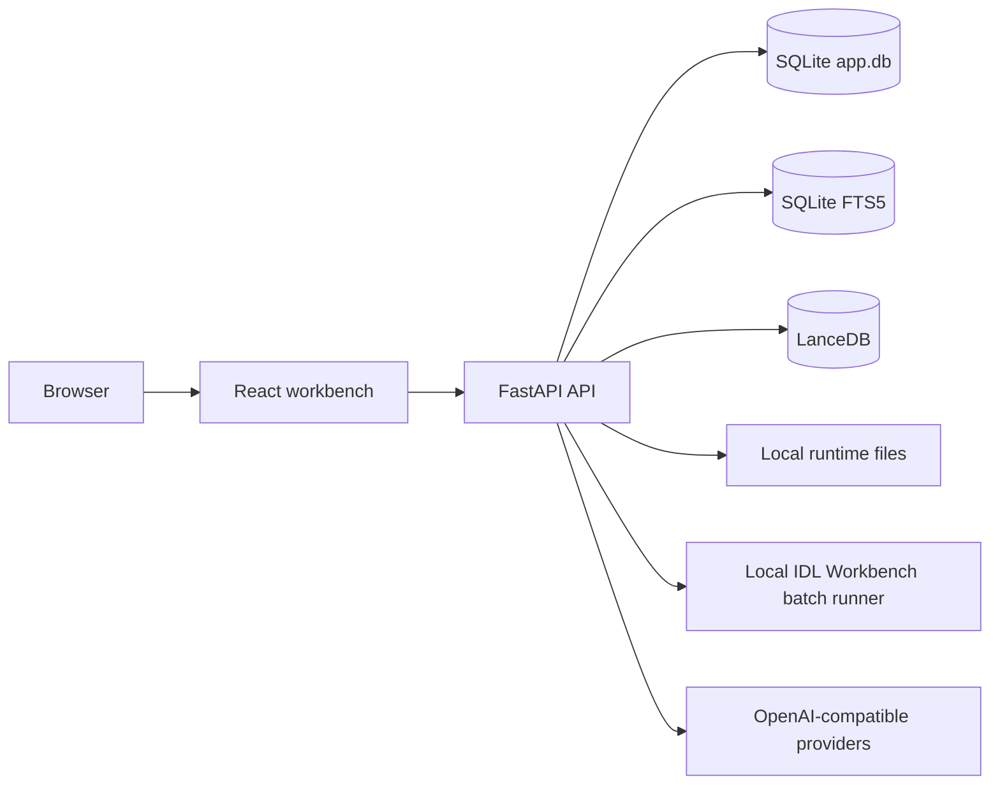
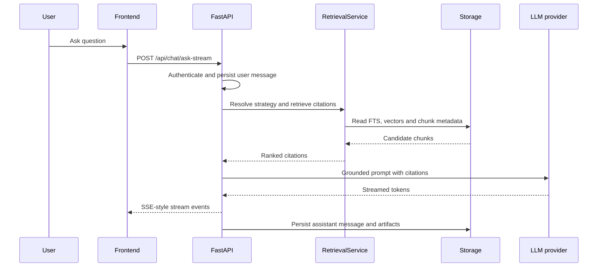
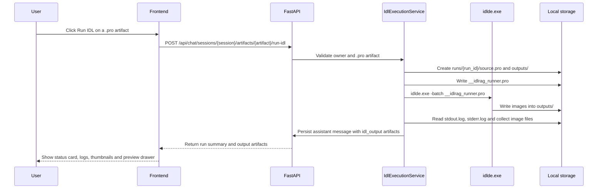
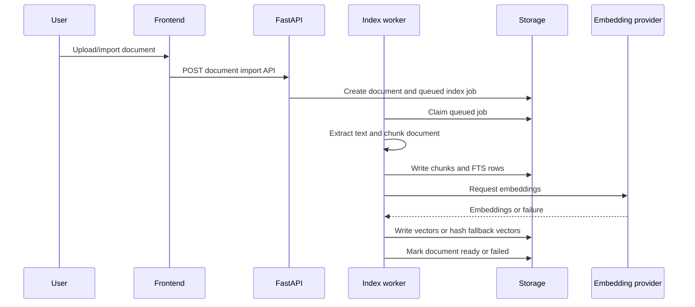

# Architecture

This document provides the maintainable architecture view for IDL RAG Panel. The shorter public overview is in [`../README.md`](../README.md), and the full module map is in [`../ARCHITECTURE.md`](../ARCHITECTURE.md).

## System boundary

The GitHub repository should contain source code, tests, documentation and configuration templates. Runtime storage under `data/` is outside the publishable boundary.

## Runtime components

| Component | Role |
|---|---|
| React frontend | User-facing workbench for dashboard, knowledge bases, documents, chat, retrieval debugging and settings. |
| FastAPI backend | Authenticated API, index worker lifecycle, RAG orchestration, evaluation and settings. |
| SQLite | Users, settings, knowledge bases, documents, chunks, jobs, chat sessions, reports and metadata. |
| SQLite FTS5 | Keyword retrieval over indexed chunks. |
| LanceDB | Vector index for semantic retrieval. |
| Local files | Uploaded sources, parsed text, generated artifacts, IDL run logs and output images. |
| Local IDL Workbench batch runner | Runs user-owned Chat `.pro` artifacts through `idlde.exe -batch` and collects image outputs. |
| OpenAI-compatible providers | Chat, embedding and optional rerank endpoints. |

## Query lifecycle

## Local IDL execution lifecycle

The runner changes IDL's working directory to `outputs/`, compiles `../source.pro`, calls the selected procedure and exits. Only image files in `outputs/` with allowed suffixes are returned as previewable artifacts.

## Index lifecycle

## Retrieval strategy notes

- `hybrid_rrf_no_rerank` is the current default because it performed close to rerank-enabled hybrid retrieval with lower latency in the local benchmark.
- `hybrid_rrf` remains available as the rerank comparison strategy.
- `multi_query` is useful for complex questions but is slower.
- `vector_only` is a diagnostic strategy for embedding/index quality.
- Code tools such as `symbol_search`, `read_context`, `find_callers` and `find_callees` should be evaluated with code-tool cases, not generic QA questions.

## Security model

- Passwords are stored as PBKDF2-SHA256 hashes.
- Runtime provider keys are encrypted in SQLite through `backend/app/core/security.py`.
- Encryption does not make `data/app.db` safe to publish; it remains local runtime state.
- The publishable repository excludes real `.env` files, local DBs, indexes, logs, private documents and generated artifacts.
