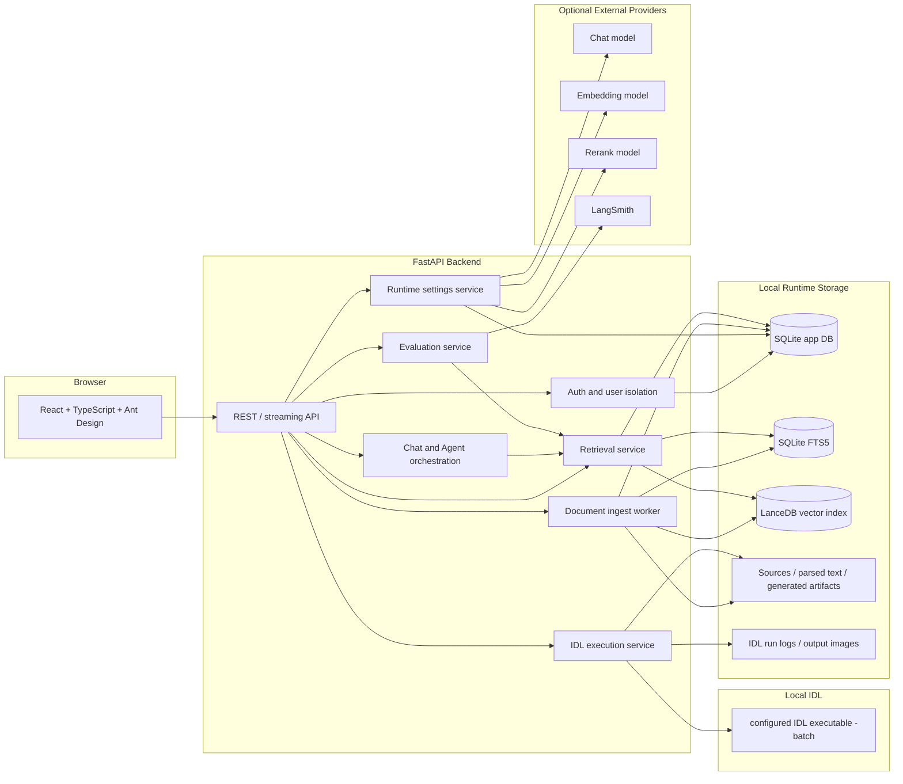
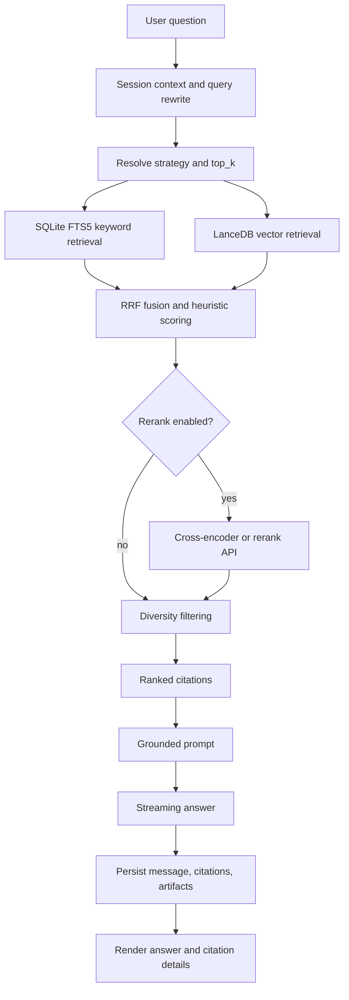
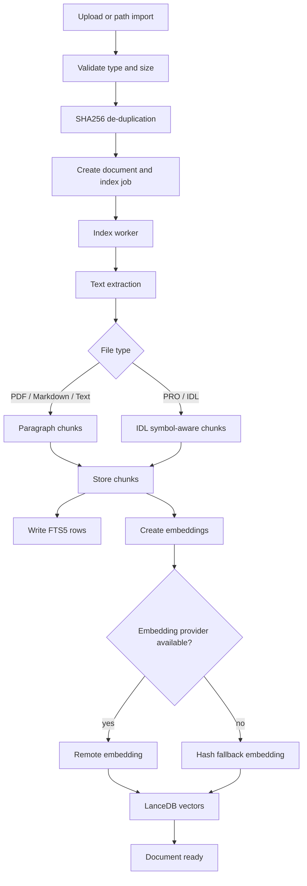
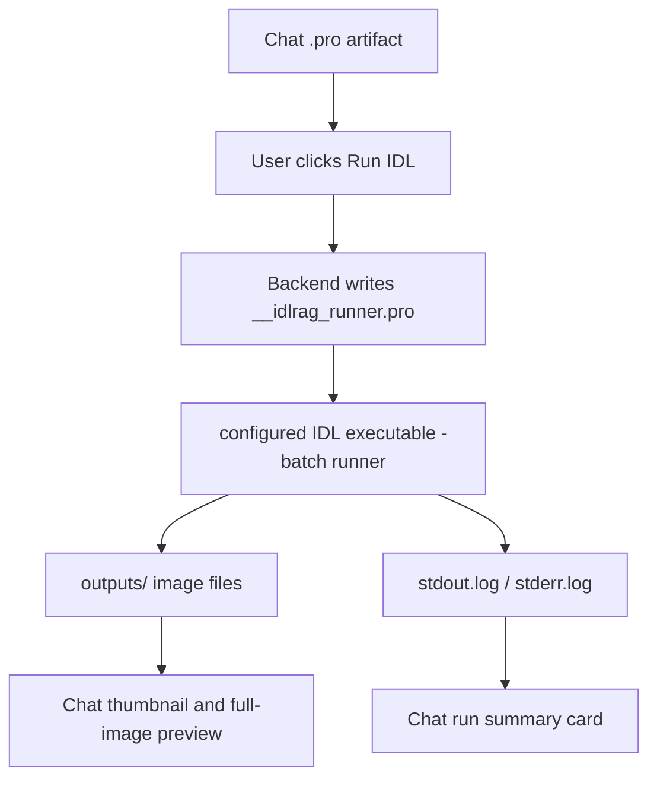
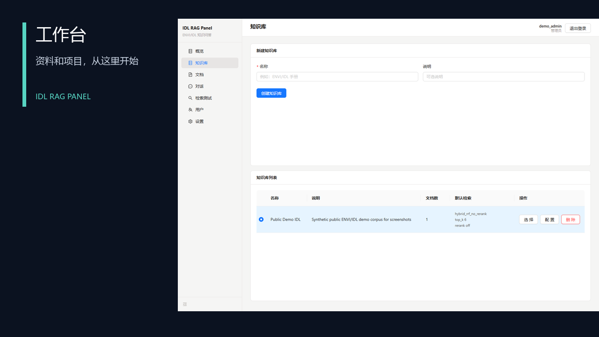
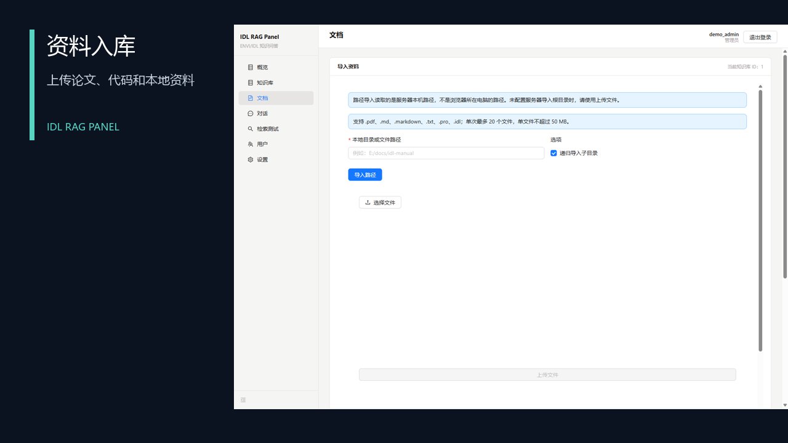
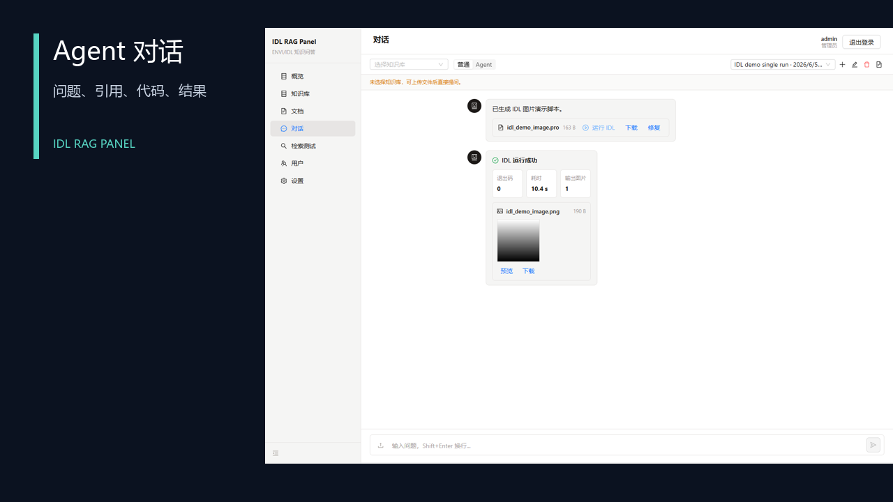
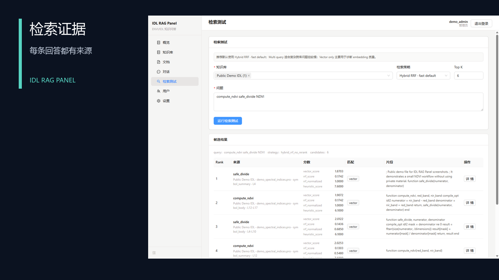
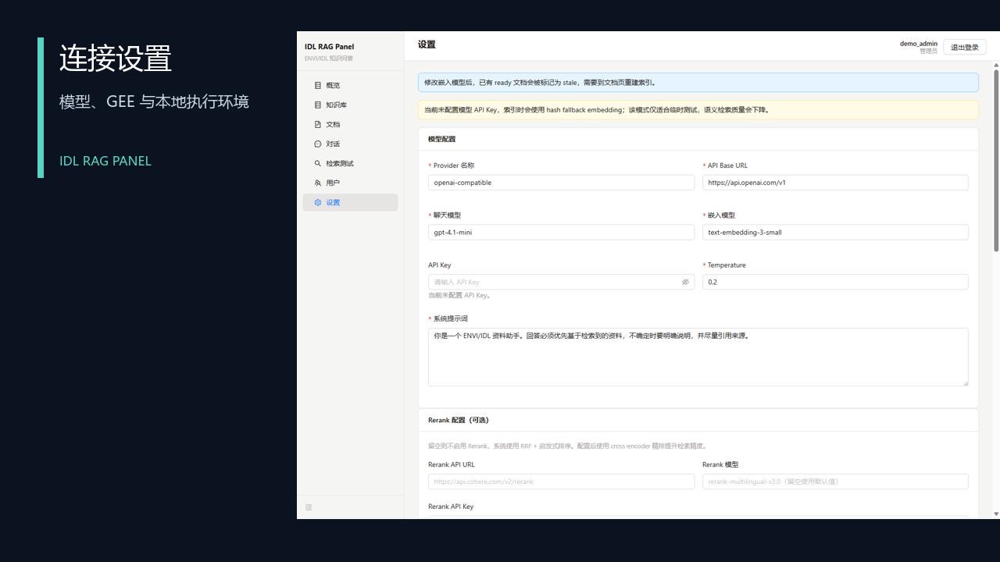

# IDL RAG Panel Project Showcase

Language: [中文](./project-showcase.zh-CN.md) | **English**

This document is intended for project review, portfolio presentation, and GitHub documentation. All screenshots were produced from public synthetic demo data. They do not contain private study notes, real API keys, local databases, private PDFs, or resume content.

## 1. Project Overview

IDL RAG Panel is a private RAG workbench for ENVI/IDL documents and code. It turns local documents, IDL/ENVI source files, course materials, or project references into searchable knowledge bases, then provides grounded Q&A, retrieval debugging, Agent tool execution, `.pro` file generation, local IDL execution, output image preview, and evaluation comparison.

The goal is not to clone a generic chat product. The project focuses on ENVI/IDL-specific retrieval, code understanding, citation traceability, and retrieval quality evaluation in a local-first vertical RAG application.

## 2. System Architecture



## 3. RAG Query Flow



The default retrieval strategy is `hybrid_rrf_no_rerank`. In local benchmarks, it achieved a similar quality profile to the rerank-enabled hybrid strategy with lower latency. `hybrid_rrf` remains available as the rerank comparison path, while `vector_only` is mainly used to diagnose embedding and vector-index quality.

## 4. Document Ingestion Flow



## 5. Local IDL Execution Flow



On Windows ENVI/IDL 8.8, complete `.pro` execution must use a licensed command-line interpreter such as `idl.exe -batch <runner.pro>`. Workbench/ENVI GUI launchers and `idlrt.exe` are rejected for source execution. The backend only runs Chat artifacts owned by the current user; it does not accept arbitrary shell commands and does not return local filesystem paths.

## 6. Screenshots

### 6.1 Dashboard

Shows corpus status, index status, worker status, and fallback embedding warnings.



### 6.2 Knowledge Bases

Manages knowledge bases, default retrieval strategy, `top_k`, and rerank settings.


### 6.3 Documents

Shows the public synthetic `demo_spectral_indices.pro` document, index status, chunk count, and parser/chunker metadata.



### 6.4 Chat

Shows local IDL execution for a `.pro` artifact, including the run summary, exit code, duration, output image count, thumbnail, and full-image preview.



### 6.5 RetrievalLab

Runs a retrieval test for the same query and shows candidate chunks, strategy guidance, scores, and metadata entry points.



### 6.6 Settings

Configures the model provider, API base URL, model names, rerank, LangSmith, and evaluation reports.



## 7. Core Modules

| Module | Capability |
|---|---|
| Auth / Users | Registration, login, admin user management, user isolation |
| KnowledgeBases | Knowledge base creation, default strategy, top_k, and rerank configuration |
| Documents | Upload, path import, deduplication, indexing, retry, reindexing, and chunk inspection |
| Chat | Normal Q&A, Agent mode, streaming generation, citations, `.pro` artifact download |
| RetrievalLab | Strategy debugging, candidate results, scores, metadata, and raw JSON inspection |
| Settings | Provider/key/model configuration, connection testing, local evaluation, LangSmith evaluation |
| Evaluation | Golden QA, strategy comparison, and separate code-tool-mode case evaluation |

## 8. Technical Highlights

- Uses SQLite + FTS5 + LanceDB for a local-first RAG architecture without requiring an external database service.
- Applies symbol-aware chunking to ENVI/IDL `.pro` and `.idl` files, preserving procedure/function boundaries.
- Supports hybrid RRF, rerank comparison, multi-query, parent-child, dependency GraphRAG, and code-tool retrieval.
- Keeps rank, strategy, score, line range, and metadata in citations for explainability and debugging.
- Encrypts sensitive runtime keys in Settings and avoids echoing real keys in API responses.
- Separates documentation, source code, screenshots, and GitHub publishing boundaries from local runtime data and private learning files.

## 9. Local Demo Steps

1. Copy `.env.example` to `.env`, then set `IDLRAG_AUTH_SECRET` and `VITE_API_BASE_URL`.
2. Start the backend:

   ```powershell
   uv run --project backend uvicorn app.main:app --app-dir backend --reload
   ```

3. Start the frontend:

   ```powershell
   npm run dev --prefix frontend
   ```

4. Log in or register an account.
5. Configure the model provider in Settings.
6. Create a knowledge base and import public or sanitized documents.
7. Ask a question in Chat and inspect citations.
8. Compare retrieval strategies in RetrievalLab.
9. Review evaluation reports in Settings.

## 10. Publishing and Security Boundary

The GitHub repository should include:

- Source code.
- Tests.
- Architecture diagrams and documentation.
- `.env.example`.
- Screenshots generated from public synthetic data.

The GitHub repository should not include:

- Real `.env` files or API keys.
- `data/app.db`, WAL/SHM files, LanceDB indexes, logs, parsed text, or generated artifacts.
- Private PDFs, course scans, resume drafts, personal study notes, or unreviewed data sources.
- `node_modules`, `dist`, `.venv`, or cache directories.

See [`security-and-data-control.md`](./security-and-data-control.md) for the full safety checklist.
