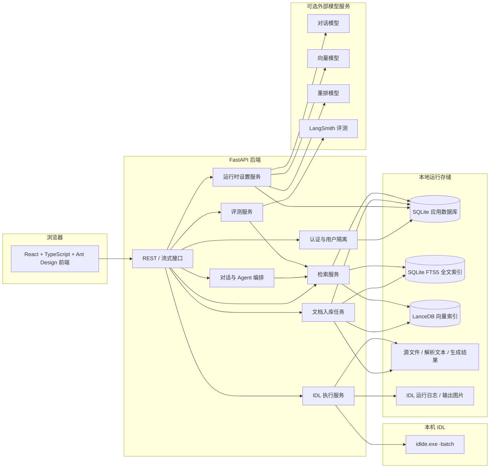
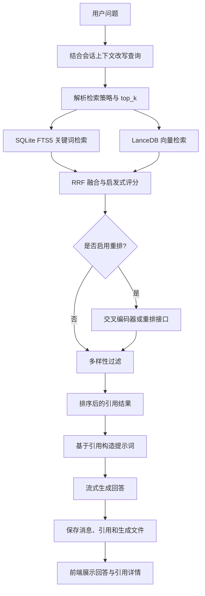
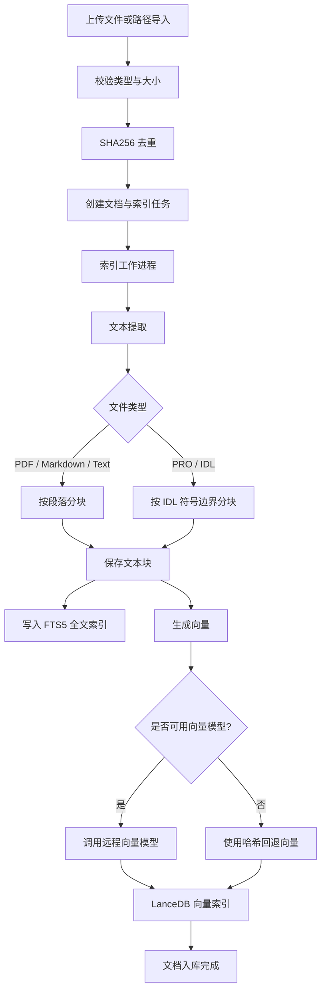
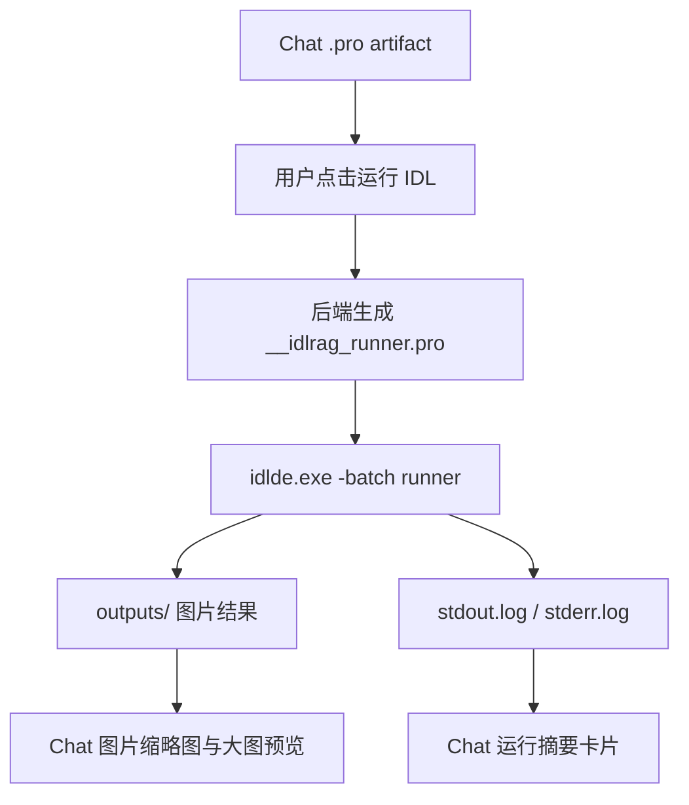
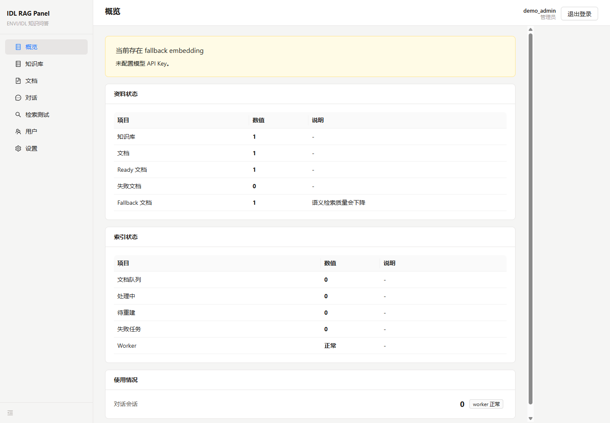
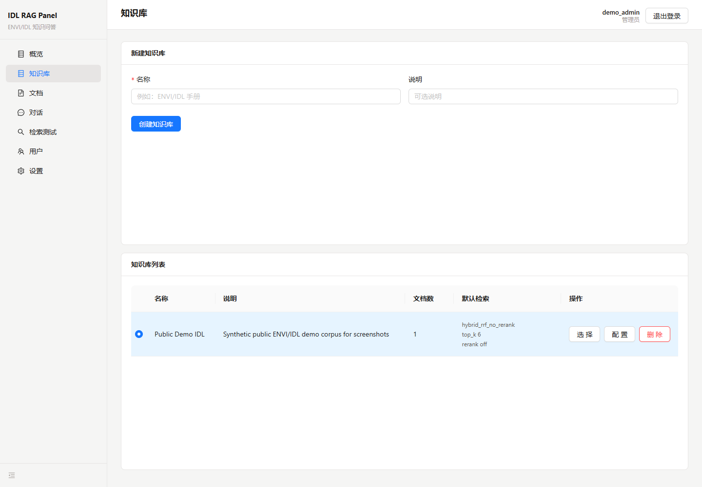
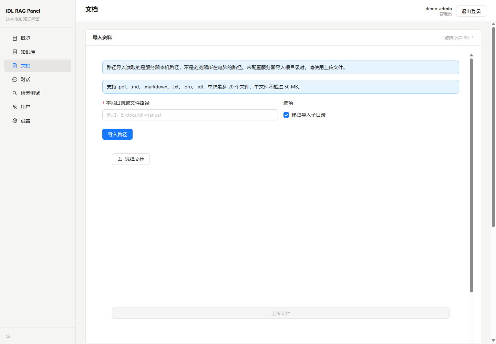
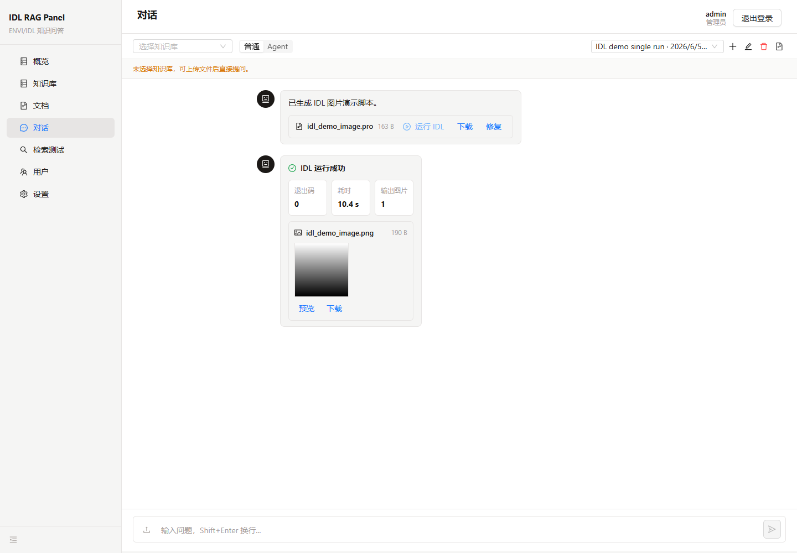
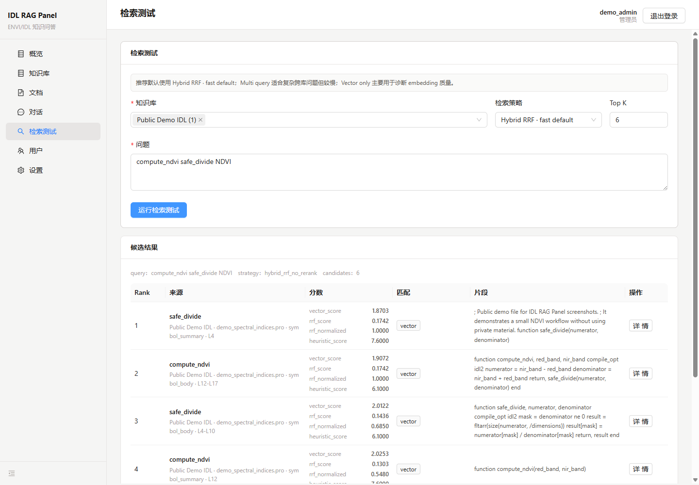
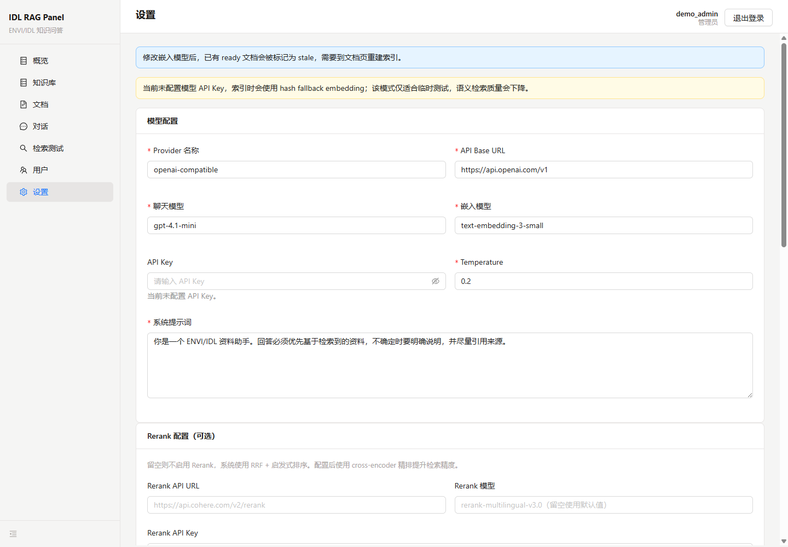

# IDL RAG Panel 项目展示说明

默认语言：**中文** | [English](./project-showcase.en-US.md) | [中文独立版本](./project-showcase.zh-CN.md)

本文档用于项目评审、作品集展示和 GitHub 说明。所有截图均来自公开合成演示数据，不包含私人学习资料、真实 API Key、本地数据库、私有 PDF 或简历内容。

## 1. 项目简介

IDL RAG Panel 是一个面向 ENVI/IDL 文档与代码资料的私有 RAG 工作台。它把本地文档、IDL/ENVI 代码、课程材料或项目资料构建为知识库，并提供带引用的问答、检索调试、Agent 工具调用、`.pro` 文件生成、本地 IDL 执行、图片结果预览和评测对比能力。

项目目标不是复制通用聊天产品，而是围绕 ENVI/IDL 的资料检索、代码理解、引用溯源和检索效果评估，构建一个可本地运行、可内网部署、可安全展示的垂直 RAG 应用。

## 2. 总体架构图



## 3. RAG 查询流程图



当前默认策略是 `hybrid_rrf_no_rerank`。它在已有本地基准测试中与启用重排的混合策略效果接近，但延迟更低。`hybrid_rrf` 保留为重排对照策略；`vector_only` 主要用于诊断向量模型与向量索引质量。

## 4. 文档入库流程图



## 5. 本地 IDL 运行流程



当前 Windows IDL 8.8 使用 `idlde.exe -batch <runner.pro>` 执行完整 `.pro` 文件。后端只运行当前用户拥有的 Chat artifact，不接受任意 shell 命令，也不返回本地文件系统路径。

## 6. 页面截图

### 6.1 概览页

展示资料状态、索引状态、工作进程状态和回退向量提示。



### 6.2 知识库页

管理知识库、默认检索策略、`top_k` 和重排开关。



### 6.3 文档页

展示公开合成的 `demo_spectral_indices.pro` 文档、索引状态、分块数量和解析器信息。



### 6.4 对话页

展示 `.pro` artifact 的本地 IDL 运行结果：运行摘要、退出码、耗时、输出图片数量、图片缩略图和大图预览。



### 6.5 检索测试页

对同一个问题运行检索测试，展示候选文本块、策略说明、分数和元数据入口。



### 6.6 设置页

配置模型服务、接口地址、模型名称、重排、LangSmith 和评测报告。



## 7. 核心功能说明

| 模块 | 功能 |
|---|---|
| 认证 / 用户 | 注册、登录、管理员用户管理、用户隔离 |
| 知识库 | 创建知识库、配置默认策略、配置 `top_k` 和重排 |
| 文档 | 上传、路径导入、去重、索引、重试、重建和文本块查看 |
| 对话 | 普通问答、Agent 模式、流式生成、引用展示、`.pro` 文件下载 |
| 检索测试 | 策略调试、候选结果、分数、元数据和原始 JSON 查看 |
| 设置 | 模型服务、密钥、模型名称配置、连接测试、本地评测、LangSmith 评测 |
| 评测 | golden QA、策略对比、工具型代码 RAG case 分离评估 |

## 8. 技术亮点

- 使用 SQLite + FTS5 + LanceDB 构建本地优先 RAG，不依赖外部数据库服务。
- 对 ENVI/IDL `.pro` / `.idl` 文件做符号级分块，保留 procedure/function 语义边界。
- 支持混合 RRF、重排对照、多查询、父子块、依赖图检索和代码工具检索。
- 引用结果中保留排序、策略、分数、行号范围和元数据，便于解释和调试。
- 设置页中的敏感 key 加密存储，API 响应不回显真实 key。
- 文档、源码、截图和 GitHub 发布边界分离，避免上传本地运行数据和个人学习资料。

## 9. 本地演示步骤

1. 复制 `.env.example` 为 `.env`，设置 `IDLRAG_AUTH_SECRET` 和 `VITE_API_BASE_URL`。
2. 启动后端：

   ```powershell
   uv run --project backend uvicorn app.main:app --app-dir backend --reload
   ```

3. 启动前端：

   ```powershell
   npm run dev --prefix frontend
   ```

4. 登录或注册账号。
5. 在设置页配置模型服务。
6. 创建知识库，导入公开或脱敏文档。
7. 在对话页提问并查看引用。
8. 在检索测试页对比检索策略。
9. 在设置页查看评测报告。

## 10. 发布与安全边界

GitHub 仓库应包含：

- 源码。
- 测试。
- 架构图和说明文档。
- `.env.example`。
- 使用公开合成数据生成的截图。

GitHub 仓库不应包含：

- 真实 `.env` 和 API Key。
- `data/app.db`、WAL/SHM、LanceDB 索引、日志、解析文本和生成文件。
- 私有 PDF、课程扫描件、简历草稿、个人学习笔记和未确认数据源。
- `node_modules`、`dist`、`.venv` 和缓存目录。

更多安全清单见 [`security-and-data-control.md`](./security-and-data-control.md)。
