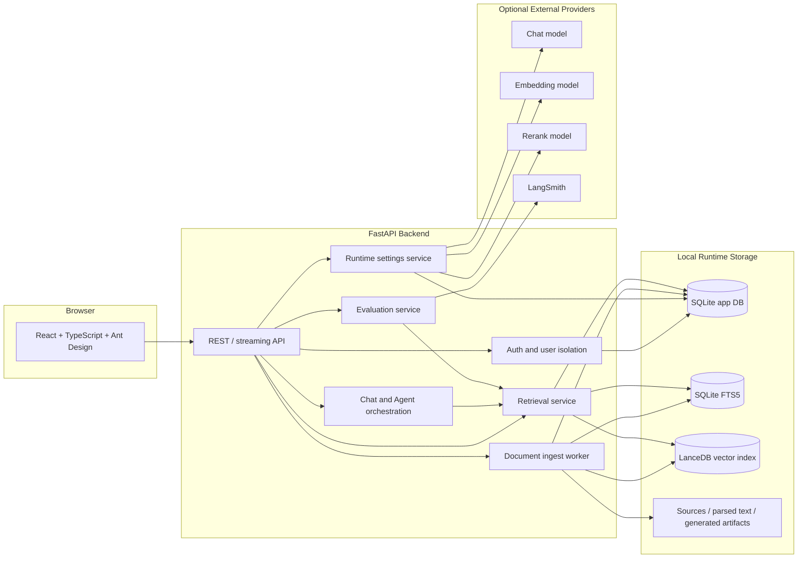
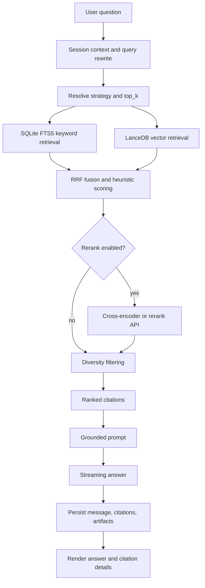
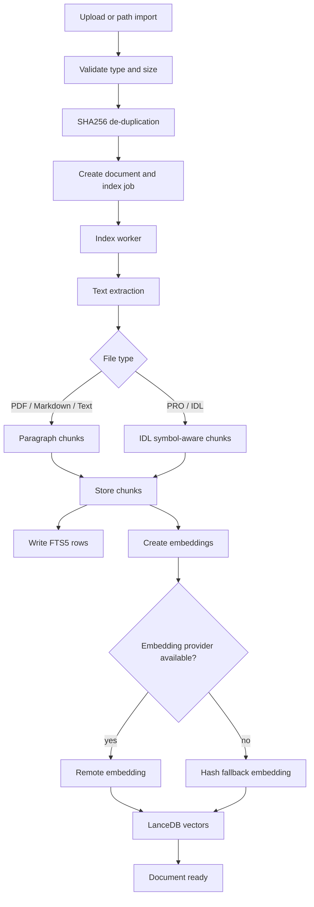

# IDL RAG Panel 项目展示说明

语言版本：**中文** | [English](./project-showcase.en-US.md)

本文档用于项目评审、作品集展示和 GitHub 说明。所有截图均来自公开合成演示数据，不包含私人学习资料、真实 API Key、本地数据库、私有 PDF 或简历内容。

## 1. 项目简介

IDL RAG Panel 是一个面向 ENVI/IDL 文档与代码资料的私有 RAG 工作台。它把本地文档、IDL/ENVI 代码、课程材料或项目资料构建为知识库，并提供带引用的问答、检索调试、Agent 工具调用、`.pro` 文件生成和评测对比能力。

项目目标不是复制通用聊天产品，而是围绕 ENVI/IDL 的资料检索、代码理解、引用溯源和检索效果评估，构建一个可本地运行、可内网部署、可安全展示的垂直 RAG 应用。

## 2. 总体架构图



## 3. RAG 查询流程图



当前默认策略是 `hybrid_rrf_no_rerank`。它在已有本地 benchmark 中与 rerank 版本效果接近，但延迟更低。`hybrid_rrf` 保留为 rerank 对照策略；`vector_only` 主要用于诊断 embedding 与向量索引质量。

## 4. 文档入库流程图



## 5. 页面截图

### 5.1 Dashboard

展示资料状态、索引状态、worker 状态和 fallback embedding 提示。


### 5.2 Knowledge Bases

管理知识库、默认检索策略、`top_k` 和 rerank 开关。


### 5.3 Documents

展示公开合成的 `demo_spectral_indices.pro` 文档、索引状态、chunk 数量和 parser/chunker 信息。


### 5.4 Chat

基于公开合成 `compute_ndvi` 示例提问，展示回答、检索策略、fallback 状态和引用来源。


### 5.5 RetrievalLab

对同一个问题运行检索测试，展示候选 chunk、策略说明、分数和 metadata 入口。


### 5.6 Settings

配置模型 provider、API base URL、模型名称、rerank、LangSmith 和评测报告。


## 6. 核心功能说明

| 模块 | 功能 |
|---|---|
| Auth / Users | 注册、登录、管理员用户管理、用户隔离 |
| KnowledgeBases | 创建知识库、配置默认策略、配置 top_k 和 rerank |
| Documents | 上传、路径导入、去重、索引、重试、重建和 chunk 查看 |
| Chat | 普通问答、Agent 模式、流式生成、citation、`.pro` artifact 下载 |
| RetrievalLab | 策略调试、候选结果、score、metadata 和 raw JSON 查看 |
| Settings | Provider/key/model 配置、连接测试、本地评测、LangSmith 评测 |
| Evaluation | golden QA、策略对比、工具型 code RAG case 分离评估 |

## 7. 技术亮点

- 使用 SQLite + FTS5 + LanceDB 构建本地优先 RAG，不依赖外部数据库服务。
- 对 ENVI/IDL `.pro` / `.idl` 文件做符号级分块，保留 procedure/function 语义边界。
- 支持 hybrid RRF、rerank 对照、multi-query、parent-child、dependency GraphRAG 和代码工具检索。
- Citation 中保留 rank、strategy、score、line range 和 metadata，便于解释和调试。
- Settings 中的敏感 key 加密存储，API 响应不回显真实 key。
- 文档、源码、截图和 GitHub 发布边界分离，避免上传本地运行数据和个人学习资料。

## 8. 本地演示步骤

1. 复制 `.env.example` 为 `.env`，设置 `IDLRAG_AUTH_SECRET` 和 `VITE_API_BASE_URL`。
2. 启动后端：

   ```powershell
   uv run --project backend uvicorn app.main:app --app-dir backend --reload
   ```

3. 启动前端：

   ```powershell
   npm run dev --prefix frontend
   ```

4. 登录或注册账号。
5. 在 Settings 配置模型 provider。
6. 创建知识库，导入公开或脱敏文档。
7. 在 Chat 提问并查看 citation。
8. 在 RetrievalLab 对比检索策略。
9. 在 Settings 查看评测报告。

## 9. 发布与安全边界

GitHub 仓库应包含：

- 源码。
- 测试。
- 架构图和说明文档。
- `.env.example`。
- 使用公开合成数据生成的截图。

GitHub 仓库不应包含：

- 真实 `.env` 和 API Key。
- `data/app.db`、WAL/SHM、LanceDB 索引、日志、解析文本和生成 artifact。
- 私有 PDF、课程扫描件、简历草稿、个人学习笔记和未确认数据源。
- `node_modules`、`dist`、`.venv` 和缓存目录。

更多安全清单见 [`security-and-data-control.md`](./security-and-data-control.md)。
