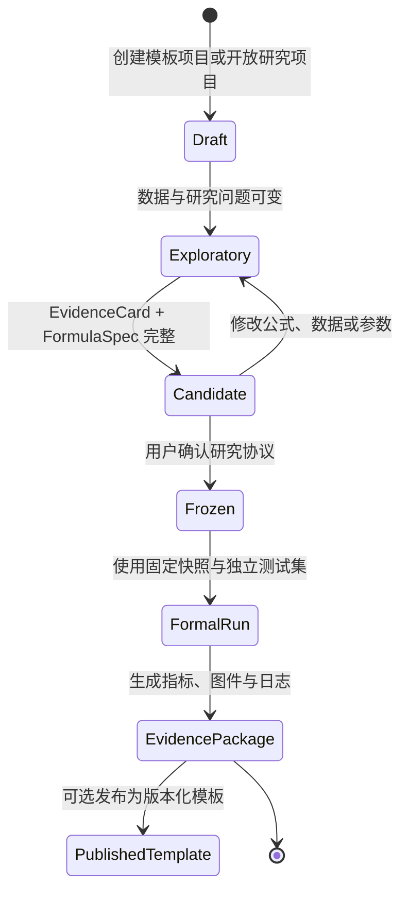
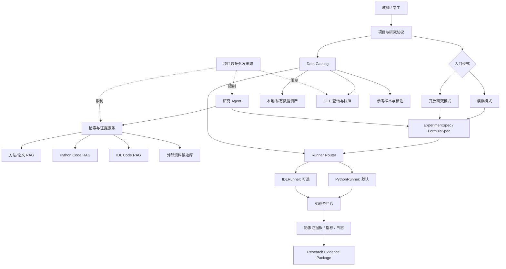
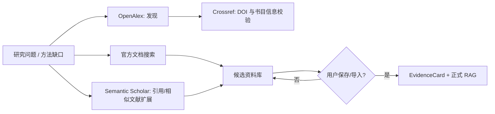

# 遥感研究工作流平台：研究与实施蓝图

> **状态：已确认的规划基线，不代表功能已经实现。**  
> **版本：v0.1 · 日期：2026-09-29**  
> 本文定义 IDL RAG Panel 向“遥感研究工作流平台”演进的研究目标、系统边界、首个实验模板与分阶段实施标准。现有系统的实际能力仍以根目录的 [README](../README.md)、[ARCHITECTURE](../ARCHITECTURE.md) 与 [PROJECT_STATUS](../PROJECT_STATUS.md) 为准。

## 1. 执行摘要

平台的目标不是把一次遥感处理自动化为“一键出图”，而是让教师与学生能够从研究问题出发，在同一系统中完成：资料检索、数据获取或导入、公式/算法试验、Python 或遗留 IDL 执行、逐步影像核验、独立验证，以及可复现研究证据包导出。

最终定位为：

> **一个本地优先、证据可追溯、支持开放探索与标准模板的遥感研究工作流平台。**

平台采用 **Python-first、IDL-optional** 的执行策略：所有新增研究模板以 Python 为默认和长期维护实现；IDL/ENVI 用于复现既有 `.pro` 算法、保留已有实验室资产、支持特定 ENVI API 工作流和教学对照。平台不会把“必须生成或运行 IDL”作为新任务的前置条件。

首个真实研究模板为：

> **云遮挡条件下 Sentinel-1/Sentinel-2 多源协同的 10 m 季节性水体制图与不确定性量化——以鄱阳湖为例。**

该研究的价值不在于宣称“首次进行水体制图”，而在于通过时空独立验证，严谨比较光学、SAR、可解释融合及公式/阈值自适应变体在不同季节、云量和水陆过渡区域的稳定性与不确定性。

## 2. 已确认的核心决策

| 决策 | 已确认方向 | 含义 |
|---|---|---|
| 平台定位 | 遥感研究工作流平台 | 现有 IDL RAG 是起点，不是产品能力上限。 |
| 默认执行语言 | Python | 新模板必须有 Python 实现；IDL 是可选适配器。 |
| IDL 的角色 | 兼容、对照、教学、ENVI 资产复现 | 不强行容器化，也不在没有本机许可时阻断 Python 工作流。 |
| 交互入口 | 模板优先 + 开放研究模式 | 模板保证规范；开放模式不要求先选模板。 |
| 正式结论 | 必须由冻结验证模式产生 | 探索阶段结果不能直接包装成已验证科研结论。 |
| 数据流转 | 默认 `private-local` | 私有原始数据及高精度预览不自动发往外部服务。 |
| RAG 分层 | 方法 RAG、Python Code RAG、IDL Code RAG、Data Catalog | 遥感影像资产不作为普通文本或像元向量库处理。 |
| 可视化 | 每个空间步骤必须交付证据图 | 教师可核验中间结果，不只看到最终产品。 |
| 栅格对齐 | 同一项目的私有波段可显式生成参考网格多波段 GeoTIFF | 为 MNDWI、反射率组合和后续公式实验消除“波段存在但网格不一致”的隐性风险。 |
| 共享 | 私有、团队/课程组、组织公共 | 默认私有；不设计妨碍日常研究的逐项审批流。 |
| 部署 | 先本地验证，后 Docker，再内部多用户 | 先验证科学和执行链路，再扩大运行边界。 |

## 3. 科学研究设计

### 3.1 研究问题与结论边界

首个模板回答以下问题：

1. Sentinel-2 光学指数、Sentinel-1 SAR 和可解释融合方法在鄱阳湖丰水、枯水和过渡期的水体制图精度有何差异？
2. 在云遮挡或光学有效观测不足时，SAR 与融合策略能否提高结果稳定性？
3. 根据云量、季节或局部统计量调整的公式/阈值候选，是否在**独立时空测试集**上优于固定阈值及简单融合基线？
4. 结果的不确定性集中在哪些区域与情景，例如水陆边界、浅水/湿地、云影、SAR 斑点或传感器观测不一致？

平台不得预设“候选公式一定优于基线”。候选模型没有显著改进、只在特定条件下改进，或导致某些场景退化，均是应该如实保存和报告的有效研究结果。

### 3.2 数据、时间和空间范围

| 项目 | 规划 |
|---|---|
| 研究区 | 鄱阳湖主体水域及其缓冲/湿地过渡区；边界作为版本化 ROI 资产保存。 |
| 研究期 | 2018–2025；以实际可用观测和参考数据质量为准。 |
| 光学数据 | Sentinel-2 Surface Reflectance Harmonized；记录集合 ID、波段、云掩膜规则、合成窗口和处理日期。 |
| SAR 数据 | Sentinel-1 GRD/RTC；记录极化、轨道/观测几何、原始单位、预处理及阈值规则。真实案例使用 RTC，因为 GRD 候选在裁剪时缺少可用 CRS。 |
| 公共参考基线 | 2018–2021 年可采用 JRC Global Surface Water 作为历史参考基线，但不得把它误写成严格独立的现场真值。 |
| 2022–2025 参考 | 建立按时相和区域分层的人工判读样本；未来接入水文站、外业调查或单位权威产品时，作为更高优先级参考。 |
| 数据快照 | 每次正式运行保存 GEE 查询、产品版本、ROI、时间范围、波段、投影、尺度、掩膜、下载/导入校验值及本地资产引用。 |

Sentinel-1/2 产品说明、波段与处理条件应以数据提供方的官方文档为准，不能只依赖博客或二手代码。[Sentinel-1 GRD 数据目录](https://developers.google.com/earth-engine/datasets/catalog/COPERNICUS_S1_GRD) [Sentinel-2 SR Harmonized 数据目录](https://developers.google.com/earth-engine/datasets/catalog/COPERNICUS_S2_SR_HARMONIZED)

### 3.3 对照实验矩阵

首个模板固定以下四类模型，确保候选方法有足够的、可解释的对照：

| 编号 | 模型族 | 目的 | 初始示例 |
|---|---|---|---|
| M1 | 光学基线 | 给出可解释的指数型参照 | MNDWI + 固定阈值；MNDWI + 受控自适应阈值。 |
| M2 | SAR 基线 | 覆盖云遮挡条件 | Sentinel-1 VV/VH 或其组合的透明阈值规则。 |
| M3 | 规则融合基线 | 检查多源协同的增益 | 明确的光学有效性判断 + SAR/光学逻辑或加权融合。 |
| M4 | 公式模型实验室候选 | 检验研究假设 | 根据云量、季节或局部统计量自适应调整阈值/融合权重的候选。 |

M4 只能在以下条件都满足时成为正式候选：有 `EvidenceCard`、有明确公式和参数范围、没有访问最终测试标签、可由 PythonRunner 重现、能够输出与 M1–M3 相同的结果层与评价指标。深度学习、复杂反射率反演、PROSAIL 或大模型驱动建模属于第二阶段，需在基线和参考数据充分后单独立项。

#### V1 已实现：安全的声明式波段数学候选

为让研究者能够测试经文献支持的反射率、指数或阈值修改，同时不把运行器变成任意代码执行入口，`PythonRunner` 提供 `safe_band_math_threshold`。一份 FormulaSpec 必须在**同一个本地 GeoTIFF**中声明输入名、波段号及可选 `scale`/`offset`，再提供表达式、有限数值参数、阈值和 `water_condition`（`>=` 或 `<=`）。例如：

```json
{
  "operation": "safe_band_math_threshold",
  "input_asset_id": 42,
  "inputs": {
    "green": { "band": 1, "scale": 1.0, "offset": 0.0 },
    "swir1": { "band": 2, "scale": 1.0, "offset": 0.0 }
  },
  "expression": "clip((green - swir1) / (green + swir1) + bias, -1, 1)",
  "parameters": { "bias": 0.0, "threshold": 0.0 },
  "water_condition": ">="
}
```

表达式仅允许数字、已声明名称、一元正负号、`+`、`-`、`*`、`/`、`**`，以及 `abs`、`sqrt`、`log`、`exp`、`clip`、`minimum`、`maximum`。属性访问、下标、未知名称/函数、字符串和任何 Python 语句均会拒绝；它不能访问验证样本或标签。运行会保存输入预览、连续特征 GeoTIFF/PNG、水体分类 GeoTIFF/PNG、波段变换、表达式和最终参数到 Run manifest，并在正式运行时纳入证据包。此机制只验证受限公式的数值行为，**不构成**对反射率模型物理正确性或研究结论的自动背书；每个候选仍需由 EvidenceCard、独立验证和正式协议支撑。

#### V1 已实现：私有多波段栅格对齐

MNDWI 等公式通常需要把不同空间分辨率的波段放在同一输入栅格中。研究页提供“生成对齐多波段栅格”动作：用户选择同一项目内至少两个已落盘的 `raster` 资产，第一个或显式指定的资产作为参考网格，服务使用 Rasterio `WarpedVRT` 按 `nearest`、`bilinear` 或 `cubic` 重投影/重采样，并创建新的私有 GeoTIFF DataAsset。派生资产保存有序源资产 ID、源 SHA-256、参考资产、波段名、重采样方式、CRS、仿射变换、宽高、波段数、NoData 和输出 SHA-256；原始像元不会进入 RAG 或外部请求。

服务拒绝远端 `reference`、跨项目 ID、非栅格资产、重复资产和不可读 GeoTIFF。该能力只保证网格与数值处理可复现，不自动保证大气校正、传感器标定或波段物理可比性；这些仍需在研究协议和 EvidenceCard 中审查。

### 3.4 时空独立验证

为避免把同一地点或相邻时相的相似像元同时放入开发集和测试集，采用如下基线方案：

| 阶段 | 时间范围 | 用途 |
|---|---|---|
| 探索/参数设计 | 2018–2022 | 生成候选、限定合理参数范围、检查预处理和可视化。 |
| 模型选择验证 | 2023 | 在不访问最终测试集的前提下，选择最终的公式版本与参数。 |
| 独立测试 | 2024–2025 | 冻结后一次性评价正式结论。 |

同时按鄱阳湖水文分区或空间网格块分配样本，并按丰水期、枯水期、过渡期、云量等级和水陆边界情况分层。相同或相邻空间块不得在开发/测试之间交叉泄漏。每个样本必须记录：来源、标签、获取日期、标注人、置信度、空间块、季节、是否用于探索/模型选择/独立测试，以及冲突或待复核状态。

精度估计和面积估计的报告方法应参考遥感分类精度评估的通行良好实践，例如 Olofsson 等提出的抽样与误差调整框架，而非只报告随机像元的总体精度。[Olofsson et al., *Remote Sensing of Environment*, 2014](https://doi.org/10.1016/j.rse.2014.02.015)

#### V1 点样本验证契约

项目的人工/外部参考样本以 WGS84 经纬度保存，并且只有**显式绑定到本次 DataSnapshot**的样本才能为该快照的运行计分。登记样本不等于已验证；实验的 `validation_plan` 必须主动声明采样规则，例如：

```json
{
  "split": "spatiotemporal-holdout",
  "metrics": ["f1", "iou", "area_difference"],
  "sample_validation": {
    "split": "independent_test",
    "min_confidence": 0.8,
    "require_unconflicted": true,
    "min_sample_count": 100,
    "min_spatial_blocks": 10,
    "min_temporal_strata": 3,
    "min_samples_per_spatial_block": 10,
    "min_samples_per_temporal_stratum": 20,
    "weighting": {
      "enabled": true,
      "metadata_key": "sampling_weight",
      "minimum_total_weight": 100,
      "minimum_effective_sample_size": 50
    }
  }
}
```

`min_sample_count`、`min_spatial_blocks`、`min_temporal_strata`、`min_samples_per_spatial_block` 和 `min_samples_per_temporal_stratum` 是研究协议中预先声明的最低要求，而不是通用推荐值；上例的 100/10/3/10/20 仅用于说明字段，应由研究者根据抽样设计、研究区和季节覆盖范围确定。正式运行会在采样后实际检查总体与每个已纳入分层的下限，不能以少量“可用”点样本替代事后验证。

执行器会把合格样本投影到本次 `water_mask.tif` 的 CRS 后取分类值，并输出总体、时间分层和空间块的混淆矩阵、OA、Precision、Recall、F1 和 IoU。下列样本会被排除或使运行失败，而不会静默混入精度指标：未绑定当前快照、划分不符、置信度不足、冲突未解决、落在 ROI 外、或落在 NoData 像元。标签只在分类结果产生后用于评估，**不允许作为公式、阈值或 Otsu 参数的输入**。

当研究协议声明 `sample_validation.weighting` 时，样本必须在 `metadata_json` 顶层提供指定的正有限权重；Runner 会检查总权重和有效样本量下限，并输出按权重计算的混淆矩阵和指标。加权结果明确记录权重来源、总权重和有效样本量；当前不把未加权 Wilson 区间冒充加权设计区间，真实研究仍需按抽样设计补充设计一致的方差估计。

当研究协议声明 `sample_validation.area_adjustment` 时，每个有效样本必须在 `metadata_json` 顶层提供分层标识和该分层的一致面积。Runner 按分层面积与分层内样本比例估计面积调整混淆矩阵、OA、Precision、Recall、F1、IoU、参考正类面积、预测正类面积和面积绝对误差，并检查协议声明的分层是否全部覆盖。该模式暂不与通用 `weighting` 叠加，避免把不同抽样设计悄悄混合；面积调整结果仍不伪造设计型置信区间，真实研究需根据抽样设计补充方差估计。

面积调整配置示例（与上面的 `weighting` 配置二选一）：

```json
{
  "area_adjustment": {
    "enabled": true,
    "stratum_metadata_key": "sampling_stratum",
    "area_metadata_key": "stratum_area",
    "area_unit": "ha",
    "expected_strata": ["open_water", "wetland_edge"],
    "minimum_strata": 2
  }
}
```

#### V1 开发参数候选实验

开放研究页支持对一个 `preview` 实验提交 2–20 个候选参数对象，在 `development` 或 `model_selection` 点样本上逐个运行现有 PythonRunner。每个候选都会生成独立的特征/分类栅格、PNG 和验证 JSON，并在一个可下载的 `parameter_sweep` Run 中记录参数、样本划分、指标、排名和失败原因。扫参支持立即执行或加入现有研究 worker 队列；队列运行可取消、超时回收并按原请求独立重试。排序指标可选 OA、Precision、Recall、F1 或 IoU；系统不会读取 `independent_test`，不会自动选择或冻结 FormulaSpec，也不会把探索排名写成正式科学结论。正式实验必须重新使用冻结协议和独立测试设计。

#### V1 CSV 批量样本导入

除了逐条登记，项目成员可将 UTF-8 编码的独立样本 CSV 一次性导入到**一个指定的冻结 DataSnapshot**。导入文件本身不会进入 RAG、外部检索或额外的项目文件副本；服务只解析、校验并原子写入私有样本记录。CSV 的必需列为 `longitude`、`latitude`、`label`（仅 `0` 或 `1`）、`observed_at`、`annotator`、`confidence`、`split`、`spatial_block`、`temporal_stratum` 和 `source_note`；可选列为 `source_asset_id`、`conflict_status` 和 `metadata_json`。单次导入上限为 10 MiB / 10,000 行，任一行、JSON 元数据、来源资产或快照不合法时整批拒绝，不写入部分样本。

V1 已强制检查总有效样本数、空间块数、时间分层数以及每个空间块/时间分层的协议下限；未声明权重时输出明确标注为未加权 Wilson 95% 的 OA/Precision/Recall/IoU 区间，声明权重时输出加权指标和有效样本量覆盖，声明面积调整时输出分层面积估计与面积误差。以上仍不是完整抽样设计：分层方案本身的代表性、误差调整面积与设计一致的空间相关置信区间，需要在首个真实研究的协议冻结前补齐并强制检查。

### 3.5 探索模式与验证模式



- **探索模式**：Agent 可以基于资料提出候选公式，执行预览、比较多个版本、生成中间图和解释差异。
- **验证模式**：冻结 FormulaSpec、代码快照、环境、数据快照、参数范围、样本划分和评价指标；正式测试不能被用于反复挑选模型。
- **结论规则**：只有验证模式产物才能标注为“正式结果”。探索最优结果只能标为“探索候选”。

研究协议页还提供一个只读的“协议就绪检查”：它按路径报告研究问题、可检验假设、ROI、有效时间范围、冻结数据快照、可信 EvidenceCard、时空独立验证、空间分块、图件契约和结论边界的缺项。该检查不阻断预览，也不代替正式实验对具体参考资产、点样本最低覆盖和指标的校验；它的作用是让研究者在冻结协议前看到可操作的缺口，而不是把不完整草案静默当作正式设计。

## 4. 产品形态与用户工作流

### 4.1 两种入口

| 入口 | 适用情况 | 行为 |
|---|---|---|
| 研究模板模式 | 课程作业、成熟实验、标准业务流程 | 选择模板后，按定义好的数据、方法、验证和证据步骤执行。 |
| 开放研究模式 | 新公式设想、尚无模板的课题、本地资料探索 | 从自然语言问题、论文、数据或公式开始；Agent 逐步生成研究协议草案。 |

开放研究模式是“无模板起步”，不是“无记录运行”。用户请求进入正式验证时，系统必须自动整理并显示可编辑协议，至少包括研究问题、假设、数据快照、FormulaSpec、代码、参数范围、验证划分、证据来源和必需可视化。用户确认后才能冻结和正式运行；验证成功的协议可发布为个人、团队或组织模板的新版本。

**当前 V1 实现边界（2026-09-29）：** 开放研究页已提供本地 `protocol-draft` 接口：用户输入自然语言研究问题后，系统生成一份包含研究区、时间、数据、方法、时空独立验证、图件契约和结论边界的结构化预填草案。生成不读取项目资产，也不调用外部检索、RAG 或模型服务；草案不会自动写回项目，必须由用户审阅、编辑并主动保存。每次内容不同的协议保存都会形成项目内递增版本、规范化 JSON 和 SHA-256，成员可在项目页查看历史；仅修改项目说明或重复保存相同协议不会产生伪版本。每个新建实验关联当前协议版本并记录快照与指纹；正式实验还要求已保存至少 8 个字符的研究问题，并在运行前再次检查版本、快照和指纹。证据包只收录该实验的协议版本与快照，后续项目编辑不会改写历史记录。项目 RAG 证据映射和只读协议就绪检查已经提供，但仍然只是研究者审查辅助，不是 Agent 对研究方法、论文证据或公式优劣作出的判断；公开文献摘要也只能在用户明确选择已绑定 Method 知识库后以 `abstract_only` 候选记录导入，不能替代全文许可核验。

### 4.2 项目主界面

项目而非聊天记录是平台的一级对象。每个项目包含：

1. **研究协议**：问题、假设、模板版本、状态、适用边界与版本历史。
2. **数据目录**：数据卡、ROI、原始/派生资产、访问策略、质量信息与快照。
3. **方法与公式**：EvidenceCard、FormulaSpec、Python/IDL 实现、参数和变体关系。
4. **运行记录**：预览和正式任务、执行器、日志、状态、耗时、资源与可重跑入口；同一 formal 实验的已完成 Run 可按绝对/相对容差比较冻结上下文与生成产物，明确区分一致、超差和不可比较。
5. **影像证据板**：每一处理阶段的地图、统计和图层对比。
6. **验证与证据包**：样本、指标、误差图、结论边界、引用和可导出包。

Agent 是这些页面中的上下文研究助手：可检索资料、解释代码、建议参数、生成候选、解释影像和创建任务；它不能绕过数据记录、验证冻结和证据归档。

### 4.3 预览与正式运行

| 模式 | 数据和计算 | 输出定位 |
|---|---|---|
| 预览 | 小 ROI、降采样、少时相或代表性切片；允许快速修改。 | 检查数据、参数和中间影像是否合理，不作为正式结论。 |
| 正式可复现实验 | 冻结数据快照、目标分辨率、完整时相、固定参数和独立测试样本。 | 形成不可变 Research Evidence Package。 |

两种模式均由教师或学生直接发起，不增加日常审批。正式模式的区别来自研究设计状态，而不是人为权限障碍。

## 5. 逻辑架构



### 5.1 关键领域对象

| 对象 | 作用 | 必要字段示例 |
|---|---|---|
| `Project` | 用户开展研究的顶层容器 | owner、共享范围、外发策略、状态、研究协议版本。 |
| `DataAsset` | 原始、派生或参考数据资产 | URI/内部路径、校验值、传感器、时间、ROI、CRS、分辨率、许可、访问策略。 |
| `DataSnapshot` | 可复跑的数据引用集合 | DataAsset 版本、GEE 查询、选择条件、导入校验、创建时间。 |
| `EvidenceCard` | 方法、公式或代码的证据来源 | DOI/官方链接、来源类型、许可、适用条件、检索日期、可信状态。 |
| `FormulaSpec` | 与语言无关的公式与参数定义 | 输入波段、公式、单位、掩膜、参数域、输出、验证规则。 |
| `ExperimentSpec` | 一次可执行试验的冻结协议 | 模型、数据快照、runner、环境、参数、样本划分、可视化清单。 |
| `Run` | 预览或正式执行记录 | run ID、代码哈希、环境锁定、日志、退出状态、产物索引。 |
| `ResearchEvidencePackage` | 正式结论的不可变归档 | 协议、产物、指标、证据、结论边界、导出清单。 |

`FormulaSpec` 必须是语言无关的。例如，同一个 MNDWI 模型只定义一次波段、公式、掩膜、阈值和输出，再交由不同 Runner 实现：

```yaml
model_id: water-mndwi-threshold-v1
inputs:
  green:
    product: Sentinel-2 SR Harmonized
    band: B3
  swir1:
    product: Sentinel-2 SR Harmonized
    band: B11
formula: "(green - swir1) / (green + swir1)"
parameters:
  threshold:
    type: float
    default: 0.0
    allowed_range: [-1.0, 1.0]
rules:
  nodata: preserve
  cloud_mask: required
outputs:
  - water_mask
  - index_raster
  - confidence_map
validation:
  metrics: [oa, precision, recall, f1, iou, area_difference]
```

## 6. RAG、外部检索与数据目录

### 6.1 四层知识与数据组织

| 层 | 内容 | 可以进入向量检索 | 典型用途 |
|---|---|---:|---|
| Method RAG | 论文、官方算法文档、产品说明、验证规范 | 是 | 解释方法、约束模型适用范围、生成引用。 |
| Python Code RAG | Python、GDAL、Rasterio、GEE、测试与模板代码 | 是 | 生成和修复 PythonRunner 实现。 |
| IDL Code RAG | `.pro`/`.idl`、ENVI 资料、函数依赖 | 是 | 复现遗留算法、生成教学或对照实现。 |
| Data Catalog | 影像、样本、ROI、GEE 查询、实验产物元数据 | 否（不嵌入像元） | 找到可用数据并保证版本、权限与重跑。 |

原始栅格文件、矢量文件和样本表的内容不应作为普通文本送入 RAG，也不能将完整像元直接嵌入向量库。Data Catalog 只保存可搜索的元数据、数据卡和内部访问引用；真正的数据由项目资产仓按权限访问。

**当前实现边界：** 项目成员可以将自己拥有的现有知识库显式绑定为 `method`、`idl_code` 或 `python_code` 来源；绑定后，同一项目的成员才能从项目 RAG 检索这些文本并获得引用。绑定是主动共享行为，外部 Crossref/OpenAlex/Semantic Scholar 候选及其引用关系扩展不会自动进入任何知识库；用户明确选择已绑定的 `method` 知识库后，可以把公开元数据和摘要作为标记为 `abstract_only` 的候选 Markdown 记录排队入库，完整论文仍需用户核对许可后手动上传。遥感 `DataAsset`、ROI、样本表和像元没有绑定入口，继续只通过 Data Catalog 与冻结快照管理。

### 6.2 外部资料检索链路



- 当前研究工作区已经接入 OpenAlex、Crossref 和 Semantic Scholar 的候选元数据搜索；OpenAlex 适合发现，Crossref 适合 DOI、题名、作者和出版信息校验，Semantic Scholar 提供 paper ID、作者、摘要、venue 以及按页展开引用/参考文献关系的补充入口。三类结果和关系扩展都只作为带审计的候选，仍需研究者核验。
- 外部资料在未经用户选择、许可检查和来源确认前，只是 `candidate`，不得自动进入正式知识库，也不得被 Agent 当作已审阅事实。
- 用户可以明确把**公开摘要记录**导入已绑定的 Method RAG；系统保存提供方、外部 ID、DOI/URL、检索审计 ID，并在文档中写明 `abstract_only` 和 `candidate`。该动作不抓取任意远程 URL，也不把摘要升级为 verified 证据。
- 用户上传或明确导入全文时，系统需保存来源、许可/访问说明、导入范围与原文件校验值；全文导入仍走普通私有文档上传/索引流程。
- 方法建议必须优先引用原始论文、官方数据产品文档或官方软件文档；二手网页只能作为探索线索。

官方接口参考：[OpenAlex API](https://help.openalex.org/api/) [Crossref REST API](https://www.crossref.org/documentation/retrieve-metadata/rest-api/) [Semantic Scholar Academic Graph API](https://api.semanticscholar.org/api-docs/)

### 6.3 EvidenceCard 质量门槛

任意候选公式、算法、阈值、波段映射和代码模板至少需要：

- 主来源：论文 DOI/正式引文，或官方产品/软件文档链接；
- 适用数据、传感器、波段、空间尺度、时间条件和已知限制；
- 代码来源、许可、修改记录和作者/维护者；
- 检索日期及来源状态：`candidate`、`verified`、`imported`、`experiment_pinned`；
- 与当前研究假设的关系：基线、候选变体、仅供背景、不可直接比较。

只有有可核验主来源的方案能够进入验证模式。由网页摘要、二手材料或 Agent 推断得到但未核验的内容，最多是探索候选。

### 6.4 协议中的项目 RAG 证据映射

开放研究协议支持两条明确分开的草案路径：纯本地结构化预填不会查询任何资料；“项目 RAG 证据映射”只检索**成员已显式绑定**的 Method、IDL Code 或 Python Code 知识库，并把返回的 chunk 引用逐条写进一个未持久化的 `method_plan.rag_evidence_map`。每一条都固定为 `unverified`，只提示研究者阅读原始上下文、确认适用性/限制/许可后再决定是否创建 EvidenceCard。

该映射不是自动文献综述、不是对公式或反射模型的认可，也不会自动保存协议、导入外部全文、升级 EvidenceCard 或访问 Data Catalog 的私有像元/样本。这样可以让 Agent 工作流从“资料可追溯地支持研究问题”起步，而不越过研究者的证据审查与冻结责任。

## 7. Python-first Runner 与 IDL 兼容层

### 7.1 选择原则

Python 是默认执行器，原因是它覆盖 GEE 接口、地理数据读写、数值计算、统计验证、自动化测试、图件生成和 Docker 服务化。Earth Engine 提供官方 Python 客户端；GDAL 提供 Python API；Rasterio 建立在 GDAL 之上并适合 NumPy 栅格工作流。[Earth Engine Python 指南](https://developers.google.com/earth-engine/guides/python_install) [GDAL Python API](https://gdal.org/en/stable/api/python/) [Rasterio 文档](https://rasterio.readthedocs.io/en/stable/)

IDL 并非删除对象。它在既有 `.pro` 资产、导师已验证算法、ENVI 对象 API、ENVI 自定义 Task 和教学场景中仍有价值。ENVI API 的核心接口基于 IDL，且相关运行通常依赖合法的 ENVI/IDL 许可环境。[ENVI API 编程概览](https://www.nv5geospatialsoftware.com/docs/programmingguideintroduction.html)

### 7.2 Runner 契约

| Runner | 状态 | 输入 | 输出 | 环境策略 |
|---|---|---|---|---|
| `PythonRunner` | 必需、默认 | `ExperimentSpec`、受控 DataSnapshot | 标准化栅格/矢量、统计、PNG/COG、日志、环境锁定 | 本地 Conda/Mamba 环境，后续 Docker 镜像。 |
| `IDLRunner` | 可选 | 同一 `FormulaSpec` 或已批准 IDL artifact | 标准化结果与日志；兼容时输出同类证据图 | 只调用用户已配置的本机/内部授权 IDL/ENVI。 |

建议的 Python 基础栈：GDAL、Rasterio、NumPy、SciPy、GeoPandas、xarray、Matplotlib、scikit-image、scikit-learn 和 `earthengine-api`。具体版本必须随 `Run` 记录并在正式阶段锁定。由于 GDAL/Rasterio 有底层二进制依赖，本地阶段优先采用稳定的隔离地理空间环境；容器化阶段将 Python、GDAL 和系统依赖一同固定。[Rasterio 安装说明](https://rasterio.readthedocs.io/en/stable/installation.html)

### 7.3 IDL → Python 等价验证

当已有 IDL 实现时，迁移不是凭视觉判断。平台应提供对照任务，至少比较：

1. 输入影像、ROI、尺度、投影、重采样和 NoData/掩膜规则；
2. 公式、常数、阈值、单位、数据类型与边界行为；
3. 连续变量的像元差异、RMSE、分布统计和异常值；
4. 分类结果的混淆矩阵、IoU、F1、面积差异与边界差异；
5. 每个中间图层、日志、依赖版本及允许数值容差。

**当前已实现的受控对照路径：** 研究者可先将本机受许可 IDL/ENVI 输出的 GeoTIFF 上传为当前项目的私有 `derived` DataAsset，并在 `ExperimentSpec.parameters.idl_comparison` 预先声明该资产、`comparison_mode`（`classification` 或 `continuous`）、Python GeoTIFF 文件名和容差。PythonRunner 在同一 Run 内先生成标准产物，再校验两者的 CRS、尺寸、仿射变换、共同有效像元和 NoData 不一致情况。分类对照输出一致率、F1、IoU、像元面积差与有符号差异图；连续对照输出平均有符号差、MAE、RMSE、最大绝对差、容差通过率与差异图。比较报告、差异 GeoTIFF/PNG 与运行清单会进入正式 Research Evidence Package。IDL 结果是**实现对照而非独立参考真值**，不得取代本节以外的精度验证资料。

项目级 `IDLRunner` 已接入本地受许可节点边界：成员先通过专用接口上传私有 `.pro` 脚本，实验在 `parameters.idl_script_asset_id` 中显式引用它；快照输入会复制到受限 `inputs` 目录，Runner 只调用配置的 `IDLRAG_IDL_EXECUTABLE -batch`，并把日志、图件和 manifest 纳入同一 Run/证据链。实验可用 `parameters.idl_prediction_output_file` 声明输出 GeoTIFF（默认 `water_mask.tif`），当验证方案声明参考栅格或独立点样本时，IDL 结果复用 PythonRunner 的验证、误差图和指标契约；现在缺少声明的预测文件会明确使 Run 失败，防止批处理进程空退出被误报为成功。缺少脚本、许可或可执行文件时明确返回 `unavailable`，不影响 PythonRunner；Workbench/ENVI GUI 启动器 `idlde`/`envi_idl` 与 SAV-only `idlrt` 会在启动前被拒绝。本机 `envi_idl.exe` 已证明只是可启动的 Workbench 入口，候选 `idl.exe` 现场运行又因 `Failed to initialize IDL instance` 未生成 GeoTIFF，当前真实研究仍需在有效授权节点上完成 ENVI batch 初始化、输入读取、带空间参考的预测 GeoTIFF 输出、过程约定和正式许可策略。

通过既定容差的 Python 实现可成为该模板的 `canonical_runner`。之后 IDL 保留为历史对照，不再要求所有新增研究任务生成 IDL。

## 8. 可视化证据契约

任何产生空间结果的步骤，模板必须声明可视化输出。没有空间产物的步骤应输出结构化日志或表格证据，并明确说明“无地图输出”。

| 阶段 | 最低证据 | 必须随图保存的元数据 |
|---|---|---|
| 输入 | 光学真彩/假彩或 SAR 初始图；ROI 叠加 | 产品、时间、波段/极化、CRS、尺度、空间范围。 |
| 预处理 | 云/阴影掩膜、SAR 去噪/处理结果、合成图 | 算法、阈值、有效像元率、NoData 比例。 |
| 特征/公式 | 指数图、连续变量图、局部统计或阈值图 | 色带、显示范围、单位、公式版本、参数。 |
| 模型输出 | 水体掩膜/反演结果、分类图 | 类别含义、面积/像元数、投影、参数。 |
| 不确定性 | 置信度、分歧、敏感性或质量掩膜图 | 不确定性定义、数值域、汇总统计。 |
| 验证 | 参考样本叠加、错误点/面、差异图 | 样本集版本、指标、分层信息、误差类型。 |
| 最终成果 | 标准成果图与对比图 | 引用 Run、数据快照、模型版本、结论边界。 |

证据板应支持图层开关、透明度叠加、前后对比、同一范围同步、色带图例、像元/区域统计、下载和 Run/FormulaSpec 回溯。正式报告图的显示范围不得无记录地自动变化，避免视觉夸大差异。

## 9. 数据安全、隐私与协作

### 9.1 项目级外发策略

默认策略为 `private-local`：

- 私有原始影像、矢量、样本表和高分辨率预览只在本地执行器或学校/企业私有部署中处理；
- 文献搜索、GEE、模型服务只接收完成任务所必需的公开条件、元数据，或用户明确允许的脱敏/降尺度派生结果；
- 任何策略变化和外发行为写入运行/审计日志；
- 共享实验包默认只包含内部数据引用、校验值、访问说明和派生结果，不复制私有原始数据。

### 9.2 轻量共享模型

日常工作不使用繁琐的逐项审批。对象具有简单的可见范围：`my`、`workspace`、`organization`。默认 `my`；教师和学生都可创建项目、上传资料、运行任务及在范围内共享。当前实现已经提供最小协作模型：项目创建者按已注册用户名邀请或移出成员，受邀成员共享项目工作流，不区分教师/学生操作角色；未受邀用户仍无法用项目 ID 读取资料或产物。管理员负责账号、组织空间、配额、基础配置和部署，不应成为每次研究运行的瓶颈。

在内部多用户部署前，仍需将当前按用户名的项目成员扩展为学校/企业目录、课程组与组织范围，并对所有新对象和下载路径持续执行对象级归属/成员检查，防止仅依赖 URL/ID 获取他人数据的对象级授权漏洞。文件导入必须采用扩展名白名单、内容类型/文件签名检查、大小限制、隔离存储、路径规范化和恶意文件防护等措施。[OWASP 文件上传防护清单](https://cheatsheetseries.owasp.org/cheatsheets/File_Upload_Cheat_Sheet.html) [OWASP API 对象级授权风险](https://api-security.owasp.org/editions/2023/en/0xa1-broken-object-level-authorization/)

### 9.3 人工判断与作者责任

Agent 不应替代研究者对以下事项的判断：研究问题合理性、数据使用许可、标签真值质量、统计假设、结论表述、作者署名和对外发布。平台必须明确区分：来源事实、Agent 推断、用户假设、已验证结果与尚未验证的探索候选。

## 10. Research Evidence Package

每个正式可复现实验生成一个不可变证据包，至少包括：

```text
research-evidence-package/
  manifest.json                 # 包版本、完整性、对象引用
  protocol/                     # 冻结的研究问题、假设和 ExperimentSpec
  data/                         # DataSnapshot、DataCard、校验值和内部访问引用
  method/                       # FormulaSpec、EvidenceCard、代码快照与许可说明
  environment/                  # Python/IDL runner、依赖锁定、系统信息
  runs/                         # run 日志、参数、状态、耗时与资源摘要
  visuals/                      # 所有阶段的图、色带、渲染元数据与统计
  validation/                   # 样本版本、划分、指标、误差图和不确定性分析
  references/                   # 文献与官方数据/软件来源
  conclusion.md                 # 结论、适用范围、局限和未解决问题
```

正式证据包的不可变性指逻辑版本冻结：后续修订必须创建新版本或派生 Run，而非覆盖原有结论。若含私有数据，导出包应留下授权引用和校验值，而非复制原始数据。

formal Python Run 同时生成确定性的 review-first Markdown 报告。报告只引用研究问题、冻结协议/快照/公式摘要、验证结果和已生成产物，不复制原始 URI 或像元；它明确要求研究者报告改进、无差异、退化和未解决限制，不把指标或重跑一致性自动解释为科学优越性。报告随 Evidence Package 保存，也可从研究页面单独下载。

同一项目内的两个 formal Run 还可以做基线/候选描述性比较：两者必须共享同一冻结 DataSnapshot 和完全相同的验证方案，但 FormulaSpec 可以不同。系统只计算共同有限指标的候选减基线 delta，并明确不提供统计显著性或科学优越性判断；preview、参数扫参、快照不一致或验证设计不一致的结果不能进入该比较。

### 研究 Agent 的受控项目上下文

现有对话 Agent 可以在用户明确选择一个研究项目后进入“研究项目上下文”。它通过只读工具逐步完成：查看不含原始路径/凭据的项目摘要、检索项目成员显式绑定的 Method/IDL Code/Python Code RAG、生成未持久化的结构化协议草案，以及读取协议就绪检查。所有工具在服务端重新验证项目所有者或成员身份，并要求工具参数中的 `project_id` 与当前会话绑定项目一致；未授权用户、跨项目参数和无项目上下文都会被拒绝。

外部文献搜索是独立的出站能力，默认关闭，只有用户在聊天页打开“允许外部文献搜索”后 Agent 才能调用。出站请求只包含用户研究问题、provider 和数量，不包含项目影像、ROI、DataSnapshot、运行产物、原始 URI 或凭据；返回的 Crossref/OpenAlex/Semantic Scholar 候选仍需人工核验，Agent 不能直接把候选导入 RAG、创建 EvidenceCard、修改协议或启动正式实验。正式实验、数据下载、公式冻结和导入操作继续保留在研究页的显式操作路径中。

当前提供受限的“用户确认后 preview 工作流”动作：聊天页单独的“允许 Agent 预览执行”开关和用户明确的执行请求共同构成授权；Agent 可先读取安全的数据目录/运行摘要，再使用当前项目已有公式规格和数据快照创建 Python `preview` 计划，并在第二次明确确认后将其加入队列。服务端再次检查项目成员权限、资源归属、`execution_mode=preview`、`runner_type=python` 和 `confirm=true`；队列仍复用 worker 的原子 claim、取消、超时回收和重试状态机。Agent 不能修改公式/协议、同步执行、排队 formal/parameter sweep/IDL，也不能读取原始像元或私有路径；任何正式研究结论仍必须由研究者在研究页显式冻结、运行和审阅。

Agent 还可在另一枚独立的“允许 Agent 获取 GEE”授权下调用受限 GEE 数据获取。该工具复用 `GeeService` 的数据集白名单、经纬度 bbox、最大范围、波段数、尺度、日期格式和下载大小校验，只把查询后的私有 DataAsset 摘要返回给 Agent；原始像元和 `research://` 存储 URI 不进入模型上下文。获取完成后只登记 DataAsset，不能自动冻结 DataSnapshot、创建实验或启动 Runner；研究者仍需在研究页核对查询和资产，再显式冻结后续流程。

研究页还提供证据包完整性校验：拥有项目权限的成员可以对已生成 ZIP 检查外层 SHA-256、ZIP 内部 `checksums.sha256`、`package_manifest.json` 对 `run_manifest.json` 的摘要引用、每个登记生成产物的摘要以及 `raw_data_included=false` 隐私声明。该校验只验证包边界和文件完整性，不把文件完整性误报为科学结论，也不会读取或外发原始私有影像。

## 11. 分阶段实施路线图

不以日历日期估算，而以可验证的交付物推进。

### 阶段 A：研究对象与本地执行基础

- 定义 `Project`、`DataAsset`、`DataSnapshot`、`EvidenceCard`、`FormulaSpec`、`ExperimentSpec` 和 `Run` 的最小数据模型。
- 建立本地项目目录约定、资产校验、DataCard 与数据快照写入。
- 引入隔离的 Python 地理空间环境，验证 GDAL/Rasterio/GEE 本地最小案例。
- 将现有 IDL 运行能力整理为可选 `IDLRunner` 边界，不扩大其权限。

**验收：** 本地数据与受控 GEE 小范围数据都可登记为 DataAsset；一个 Python 预览任务可留下日志、产物和数据快照。

### 阶段 B：公式模型实验室与 PythonRunner

- 实现 FormulaSpec/ExperimentSpec 的版本、校验和冻结状态。
- 实现 M1–M3 基线及其统一输入/输出契约；引入 M4 候选接口，但不预设结论。
- 当前 V1 已实现预览/正式任务队列、失败记录、运行产物和环境记录；worker claim、心跳、队列来源任务超时回收、协作式取消和独立重试 Run 已落地。取消不会强杀正在执行的 Python 进程；自动重试策略和分布式调度仍作为后续增强，不把同步运行误交给队列 worker。
- 如果有可用 IDL 基线，为其增加像元/指标对照测试。

**验收：** 同一数据快照可用 Python 完成至少一项 M1–M3 模型并输出标准化结果；若运行 IDL 对照，差异可量化与可视化。

### 阶段 C：证据板、标注和独立验证

- 按可视化证据契约输出和展示各阶段地图。
- 提供逐条与受限 CSV 批量样本导入/标注，保存置信度、冲突/待复核状态和时空分层信息。
- 实现混淆矩阵、OA、Precision、Recall、F1、IoU、面积差异和明确假设的 95% Wilson 不确定性区间；复杂抽样设计的权重、空间相关性和面积误差分析仍由真实研究方案负责。
- 对 2018–2025 的时空独立设计执行第一轮完整研究。

**真实案例回放（2026-09-30）：** 已完成一条可复核的 Planetary Computer Sentinel-2 B03/B11 + Sentinel-1 RTC VV（线性功率转 dB）→ WorldCover class 80 代理参考 → 10 m 同网格对齐 → MNDWI/SAR threshold PythonRunner formal Runs → formal comparison → 影像/指标/证据包链路。案例实际发现并修复了 EPSG:4326 COG 目标分辨率单位、SAR 原始网格、派生资产输入类型和线性功率/dB 单位问题；修复后的结果和边界见 [`docs/real-research-case-poyang.md`](real-research-case-poyang.md)，问题闭环见 [`docs/real-case-issues.md`](real-case-issues.md)。这仍是单 ROI、跨年份代理参考的科研起点，不是最终的同期现场验证或方法优越性结论。

**验收：** 教师能够从项目界面追溯任意正式结论到影像、样本、公式、参数、代码和来源；结果可显示“未改进”而不破坏流程。

### 阶段 D：开放研究模式与证据包

- 开放研究对话自动生成可编辑研究协议草案。
- 实现 EvidenceCard 审核状态和外部资料候选→正式 RAG 的显式迁移。
- 生成、导出和版本化 Research Evidence Package；支持验证后发布为模板。

**已落地的最小切片：** 无模板用户可用自然语言问题生成不外发的本地协议预填，并人工保存为项目协议；尚未将该预填宣称为 Agent 研究结论或可冻结协议。

#### 公开数据可达性检查（非项目数据导入）

为避免只以合成栅格判断数据链路，已于 2026-09-29 对 Microsoft Planetary Computer 的匿名 STAC 端点进行了只读检查：以 `sentinel-2-l2a`、`2024-10-01/2024-10-31`、`[115.80, 28.90, 116.05, 29.15]` 和 `eo:cloud_cover < 20` 查询，返回了覆盖鄱阳湖附近的多个 Sentinel-2A/B L2A 场景，最低报告云量为 0.011049%。随后对其中 B03 10 m COG 使用提供方临时签名 URL 做了不落盘的 16 KiB HTTP Range 读取，返回 `206`。这证明公开元数据发现与对象存储读取可用；签名 URL、原始像元和临时文件均未写入项目或仓库。

当前 Windows QGIS GDAL 对该远程 COG 的小窗口读取在本机超时，已终止临时进程；因此早期检查本身不是“已完成真实数据导入或真实研究”的宣称。平台现在提供白名单 STAC 元数据搜索、研究者二次确认后的 `reference` 远端引用登记，以及受大小/超时/域名白名单约束的 GeoTIFF 下载、Planetary Computer SAS 授权、WGS84 bbox 裁剪、可选目标分辨率重采样、格式校验和 SHA-256 私有落盘。已用匿名 STAC 返回的真实 Sentinel-2 B01 COG 做现场探针：约 7.32 MB 文件可授权下载并裁剪为 EPSG:32650、82×93 私有栅格；真实 B03 10 m COG 在指定 crop_bbox 后改走 HTTP Range，得到 EPSG:32650、492×558 私有栅格；未指定 crop_bbox 的大对象仍按上限拒绝。随后用真实公共 STAC 服务跑通一次 API 级搜索、候选审计、B01 下载、私有 `research://assets/` 登记和 DataSnapshot 冻结。下载后的资产才可进入 Runner；不同公共数据集的对象授权和签名 URL 有效期仍需在部署环境中做一次现场验收。Microsoft Planetary Computer 的 STAC API 和匿名数据目录说明见其[官方 STAC 文档](https://planetarycomputer.microsoft.com/docs/reference/stac/)、[SAS 授权文档](https://planetarycomputer.microsoft.com/docs/concepts/sas/)与[数据目录说明](https://planetarycomputer.microsoft.com/docs/)。

**验收：** 用户无需选择模板即可完成探索，并在正式验证前将过程冻结为可复跑协议；证据包可在同一环境或干净环境中按记录重跑。

### 阶段 E：Docker 与内部多用户部署

- 已创建 Docker Compose：前端、FastAPI、独立文档/研究任务 worker 和持久卷；API 提供 `/api/health` liveness 与 `/api/ready` readiness（数据库和 worker 心跳），worker 容器 healthcheck 也会校验 heartbeat 状态和新鲜度，Web 只有在 API/worker 均 healthy 后才启动；真实镜像构建、容器 health check、重启持久化仍需在 Docker daemon 可用的干净环境现场验收。
- 将本地 SQLite/文件系统向 PostgreSQL + 挂载卷或对象存储演进；建立迁移策略而非直接覆盖历史数据。
- 将按用户名的项目成员扩展为课程组/组织范围、配额、任务队列和可选学校统一身份认证。
- IDL/ENVI 保持为外部受许可节点，不打包进核心容器镜像。

**验收：** 内部部署可在不暴露私有原始数据和密钥的条件下运行 Python 工作流；多用户项目的共享范围与对象授权可验证。

## 12. 与现有代码库的关系

当前代码库已经具备可复用基础：React/Ant Design 前端、FastAPI 后端、用户与会话归属、SQLite/FTS5/LanceDB、本地文件管理、论文/文本/IDL 文档入库、IDL 符号级分块、RAG 引用、结构化 GEE 小范围数据 artifact 与用户主动触发的本机 IDL 运行。

演进时应保留而非重写的部分：

- 现有 Method/IDL RAG 摄入、引用、检索调试和评测能力；
- 现有用户、会话、artifact 与本地运行安全边界；
- 现有 GEE 结构化输入思路和 IDL 运行产物收集机制；
- 现有 React + FastAPI 技术主线。

建议新增的能力是新的研究领域层，而非把所有逻辑继续塞入 Chat artifact：

| 建议能力 | 责任 |
|---|---|
| `research` 领域模型/服务 | 项目、协议、FormulaSpec、Run、证据包和状态机。 |
| `data_catalog` 服务 | DataCard、DataAsset、快照、校验、访问策略和 GEE/本地来源。 |
| `python_runner` | 受控的 Python 地理处理、环境记录、标准产物与任务状态。 |
| `runner_router` | 按模板能力与用户选择路由 PythonRunner/IDLRunner。 |
| `visual_evidence` | 渲染约定、统计、图层元数据和证据板 API。 |
| `validation` | 样本、分层、指标、误差分析和结论边界。 |
| `external_sources` | 候选资料、书目信息校验、EvidenceCard 与导入流程。 |

这些名称是领域边界而不是强制目录名。当前仓库已经按现有结构落地了 `research_service`、`research_asset_storage`、`python_runner`、`research_idl_runner`、`research_run_service`、验证/证据包和外部来源服务；后续新增能力仍应优先复用这些边界，而不是把研究逻辑重新塞回 Chat artifact。

## 13. V1 验收清单

V1 视为完成，至少需要满足以下可观察标准：

- [x] 教师或学生可登录、创建私有项目，或从开放研究模式开始。
- [x] 可将本地数据和受控 GEE 数据登记为带校验的 DataAsset/DataSnapshot。
- [x] 公开 STAC 只能通过白名单查询并经研究者二次确认登记；下载、裁剪、可选重采样和 SHA-256 校验后的私有 GeoTIFF 才可进入 Runner，远端引用本身不能直接运行。
- [x] 新任务默认通过 PythonRunner 运行；项目级 IDLRunner 可在受许可环境中显式运行 `.pro` 脚本，缺失或不可用不阻塞 Python 流程。
- [x] 可执行并比较 M1–M3 基线；M4 可使用受限声明式波段数学表达式，但只有具备 EvidenceCard 时才进入候选比较。
- [x] 预览任务与正式任务有明确状态和不同的结果标记。
- [x] 每个空间处理环节按照证据契约产生可回溯图件和元数据。
- [x] 采样、时空独立划分、评价指标和不确定性图可被检查。
- [x] 正式运行可生成 Research Evidence Package，默认不复制私有原始数据。
- [x] 同一冻结协议在相同环境中可重跑，产物在预设数值容差内一致。
- [x] 研究报告能够诚实报告无改进、场景退化和未解决局限；真实课题的科学结论仍需独立数据验收。

## 14. 已知风险与缓解措施

| 风险 | 影响 | 缓解措施 |
|---|---|---|
| 用随机像元划分产生虚高精度 | 研究结论不可信 | 使用时空独立、分层和冻结测试集。 |
| 仅凭 Agent 生成公式 | 缺乏科学依据 | EvidenceCard、候选状态、验证模式质量门槛。 |
| 私有影像进入外部模型上下文 | 数据泄露 | `private-local`、最小外发、可审计外发日志。 |
| GEE 配额、认证或下载限制 | 运行失败或不可复跑 | 保存查询和快照；使用预览任务；记录账户与失败原因。 |
| GDAL/Windows 依赖不一致 | 本地无法复现 | 隔离地理空间环境、环境锁定、后续容器化。 |
| IDL/ENVI 授权不可用 | 对照流程不可运行 | Python 是主路径；IDL 作为可选节点并清晰报告不可用状态。 |
| 过早建设企业级平台 | 消耗资源、延误研究验证 | 先完成单机真实研究闭环，再扩展 Docker 和多用户。 |
| 共享模板被无意覆盖 | 方法资产丢失 | 模板版本化、派生发布、不可静默覆盖已验证版本。 |

## 15. 参考资料与依据

以下资料用于定义初始研究和技术方向；使用时仍应按项目实际版本、许可与访问日期再次核验。

### 遥感数据与验证

1. Google Earth Engine. [COPERNICUS/S1_GRD 数据目录](https://developers.google.com/earth-engine/datasets/catalog/COPERNICUS_S1_GRD)。
2. Google Earth Engine. [COPERNICUS/S2_SR_HARMONIZED 数据目录](https://developers.google.com/earth-engine/datasets/catalog/COPERNICUS_S2_SR_HARMONIZED)。
3. Google Earth Engine. [JRC Global Surface Water Metadata](https://developers.google.com/earth-engine/datasets/catalog/JRC_GSW1_4_Metadata)。
4. Pekel, J.-F. et al. (2016). High-resolution mapping of global surface water and its long-term changes. *Nature*, 540, 418–422. [DOI: 10.1038/nature20584](https://doi.org/10.1038/nature20584)。
5. Olofsson, P. et al. (2014). Good practices for estimating area and assessing accuracy of land change. *Remote Sensing of Environment*, 148, 42–57. [DOI: 10.1016/j.rse.2014.02.015](https://doi.org/10.1016/j.rse.2014.02.015)。
6. 鄱阳湖长期 Sentinel-1 水体制图相关研究可作为问题背景和对照线索，但不能据此宣称本项目“首次”开展该方向。[Water, 2022, DOI: 10.3390/w14121902](https://doi.org/10.3390/w14121902)。

### 算法、软件与可复现执行

7. Google Earth Engine. [Python 安装与认证指南](https://developers.google.com/earth-engine/guides/python_install)。
8. GDAL. [Python API](https://gdal.org/en/stable/api/python/)。
9. Rasterio. [官方文档](https://rasterio.readthedocs.io/en/stable/) 与 [安装说明](https://rasterio.readthedocs.io/en/stable/installation.html)。
10. NV5 Geospatial. [ENVI API 编程指南概览](https://www.nv5geospatialsoftware.com/docs/programmingguideintroduction.html)。
11. Jacquemoud, S. et al. (2009). PROSPECT + SAIL models: A review of use for vegetation characterization. *Remote Sensing of Environment*, 113, S56–S66. [DOI: 10.1016/j.rse.2008.01.026](https://doi.org/10.1016/j.rse.2008.01.026)。该方向属于后续阶段的候选基线，并非 V1 必需范围。

### 文献发现、数据治理与安全

12. [OpenAlex API 文档](https://help.openalex.org/api/)。
13. [Crossref REST API 文档](https://www.crossref.org/documentation/retrieve-metadata/rest-api/)。
14. [Semantic Scholar Academic Graph API](https://api.semanticscholar.org/api-docs/)。
15. [OGC STAC 标准](https://www.ogc.org/standards/stac/)，作为 Data Catalog 元数据组织的参考方向。
16. [OWASP File Upload Cheat Sheet](https://cheatsheetseries.owasp.org/cheatsheets/File_Upload_Cheat_Sheet.html)。
17. [OWASP API1: Broken Object Level Authorization](https://api-security.owasp.org/editions/2023/en/0xa1-broken-object-level-authorization/)。
