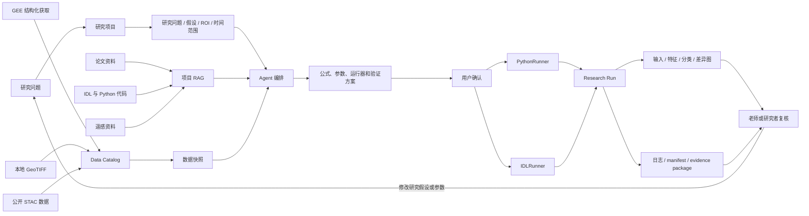

# 遥感研究 Workflow 架构

IDL RAG Panel 的核心不是把所有事情交给一个聊天机器人，而是把研究任务拆成几个可以检查的环节：资料依据、数据输入、代码执行和结果复核。

## 各部分负责什么

| 部分 | 负责内容 | 不负责内容 |
|---|---|---|
| 项目协议 | 保存研究问题、假设、ROI、时间范围和结论边界 | 不替研究者自动设计完整论文方案 |
| 项目 RAG | 检索论文、遥感资料、IDL/Python 代码并返回引用 | 不把搜索结果自动变成已验证事实 |
| Data Catalog | 登记本地、GEE 或 STAC 数据，并生成冻结快照 | 不允许模型直接读取任意私有路径 |
| Agent | 组合上下文、解释方法、生成代码和提出运行计划 | 不自动启动 formal、IDL 或跨项目任务 |
| PythonRunner | 执行声明式的栅格公式、分类和验证 | 不执行任意 Python 代码 |
| IDLRunner | 在用户确认后调用本机 `idl.exe -batch` | 不启动 Workbench GUI 或任意 shell |
| Research Run | 保存状态、阶段图、GeoTIFF、日志和证据包 | 不把 preview 结果自动写成科学结论 |

## 一次任务的数据流

1. 用户提出问题，选择研究项目。
2. Agent 读取项目协议、绑定的 RAG 和数据快照。
3. Agent 返回方法依据、公式、参数和待确认事项。
4. 用户确认后，平台调用 PythonRunner 或 IDLRunner。
5. Runner 输出阶段影像、GeoTIFF、日志和运行清单。
6. 用户在页面中检查结果，修改公式或参数后再次运行。
7. 需要正式结论时，再补充参考样本、验证方案和独立测试设计。

GEE、IDL 和 Python 的具体安装、环境变量、授权方式和排错步骤见 [`integrations.md`](./integrations.md)。
